# IB-Link 操作マニュアル


IB-Link 操作マニュアル
## 更新履歴
2026/02/13 推奨モデル追記  
2026/01/29 バージョン4.0対応  
2025/12/12 モデル切り替えAPI追記  
2025/11/21 モデル操作修正  
2025/11/17 Document API利用フロー追記およびRuntime設定修正  
2025/11/11 Chat APIおよび補足追記  
2025/09/30 バージョン3.0対応  
2025/09/09 バージョン2.0対応  
2025/07/15 「IB-Link」表記修正  
2025/06/25 「利⽤者向け機能」「開発者向け機能」章分け  
2025/06/18  初版  

## ⽬次

1. システム概要
2. 機能概要
3. 利⽤者向け機能  
   3.1. モデル操作  
   3.2. モデル選択と起動⼿順  
   3.3. マルチモーダルモデル  
   3.4. IB-Link 停⽌⼿順  
   3.5. 初期化失敗時の再イニシャライズ（再実行）  
4. 開発者向け機能  
   4.1. チャットの使い⽅  
   4.2. Runtime（ランタイム）設定  
   4.3. Logs機能  
   4.4. ドキュメント埋め込み  
   4.5. Chat API  
   4.6. Documents API  
   4.7. Retriever API
   4.8. Audio API  
   4.9. モデル切り替え API  
## 1.システム概要
   ⼤規模⾔語モデル（LLM）をPC上で実⾏・実験できるLLM利⽤アプリケーションです。
## 2.機能概要
   利⽤者向け機能と開発者向け機能が⽤意されています。
   利⽤者向け機能 （D-アプリをご利⽤いただくための機能になります。）
   モデル操作
   起動・停⽌ （OS起動時に⾃動でIB-Linkは起動され利⽤可能状態になります。）
   開発者向け機能
   チャット
   Runtime(ランタイム)設定
   ログ操作
   ドキュメント埋め込み機能
   ⾳声⽂字起こし
   データベース
   API


## 3.利⽤者向け機能
### 3.1 モデル操作
#### 3.1.1 GGUF形式のLLMモデル操作
「Models」タブでは、利⽤するGGUF形式のLLMモデルを検索・選択・ダウンロードできます。
初期状態 デフォルトのモデルが選択され、使⽤可能な状態になっています。
最適なモデル選定 速度重視の軽量モデル／精度重視の⼤型モデルを簡単に切り替え、⽤途に合った
LLMを試せます。
モデルバージョン管理 旧版も併存させて⽐較しながら検証できるので、アップグレード判定がスムー
ズ。

1. 「GGUF Models」タブをクリックすると、モデル管理画⾯が表⽰されます。
   右側にモデルの詳細情報が表⽰されます。
   モデルは C:\Users\<ユーザー名>\.iblink\Models に保存されます。


---


2. モデルを検索する  
   上部の検索バーにモデル名を⼊⼒すると、該当する候補が⼀覧に表⽰されます。
   例︓Qwen3-0.6B と⼊⼒すると、該当するGGUFモデルがリストに出てきます。
   絞り込み可能です（部分⼀致）。


---


3. 任意のモデルをクリックすると、右側にモデル情報が表⽰されます。
   作成者、種類、ファイルサイズ、作成⽇、最終更新⽇などが確認可能です。
   複数のGGUFファイルがある場合、それぞれ選択できます。


---


4. 「Available GGUF Files」からダウンロードするファイルを選び、「Download Selected File」ボタンをクリックします。
   ダウンロードの進捗が画⾯下に表⽰されます（例︓10.9%）。
   複数ファイルがある場合は、任意の精度（例︓q5_k, q8_0など）を選択できます。


---


5. ダウンロード完了メッセージ  
   ダウンロードが完了すると、Donwloaded Modelsにモデルが表示されます。
   保存先︓C:\Users\<ユーザー名>\.iblink\Models
   チャット画⾯でモデルが使⽤可能になります。


---


6. モデルの削除は、「Donwloaded Models」の削除対象のモデルを選択し、「Delete」をクリックします。


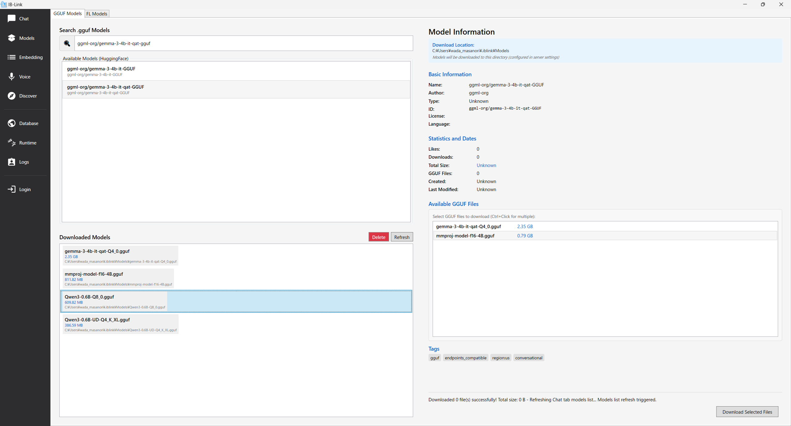

  OKをクリックすると削除されます。

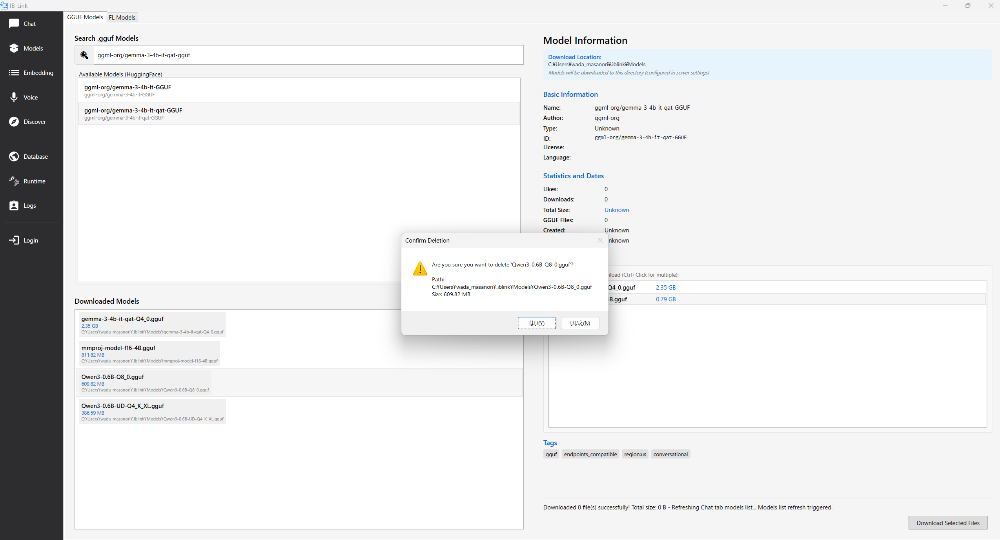


---
#### 3.1.2 Foundry LocalのLLMモデル操作　（Intel版は本機能がございません）
1. FL Modelsタブを開く  
   「Reflesh Models」をクリックすると、Available Modelsにモデルが表示されます。ダウンロードするモデルを選択し、「Download Model」をクリックします。  


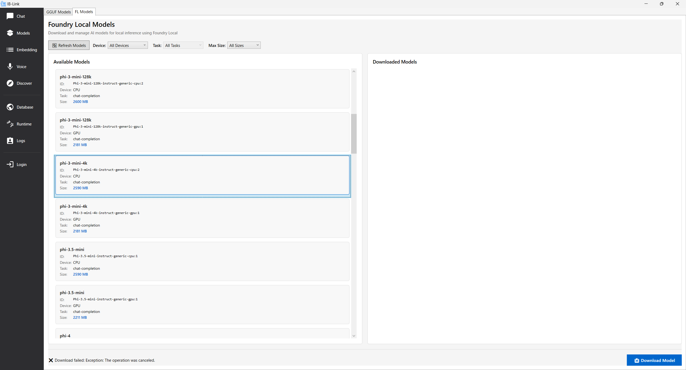

2. モデルのダウンロード開始  
　 
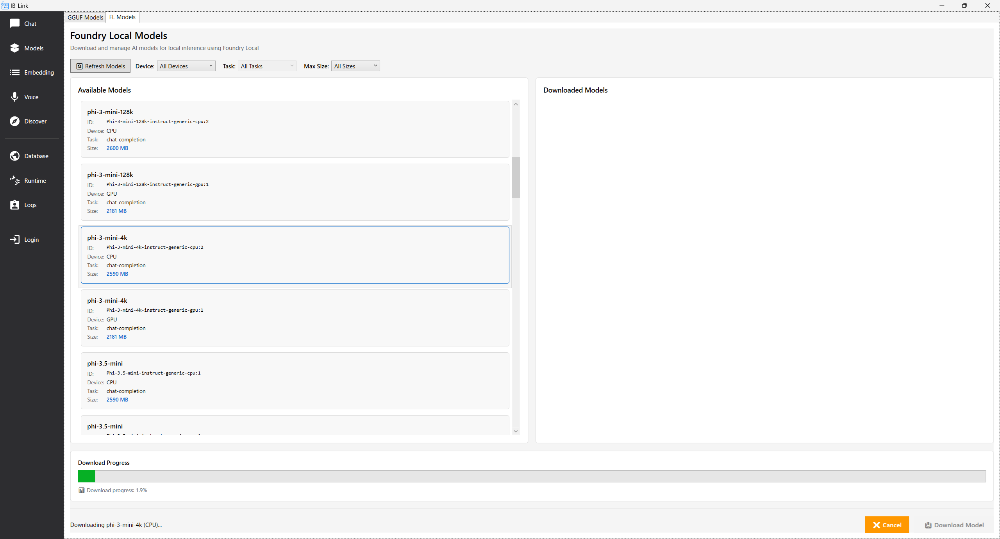

3. ダウンロードが完了すると、右の「Download Models」に表示されます。

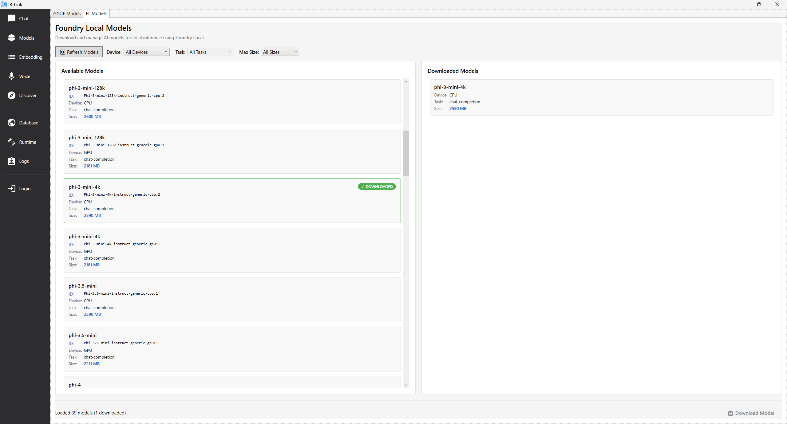

4. モデルの削除は、「Download Models」に表示されているモデルから対象を選択します。

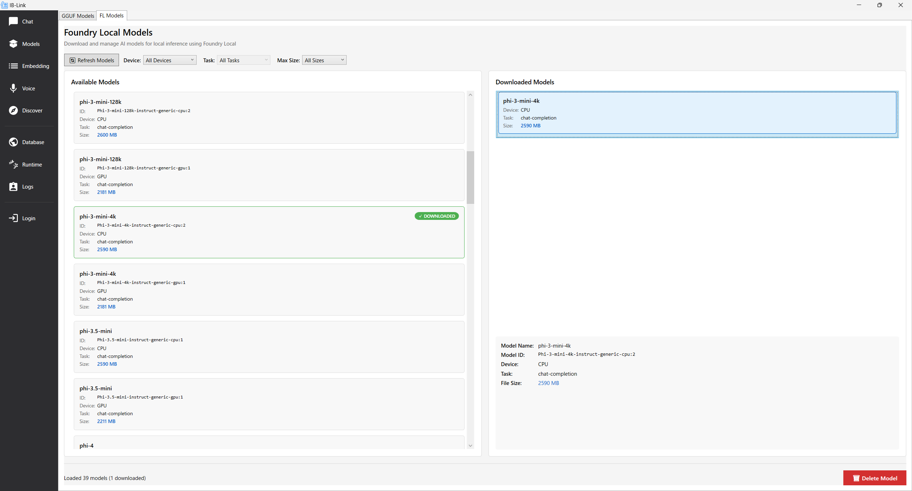

5. 「Delete Models」をクリックします。 
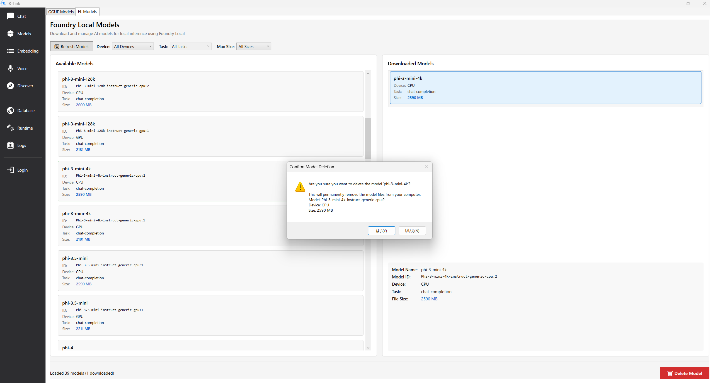

---
#### 3.1.3 推奨モデル（Intel版）
Intel版で利用できる推奨モデルを以下に示します。

##### 1. unsloth/Qwen3-VL-2B-Instruct-1M-GGUF ※マルチモーダル
画像とテキストの両方を理解できるマルチモーダルモデルです。  

**推奨ファイル:**
- モデル: `Qwen3-VL-2B-Instruct-1M-UD-Q5_K_XL.gguf`
- Visionエンコーダー: `mmproj-F16.gguf`

##### 2. unsloth/Qwen3-VL-2B-Thinking-1M-GGUF
思考プロセスを重視したモデルです。複雑な推論タスクに適しています。

**推奨ファイル:**
- モデル: `Qwen3-VL-2B-Thinking-1M-UD-Q5_K_XL.gguf`

##### 3. LiquidAI/LFM2.5-1.2B-JP-GGUF
日本語に特化した軽量モデルです。日本語タスクで高い性能を発揮します。

**推奨ファイル:**
- モデル: `LFM2.5-1.2B-JP-Q6_K.gguf`

##### 4. mradermacher/shisa-v2.1-lfm2-1.2b-GGUF
日本語と英語の両方に対応したモデルです。

**推奨ファイル:**
- モデル: `shisa-v2.1-lfm2-1.2b.Q6_K.gguf`

##### 5. unsloth/Qwen3-4B-Instruct-2507-GGUF
汎用的な指示実行タスクに適した4Bパラメータモデルです。

**推奨ファイル:**
- モデル: `Qwen3-4B-Instruct-2507-UD-Q4_K_XL.gguf`

---

#### 3.1.4 推奨モデル（Qualcomm版）
Qualcomm版で利用できる推奨モデルを以下に示します。

##### 1. unsloth/Qwen3-0.6B-GGUF     
軽量で扱いやすいモデルです。高精度な量子化で性能を保ちます。

**推奨ファイル:**
- モデル: `Qwen3-0.6B-UD-Q8_K_XL.gguf`

##### 2. ggml-org/gemma-3-4b-it-qat-gguf ※マルチモーダル   
画像とテキストの両方を理解できるマルチモーダルモデルです。 

**推奨ファイル:**
- モデル: `gemma-3-4b-it-qat-Q4_0.gguf`
- Visionエンコーダー: `mmproj-model-f16-4B.gguf`

---
### 3.2 モデル選択と起動⼿順
ダウンロード済みのモデルを選択し、起動するための⼿順を解説します。

1. 現在のモデル確認とチャット初期状態
   IB-Linkが起動し、チャット画⾯でモデルが表⽰されている状態。
   右上のStop Serverをクリックするとサーバが停⽌します。
   Statusが Server stopped になれば停⽌状態になります。


---


2. サーバー停⽌後の状態
   StatusがServer stopped の場合は機能しません。
   モデルは選択済みでも、サーバーを起動しなければ使⽤できません。


---


3. モデル選択⼿順  
   画⾯上部の Model: ドロップダウンをクリックし、使⽤したいモデル（例︓Qwenやtinyswallow）を選びま
   す。
   .gguf 形式のモデルファイルから選べます。


---


4. サーバーを起動していないと以下のような警告が表⽰されます。  
   To start chatting, either:
   Run the local server (click 'Run Server' button)
   Configure OpenAI API settings in the Runtime tab


---


5. サーバーを起動する  
   右上の Run Server ボタンをクリックすると、ローカルモデルのロードが始まります。
   ステータス︓Loading model... → Server running になると起動完了になります。


---


### 3.3 マルチモーダルモデル
マルチモーダルモデルを使⽤する⼿順を記載します。  

1. Models でモデルを検索
   左側サイドバーで Models を開き、検索ボックスに次を⼊⼒します。
   ggml-org/gemma-3-4b-it-qat-gguf
2. リポジトリを選択して内容を確認  
   検索結果から ggml-org/gemma-3-4b-it-gguf を選択します。右側の Model Information に基本情報と利⽤可能な GGUF ファイルが表⽰されます。  
   Available GGUF Files に以下の 2 つが⾒えることを確認します。
   gemma-3-4b-it-qat-Q4_0.gguf（約 2.35GB）
   mmproj-model-f16-4B.gguf（約 0.79GB）


---


3. Gemma 本体（Q4_0）をダウンロード  
   gemma-3-4b-it-qat-Q4_0.gguf を選択し、右下の Download Selected GGUF File をクリック。進捗が下部に表⽰されます。  
   ダウンロード完了メッセージが出るまで待ちます。


---


4. mmproj（投影モデル）をダウンロード  
   続けて mmproj-model-f16-4B.gguf を選択して同様にダウンロードします。
   完了を確認します。


---


5. ローカルサーバーを停⽌  
   左側サイドバーで Chat を開きます。 右上の Stop Server をクリックしてサーバーを起動します。ステータスが Server stopped になることを確認します。  
   上部の Model ドロップダウンから gemma-3-4b-it-qat-Q4_0.gguf を選択します。  
   <>アイコンを押下して、詳細設定ページを開きます。
   Custom Arguments に mmproj を追加します︓


---


追加ボタン（Add Custom Argument）を押し、名前に --mmproj、値に C:\Users\<ユーザー名

>\.iblink\Modelsmmproj-model-f16-4B.gguf を⼊⼒
>（モデルと同じディレクトリにある前提・相対指定が可能です）
>Save Setting をクリック
>プレビュー（Command Preview）に --mmproj "mmproj-model-f16-4B.gguf" が含まれていることを確認します。  

6. ローカルサーバーを起動
   右上の Run Server をクリックしてサーバーを起動します。ステータスが Server running になったら、下部
   の⼊⼒欄からチャットを開始できます。
7. D-Appを再起動してください。
   うまくいかないときは、モデルが⾒つからない/読み込めないDownload Location（…\.iblink\Models）にファイルがあるか確認します。  
   モデル名の拡張⼦が .gguf で⼀致しているか確認します。  
   mmproj が効いていない  
   Custom Arguments に --mmproj mmproj-model-f16-4B.gguf が⼊っているか、Command Preview に反映されているか確認します。  


---


### 3.4 IB-Link 停⽌⼿順

1. IB-Linkが起動中であることを確認  
   IB-Link の画⾯右上にある Status: Server running を確認します。
2. 「Stop Server」ボタンをクリック  
   上部の「Stop Server」ボタンをクリックして、ローカルサーバを停⽌します。


---


3. IB-Link停⽌を確認  
   「Status」が Server stopped に変わっていることを確認します。  
4. タスクトレイから IB-Link を終了（必要に応じて）  
   タスクバーのトレイアイコンから IB-Link を右クリックし、Exit を選択します。  


### 3.5 初期化失敗時の再イニシャライズ（再実行）

初回起動（初期化：IB-Link Setup）が途中で失敗した場合、失敗したステップのみを選択して再実行（再イニシャライズ）できます。

#### 3.5.1 事前確認

- IB-Link を起動し、左メニューの `Setup` を開きます。
- 画面下部の `Activity Log` に失敗理由（例：ネットワークエラー、依存関係の導入失敗など）が表示されている場合は、先に内容を確認します。

#### 3.5.2 ネットワークエラー（Prerequisites）が出る場合

依存コンポーネント（例：Visual C++ Redistributable）の取得でネットワークが必要になる場合があります。

1. `Network Connection Required` の警告が表示されたら、ネットワーク接続を確認します。
2. 右側の `Retry` をクリックして再試行します。
3. 繰り返し失敗する場合は、警告内に表示されるダウンロード URL から手動導入し、再度 `Retry` をクリックします。

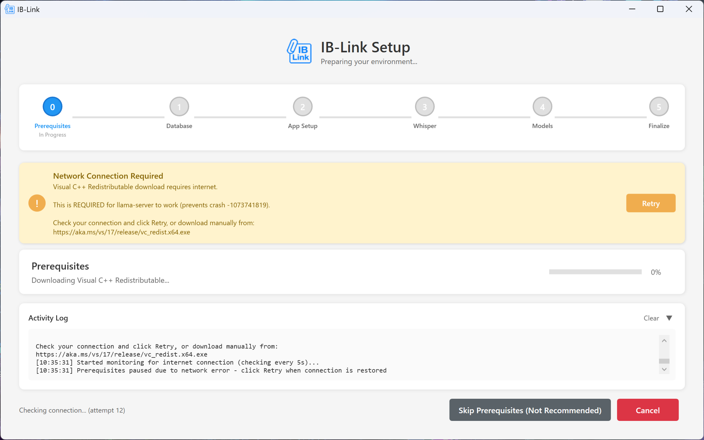

#### 3.5.3 再イニシャライズ（再実行）の実施

1. 左メニューから `Setup` を開き、`Initialization Complete`（または Setup 画面）まで進んでいることを確認します。
2. `Re-run Initialization Steps` で、再実行したいステップにチェックを入れます。
3. `Re-initialize Selected` をクリックして再実行します。


##### 3.5.3.1 Prerequisites（前提条件）を再実行する例

1. `Prerequisites` にチェックを入れます。
2. `Re-initialize Selected` をクリックします。


実行中はステップが `In Progress` になり、進捗とログが更新されます。


完了すると当該ステップが `Done`（緑のチェック）になります。


##### 3.5.3.2 Whisper を再実行する例

1. `Whisper` にチェックを入れます。
2. `Re-initialize Selected` をクリックします。

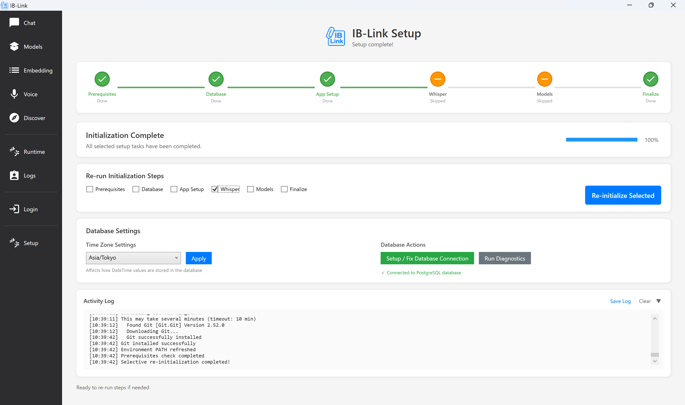

実行中は `Whisper Setup` が `In Progress` になり、進捗が表示されます。


完了すると `Whisper` が `Done` になります。


##### 3.5.3.3 Models（Chat Model）を再実行する例

1. `Models` にチェックを入れます。
2. `Re-initialize Selected` をクリックします。


実行中はダウンロード進捗とログが表示されます。


完了すると `Models` が `Done` になります。


#### 3.5.4 再実行がうまくいかない場合の確認ポイント

- **ログ確認**: `Setup` 画面の `Activity Log` を確認し、失敗要因（ネットワーク、権限、容量、依存導入など）を切り分けます。  
  例：`C:\Users\<ユーザー名>\.iblink\logs\initialization_*.log`
- **ネットワーク**: 企業プロキシ／FW 環境では外部取得がブロックされることがあります。必要に応じて手動導入後に再実行します。
- **権限**: 依存導入で管理者権限が必要になることがあります。
- **ディスク容量**: `Models` 再実行はモデル取得で容量が必要です。

## 4. 開発者向け機能
### 4.1 チャットの使い⽅
5. チャットの新規作成
   左上の New Chat ボタンをクリックすると、新しい会話が作成されます。


---


2. メッセージの⼊⼒と送信  
   下部のテキストボックスにメッセージを⼊⼒し、右側の⻘い⽮印ボタンをクリックして送信します。  


---


3. 応答の確認
   アシスタントの返信が緑⾊の背景で表⽰されます。


---


### 4.2 Runtime 設定
Runtime タブでは、ローカルモデルの実⾏に必要な Llamaサーバー設定 と API設定 を構成できます。
初期状態 デフォルトの Llama が選択され、使⽤可能な状態になっています。
ハードウェアに合わせた最適化 ⾃PCの命令セットに合う Llama バイナリを選ぶことで推論速度を最⼤化できます。 
なお、Embedding APIは機能としては提供しておりません。 

1. Llama Server 設定タブ
   ローカル実⾏⽤ Llama サーバーの .exe 実⾏パスを指定し、任意のバージョンを選択またはダウンロードできます。  
2. 操作⼿順
3. llama-server.exe を指定
   Browse ボタンで任意のバイナリファイルを選択
4. Select from Downloaded Servers から⾃動抽出されたバージョンを選択するとそのパスが有効になります。  
5. 必要に応じて Release Tag と Zip File Name を⼊⼒し、モデルをダウンロードします。  
   例: b5085, llama-b5085-bin-win-avx2-x64


---


### 4.3 Logs機能
Server Logs の確認  
上部タブから Server Logs を選択します。
アプリ起動時の状態、モデルロード、OCR設定、バックグラウンドサービスの状態などが時系列で表⽰されます。  
例: APIキーの読込、ローカルサーバの起動、OCR対象ディレクトリ数、エラー/警告 等。
API Logs の確認  
上部タブから API Logs を選択します。すべてのAPIログを⼀覧で確認できます。  


---


API の絞り込み（Filter API）

1. 画⾯上部の Filter API ドロップダウンをクリックします。
2. All / Documents API / Embeddings API / Retriever API / Audio API などから対象を選択します。
   Documents API のログを⾒る  
   Documents API を選択すると、ドキュメント処理（OCR、分割、チャンク数、進捗％、成功/失敗件数、ストレージ使⽤量など）の詳細が確認できます。  
   例:「Processed file」「Strategy: Sync」「Chunks」「Progress」「Succeeded/Failed」 などの⾏で処理結果を確認できます。  


---


OCR=True/False、分割戦略、チャンク数、実⾏時間、リソース使⽤量
（Storage/DB/Embeddings/Processing）等
Embeddings API のログを⾒る
Embeddings API を選択すると、トークン化、推論時間、バッチサイズ、メモリ使⽤量、⽣成された
埋め込み数などが確認できます。
Retriever API のログを⾒る
Retriever API を選択すると、問い合わせテキストに対する埋め込み⽣成、RDBクエリ（例: SELECT
COUNT(*) FROM "DocumentEmbeddings"）実⾏、応答時間（ms）などが確認できます。
共通操作（⾃動スクロール・差分のみ・保存/クリア）


---


Auto-scroll: 新しいログが出ると⾃動で末尾へ追従します。⻑時間の監視に便利です。
Changes Only: 変化のある⾏だけを表⽰してノイズを減らします。
Status: 現在の稼働状態（例: Running (Healthy) (Standalone)）が表⽰されます。
Refresh: 表⽰を更新します。
Save Logs: 現在の表⽰内容をファイルに保存します（監査・共有⽤）。
Clear Logs: 画⾯上のログ表⽰をクリアします（※サーバ側のログ消去とは異なる場合があります）。
Start/Stop/Restart API: 埋め込みやリトリーバー等のAPIサービスの起動/停⽌/再起動を⾏います（権
限・構成に依存）。
トラブルシューティングのヒント
エラーが出た時刻を基点に Server Logs と API Logs を併読し、原因箇所（起動直後・ドキュメント処理・埋め込み⽣成・検索処理など）を切り分けます。
Filter API で対象を絞り、Changes Only をオンにして差分だけを追うと効率的です。


---


### 4.4 ドキュメント埋め込み

1. 画⾯を開く
2. IB-Link を起動し、左メニューから Embedding を開く。
3. ルートフォルダを選択
4. 左 Document Library の Root Directory で Browse… をクリックし、埋め込み対象フォルダを選択。
5. ツリーに出たファイルへチェック（Select All でも可）。
6. スキャンPDFはツリー上部の OCR を有効化。
7. 埋め込み処理の開始


---


1. Process をクリックして埋め込み開始。
2. 進捗は下部 Embedding Progress に表⽰。
3. 処理完了の確認
4. 「Processing Complete」ダイアログが出たら OK。
5. Documents to embed が 100% で、Completed Files に並んでいることを確認。
   「Files processed: 0 (no new files needed processing)」は差分なし／対象外の意味。更新やOCR
   設定、選択状態を確認。


---


5. 埋め込み済みドキュメントの選択
6. 右 Embedded Documents で Refresh。
7. 使いたいドキュメントにチェック（Select All も可）。不要なら Delete Selected。
8. チャットで質問（検索）
9. 上部 Chat に移動。


---


2. 右で選択したドキュメントを根拠に回答されるので、質問を⼊⼒して送信。


---
### 4.5 イニシャライズ・データベースセットアップ

概要
イニシャライズ状態を確認し、PostgreSQL の接続設定（Database Connection Setup）を行って、接続テスト成功までを確認する。


---

1. 左メニューから **Setup** を開く。
2. 画面上部のセットアップステップがすべて **Done** になっていることを確認する。  
   - Prerequisites / Database / App Setup / Whisper / Models / Finalize
3. **Initialization Complete** が表示され、進捗が **100%** になっていることを確認する。


---

#### 4.5.1 再イニシャライズ（必要な場合のみ）

「3.5 初期化失敗時の再イニシャライズ」を参照してください。

---

#### 4.5.2 Database Settings（タイムゾーン設定）

1. **Database Settings** の **Time Zone Settings** でタイムゾーンを選択する。  
   - 例：`Asia/Tokyo`
2. **Apply** をクリックして反映する。


---

#### 4.5.3 Database Connection Setup（接続設定）

1. **Database Actions** の **Setup / Fix Database Connection** をクリックする。
2. **Database Connection Setup** 画面が表示されることを確認する。

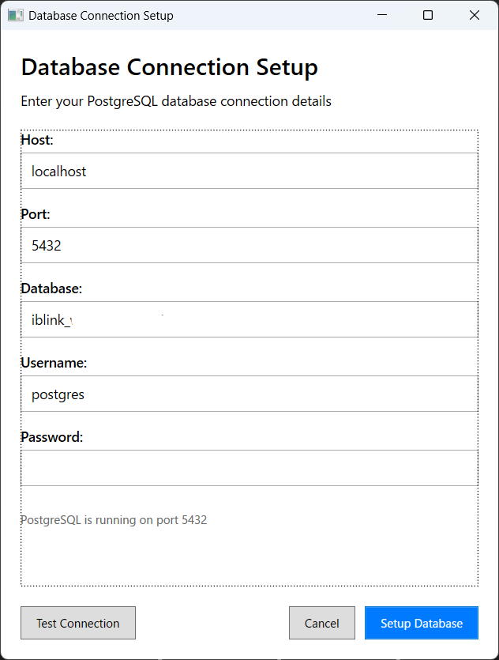

3. 接続情報を入力する
以下の項目を入力する（画像の例）：

- **Host**: `localhost`
- **Port**: `5432`
- **Database**: `iblink_wada_masanori`
- **Username**: `postgres`
- **Password**: （PostgreSQL のパスワード）

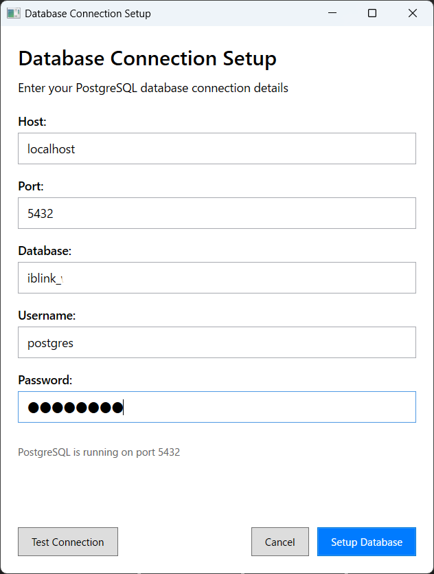

4. 接続テストを実行する
5. **Test Connection** をクリックする。
6. 画面下部に **「Connection successful! Server is reachable.」** と表示されることを確認する。

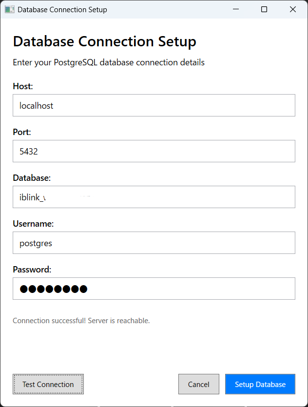

#### 4.5.4 DBセットアップを実行する（必要な場合）
- 接続テスト成功後、DB作成／初期化が必要な運用の場合は **Setup Database** をクリックする。  
  ※既存DBに接続するだけの運用では不要な場合があります。

---

#### 4.5.5 診断（任意）
- **Database Actions** の **Run Diagnostics** をクリックすると、診断結果が表示される。
- 画面上で **Connected to PostgreSQL database**（接続済み）表示を確認する。


---


### 4.6 DocumentsAPI
概要  
DocumentsAPI は、IB-Link（Documents サービス）に対して **ドキュメント取り込み（非同期）/状態取得/検索/抽出/一覧/削除** を行う HTTP API です。Dアプリ（フロントエンド）は、本節のフローと既存実装（参照先）に合わせて呼び出します。

---

#### Base URL
- `http://localhost:8500/iblink/v1`
  - 既存実装では `http://localhost:8500/iblink` を base にして `/v1/documents/...` を組み立てるパターンもあります。

---

#### 共通
- Headers
  - `Content-Type: application/json`（実装により `application/json; charset=utf-8`）

---

#### Endpoints（OpenAPI / apidocs）
- 取り込み（非同期）: POST `/documents/process`
- 状態取得: POST `/documents/status`
- 検索: POST `/documents/search`
- 抽出（埋め込み生成なし）: POST `/documents/extract`
- 一覧: POST `/documents/list`
- 削除: DELETE `/documents/delete`
- 情報: GET `/documents/info`

補足（混線防止）
- 本節は **`http://localhost:8500/iblink/v1` 配下の `/documents/*`** を扱います。
- 「意味検索」を行うAPIは **DocumentsAPI（`POST /documents/search`）** と **RetrieverAPI（`POST /retriever`）** が別系統です。Dアプリ実装でどちらを採用しているかはアプリごとの参照先に合わせます。
- `manual/apidocs` には `GET /documents/health` の例が存在しますが、`docs/api/openapi.*.yaml` には定義がありません（採用する場合はOpenAPI側に追記して仕様化します）。

---

#### 代表フロー（Dアプリ実装での使い方）
1. **取り込み**（POST `/documents/process`）でジョブ作成 → `job_id` を受け取る
2. **進捗/完了確認**（POST `/documents/status`）を `status_type: "processing"` でポーリングする
3. **検索**（POST `/documents/search`）で取り込み済みコンテンツを参照する
4. **削除**（DELETE `/documents/delete`）で対象を消す（必要に応じてファイル側も削除する）

---

#### Request / Response（最小の実装参照）

1) 取り込み（非同期）: POST `/documents/process`  
必須: `d_app_id`, `project_id`（OpenAPI）  

```json
{
  "d_app_id": "my-app",
  "project_id": "project-001",
  "duplicate_strategy": "sync",
  "files": [
    { "file_path": "C:\\Documents\\report.pdf", "enable_ocr": false },
    { "file_path": "C:\\Scans\\receipt.png", "enable_ocr": true }
  ]
}
```

レスポンス（例: 202）

```json
{
  "job_id": "my-app_project-001_20250120_103000",
  "status": "pending",
  "status_url": "/iblink/v1/documents/status"
}
```

2) 状態取得: POST `/documents/status`  
必須: `status_type`（OpenAPI）  

```json
{ "status_type": "processing", "job_id": "my-app_project-001_20250120_103000", "include_files": true }
```

`status_type`（OpenAPI）
- `processing`: ジョブ進捗
- `queue`: キュー状態
- `quota`: 使用量
- `health`: ヘルス
- `dependency`: 依存状態
- `jobs`: ジョブ一覧

3) 検索: POST `/documents/search`  
必須: `query`（OpenAPI）  

```json
{
  "query": "検索クエリ",
  "project_id": "project-001",
  "limit": 5,
  "directories": ["C:\\Documents\\manuals"],
  "similarity_threshold": 0.7,
  "search_mode": "hybrid"
}
```

補足（実装差分）
- 既存実装では `search_mode` を送る例があります（OpenAPI ではフィールド未定義）。
- Dアプリ実装では `query` の代わりに `text` を受け取り `query` に補正する例があります（Sales）。

4) 削除: DELETE `/documents/delete`  
必須: `d_app_id`（OpenAPI）  

```json
{
  "d_app_id": "my-app",
  "project_id": "project-001",
  "file_paths": ["C:\\Documents\\old-doc.pdf"],
  "delete_all": false
}
```

---

#### 既存実装例（参照先）
- D-Josys
  - `manual/Dapp/d-josys/src/api/IBLinkClient.js`（`/documents/{process,status,search,extract,list,delete}` をラップ）
  - `manual/Dapp/d-josys/src/assets/js/apiClient.js`（`POST /v1/documents/search` を直接呼ぶ）
- Sales
  - `manual/Dapp/d-sales/src/api/IBLinkClient.js`（`/documents/*` ラップ。`text`→`query` 補正・固定パラメータ付与の例あり）
  - `manual/Dapp/d-sales/src/preload.js`（`window.iblinkProcessDocuments` が `POST /documents/process` を直接呼ぶ。`duplicate_strategy:"sync"`）
- Retail
  - `manual/Dapp/d-retail/src/main.js`（Main 側で `POST /v1/documents/process`、`POST /v1/documents/search`、`DELETE /v1/documents/delete` を中継。`project_id` ゼロUUID補正、`file_path`/`file_paths` 正規化）
- Medical
  - 現時点の実装コードでは DocumentsAPI 呼び出しは未検出

---

### 4.7 RetrieverAPI
概要  
RetrieverAPI は、取り込み済みドキュメント（チャンク）に対して **ベクトル検索/ハイブリッド検索** を実行し、該当チャンク（`results[]`）を返すHTTP APIです。

---

#### Base URL
- `http://localhost:6500/iblink/v1`
  - OpenAPI はこのBase URLに対して `/retriever` を呼びます。
- `http://localhost:6500/iblink/v1/retriever`
  - `manual/apidocs` のUsage Examplesは、このURLを「Base URL」として例示しています（`POST` は同URL、`GET` は `/health` や `/info` を付与）。

---

#### 共通
- Headers
  - `Content-Type: application/json`

---

#### Endpoints（OpenAPI / apidocs）
- 検索: POST `/retriever`
- ヘルス: GET `/retriever/health`
- 情報: GET `/retriever/info`

補足（混線防止）
- **DocumentsAPI の `POST /documents/search` と RetrieverAPI の `POST /retriever` は別系統**です。Dアプリ実装でどちらを採用しているかは、各アプリの実装（参照先）に合わせます。

---

#### 代表フロー（Dアプリ側の実装観点）
1. DocumentsAPI（4.6）でドキュメントを取り込む（埋め込み作成が完了している前提を作る）
2. RetrieverAPI（POST `/retriever`）へクエリを投げ、`results[]` の `text` と `metadata` をUI/プロンプトへ利用する

---

#### Request / Response（最小の実装参照）

1) 検索: POST `/retriever`  
必須: `text`（OpenAPI）  

```json
{
  "text": "検索クエリ",
  "d_app_id": "app-123",
  "project_id": "proj-456",
  "limit": 10,
  "search_mode": "vector",
  "files_directories": ["C:\\Docs\\Guides"],
  "documents_id": ["550e8400-e29b-41d4-a716-446655440000"]
}
```

レスポンス（例）

```json
{
  "query": "検索クエリ",
  "project_id": "proj-456",
  "d_app_id": "app-123",
  "total_results": 10,
  "results": [
    {
      "id": "doc-123-chunk-5",
      "text": "ドキュメントの一部テキスト...",
      "score": 0.92,
      "metadata": {
        "file_path": "C:\\Docs\\Guides\\guide.pdf",
        "chunk_index": 5,
        "page_range": "12-14",
        "document_id": "550e8400-e29b-41d4-a716-446655440000"
      }
    }
  ]
}
```

2) ヘルス: GET `/retriever/health`  
3) 情報: GET `/retriever/info`

---

#### 既存実装例（参照先）
- D-Josys
  - `manual/Dapp/d-josys/src/index.js`（Main側 `iblink:documentRetriever` は **無効化（501）**。DocumentsAPI の `searchDocuments`（`POST /documents/search`）を使用する方針）
- Sales
  - `manual/Dapp/d-sales/src/Tasks/cf/renderer.js`（検証用UI: `POST ${apiUrl}/iblink/v1/retriever`。`text`/`search_mode`/`files_directories`/`documents_id` を送信）
- Retail / Medical
  - 現時点の実装コードでは RetrieverAPI 呼び出しは未検出

---

### 4.8 AudioAPI（IB-Link経由: 7000/iblink/v1/audio/*）
（この節は `manual/apidocs/AudioAPI_Usage_Examples.md` と `docs/api/openapi.*.yaml`（Audio tag）に合わせて、後続ステップで内容を移行する）

---

### 4.9 AudioNPUAPI（Whisper Server + Realtime: 8000 + WS）
概要
Audio API Server は、OpenAI 互換の⾳声⽂字起こし（Transcription）API を提供し、リアルタイムストリーミング機能を備えたサーバーです。Snapdragon NPU による⾼速化をサポートしつつ、CPU フォールバックにも対応しています。  

注意点
- 動作確認はCopilot PCに搭載されているマイクで行っております。
- IB-Linkで録音、文字起こしを行っているため、フロントエンド側でのマイク入力は不要です。

ベースURL
`http://localhost:8000`

認証
デフォルトでは認証は不要です。 API キー認証を有効にするには、.env ファイルに API_KEY を設定します。

エンドポイント

1. ヘルスチェック
   - GET `/health`
   - サーバーが稼働しているかを確認します。
   - レスポンス例

```json
{ "status": "healthy", "timestamp": "2025-01-08T12:00:00Z" }
```

2. サーバーステータス
   - GET `/status`
   - サーバーの詳細な稼働状況と設定を取得します。
   - レスポンス例

```json
{
  "status": "running",
  "uptime": 3600,
  "total_requests": 150,
  "active_connections": 2,
  "config": {
    "model": "whisper-large-v3-turbo",
    "npu_enabled": true,
    "target_runtime": "qnn_dlc"
  }
}
```

3. ⾳声⽂字起こし（OpenAI 互換）
   - POST `/v1/audio/transcriptions`
   - ⾳声をテキストに変換します。
   - Content-Type: `multipart/form-data`
   - 主なパラメータ: `file`(必須), `model`, `language`, `response_format`, `prompt`, `temperature`
   - リクエスト例

```bash
curl -X POST http://localhost:8000/v1/audio/transcriptions \
  -F "file=@audio.wav" \
  -F "model=whisper-large-v3-turbo" \
  -F "response_format=verbose_json"
```

   - レスポンス例（verbose_json）

```json
{
  "task": "transcribe",
  "language": "en",
  "duration": 30.0,
  "text": "This is the transcribed text...",
  "segments": [
    {
      "id": 0,
      "seek": 0,
      "start": 0.0,
      "end": 5.0,
      "text": "This is the transcribed text",
      "tokens": [50364, 1668, 307, 264, 1145, 17820, 2078],
      "temperature": 0.0,
      "avg_logprob": -0.25,
      "compression_ratio": 1.2,
      "no_speech_prob": 0.01
    }
  ]
}
```

   - レスポンス例（json）

```json
{ "text": "This is the transcribed text..." }
```

   - レスポンス例（text）

```
This is the transcribed text...
```

4. ⾳声翻訳
   - POST `/v1/audio/translations`
   - ⾳声を英語テキストに翻訳します（リクエスト/レスポンスは⾳声⽂字起こしと同様、結果が英語）。

5. WebSocket ストリーミング
   - WS `/v1/audio/stream`
   - リアルタイムで⾳声をストリーミングしながら⽂字起こしします。
   - 接続例

```javascript
const ws = new WebSocket('ws://localhost:8000/v1/audio/stream');

ws.onopen = () => {
  ws.send(JSON.stringify({
    model: 'whisper-large-v3-turbo',
    language: 'auto',
    response_format: 'json'
  }));
  streamAudioChunks(ws);
};

ws.onmessage = (event) => {
  const result = JSON.parse(event.data);
  console.log('Transcription:', result.text);
};
```

プロトコル
- 1) 設定を送信（JSON）

```json
{ "model": "whisper-large-v3-turbo", "language": "auto", "response_format": "json" }
```

- 2) ⾳声データを送信（バイナリ: 16kHz/16bit/モノラル PCM またはファイルチャンク）
- 3) 結果を受信（JSON）
  - 部分結果（partial）

```json
{ "type": "partial", "text": "This is being transcribed", "timestamp": 1704715200, "segment_id": 0 }
```

  - 最終結果（final）

```json
{ "type": "final", "text": "This is being transcribed in real time.", "timestamp": 1704715205, "segment_id": 0, "segments": [] }
```

6. リアルタイム⾳声⼊⼒（マイク）
   - WS `/v1/audio/realtime`
   - マイク⼊⼒からリアルタイムで⽂字起こしします。
   - 接続時の設定
      - model: 文字起こしに使用するモデル
      - language: 何語として文字起こしを行うかの設定、autoの場合は自動判別を行う
      - response_format: 期待するレスポンスの形式
      - vad_enabled: 発話区間を検出するかどうか
      - energy_threshold: 音声と認識する音声の大きさ
      - record_timeout: 一度に文字起こしする音声の秒数
      - phrase_timeout: 一つのフレーズとして確定するまでの無音検知秒数

```json
{
  "action": "start",
  "config": {
      "model": "whisper-large-v3-turbo",
      "language": "auto",
      "response_format": "json",
      "sample_rate": 16000,
      "vad_enabled": true,
      "energy_threshold": 1000,
      "record_timeout": 2.0,
      "phrase_timeout": 1.0
      }
}
```

   - 制御コマンド

```json
{ "action": "pause" }
{ "action": "resume" }
{ "action": "stop" }
```

   - 結果の受信

```json
{ "type": "transcription", "text": "Hello, this is real-time transcription", "is_final": true, "confidence": 0.95, "timestamp": 1704715200 }
```

---

エラーレスポンス形式

```json
{ "error": { "message": "エラー説明", "type": "error_type", "code": "ERROR_CODE" } }
```

⼀般的なエラーコード
- INVALID_AUDIO（400）: 無効または破損した⾳声ファイル
- FILE_TOO_LARGE（413）: ファイルサイズが上限を超過
- UNSUPPORTED_FORMAT（415）: ⾮対応の⾳声形式
- MODEL_NOT_FOUND（404）: 指定モデルが存在しない
- NPU_ERROR（500）: NPU 処理失敗（CPU フォールバックあり）
- TIMEOUT（408）: リクエストタイムアウト

レート制限
- デフォルト（変更可能）: 1分あたり 100 リクエスト / IP、同時接続 10 / IP、最⼤ファイルサイズ 100MB

レスポンスフォーマット
SRT 形式

```
1
00:00:00,000 --> 00:00:05,000
This is the first subtitle.

2
00:00:05,000 --> 00:00:10,000
This is the second subtitle.
```

VTT 形式

```
WEBVTT

00:00:00.000 --> 00:00:05.000
This is the first subtitle.

00:00:05.000 --> 00:00:10.000
This is the second subtitle.
```

クライアント実装例

```python
# Python
import requests

with open("audio.wav", "rb") as f:
    response = requests.post(
        "http://localhost:8000/v1/audio/transcriptions",
        files={"file": f},
        data={
            "model": "whisper-large-v3-turbo",
            }
    )
    print(response.json()["text"])
```

```javascript
# JavaScript / Node.js
const FormData = require('form-data');
const fs = require('fs');
const axios = require('axios');

const form = new FormData();
form.append('file', fs.createReadStream('audio.wav'));
form.append('model', 'whisper-large-v3-turbo');

axios.post('http://localhost:8000/v1/audio/transcriptions', form)
  .then(response => console.log(response.data.text));
```

```bash
# cURL
curl -X POST http://localhost:8000/v1/audio/transcriptions \
  -H "Content-Type: multipart/form-data" \
  -F "file=@audio.wav" \
  -F "model=whisper-large-v3-turbo" \
  -F "response_format=json"
```

---

パフォーマンス向上のヒント
- NPU 加速を利⽤すると 5〜10倍⾼速化
- ⻑い⾳声は 30 秒ごとに分割すると最適化可能
- VAD（Voice Activity Detection）を有効化して無⾳部分をスキップ
- 精度設定の最適化︓NPU では `w8a8`、CPU では `float32`
- 単⼀ワーカープロセスで NPU の競合を回避
- ストリーミングを活⽤してリアルタイム⽤途に最適化

OpenAI 互換性
- この API は OpenAI の Whisper API と互換性があり、既存のクライアントを簡単に置き換えることができます。

```python
# OpenAI クライアント（従来）
from openai import OpenAI
client = OpenAI(api_key="...")
transcription = client.audio.transcriptions.create(
  model="whisper-1",
  file=audio_file
)
```

```python
# この API を利⽤する場合
from openai import OpenAI
client = OpenAI(api_key="not-needed", base_url="http://localhost:8000/v1")
transcription = client.audio.transcriptions.create(
  model="whisper-large-v3-turbo",
  file=audio_file
)
```


### 4.10 EmbeddingsAPI
（この節は `manual/apidocs/EmbeddingsAPI_Usage_Examples.md` に合わせて、後続ステップで内容を移行する）

---

### 4.11 LlamaServerAPI（推論サーバ管理）

---

概要
**モデル切り替え API** は、llama-server（llama.cpp）インスタンスのライフサイクルを完全に管理する、高機能な REST API サービスです。
インテリジェントな競合検出、自動解決、ヘルスモニタリング、IB-Link エコシステムとのシームレスな統合など、エンタープライズ向けの機能を備えています。


主な機能

* **サーバーライフサイクルのフル管理** – llama-server インスタンスの起動、停止、再起動、監視
* **インテリジェントな競合検出** – ポート競合、プロセス競合、リソース制約を自動検出して解決
* **デュアルモードアーキテクチャ** – スタンドアロン、または IB-Link アプリケーションに統合して動作
* **リアルタイム監視** – ライブログ配信、ヘルスチェック、パフォーマンスメトリクス
* **GGUF モデル管理** – モデルの探索、検証、シームレスな切り替え
* **自動リカバリ** – プロセス監視と再起動による自己修復機能
* **本番運用で鍛えられた設計** – スレッドセーフな処理、包括的なエラーハンドリング、リソースクリーンアップ


コア機能

**包括的なサーバー管理**

* 任意の GGUF モデルで llama-server を起動／停止
* 設定変更なしでの動的なモデル切り替え
* 自動クリーンアップ付きのグレースフルシャットダウン
* プロセスのライフサイクル監視

**インテリジェントな競合解決**

* システム全体の llama-server プロセスを検出
* 起動前にポート競合を検出
* 競合するプロセスの自動終了
* リソース（RAM、ディスク容量）の利用可能性チェック
* ファイルロックの検出と処理

**リアルタイム監視**

* サーバーステータスとヘルスチェック
* Server-Sent Events（SSE）によるログストリーミング
* パフォーマンスメトリクス（tokens/sec、評価時間など）
* プロセス終了コードのトラッキング

**モデル管理**

* GGUF モデルの自動検出
* モデルの検証とメタデータ取得
* サイズ・互換性チェック
* すべての GGUF 量子化フォーマットに対応
* **新機能:** HuggingFace からモデルを直接ダウンロード
* **新機能:** 複数ファイル／分割モデルのサポート
* **新機能:** ダウンロード進捗のリアルタイムトラッキング

**エンタープライズ向け機能**

* OpenAPI/Swagger ドキュメント
* 構造化されたエラーレスポンス
* 詳細なログ出力
* Web クライアント向けの CORS サポート
* 設定のホットリロード

高度な機能

**スレッドセーフなオペレーション**

* ロックを用いた並行リクエスト処理
* レースコンディションの防止
* クリティカルセクションのアトミックな処理

**スマートなプロセス管理**

* 孤立プロセス（orphan）のクリーンアップ
* ゾンビプロセスの検出
* 想定外終了の検知
* 複数インスタンスの協調制御

**拡張ログ機能**

* llama-server のコンソール出力の取得
* ログレベルフィルタリング
* ログ履歴を保持するリングバッファ
* info／error ストリームの分離

Architecture（アーキテクチャ）

システムアーキテクチャ

```text
┌─────────────────────────────────────────────────────────────┐
│                        IB-Link Application                   │
│  ┌─────────────────────────────────────────────────────┐   │
│  │            StandaloneApiProcessManager              │   │
│  └─────────────────┬───────────────────────────────────┘   │
│                    │ Manages                                │
└────────────────────┼────────────────────────────────────────┘
                     │
     ┌───────────────▼───────────────┐
     │   IB-Link.LlamaServerAPI      │
     │  ┌─────────────────────────┐  │
     │  │    Controllers          │  │◄─── HTTP Requests
     │  │  - LlamaServerController│  │
     │  └───────────┬─────────────┘  │
     │              │                 │
     │  ┌───────────▼─────────────┐  │
     │  │      Services           │  │
     │  │ - LlamaServerApiService │  │
     │  │ - ModelDiscoveryService │  │
     │  │ - ConflictManager       │  │
     │  └───────────┬─────────────┘  │
     │              │                 │
     │  ┌───────────▼─────────────┐  │
     │  │    Core Services        │  │
     │  │  - LlamaServerService   │  │
     │  │  - ServerConfiguration  │  │
     │  └───────────┬─────────────┘  │
     └──────────────┼─────────────────┘
                    │
     ┌──────────────▼─────────────────┐
     │     llama-server.exe           │
     │   (llama.cpp inference server) │
     └────────────────────────────────┘
```

実行モード

1. **スタンドアロンモード**

* 独立プロセスとして独自の設定で動作
* `dotnet run` で直接実行
* ローカルの appsettings.json を使用
* 開発・テスト用途に最適

2. **ホストモード**

* IB-Link メインアプリケーションにより管理
* 親プロセスから設定を継承
* StandaloneApiProcessManager によるライフサイクル制御
* 本番環境でのデプロイモード

コンポーネントの役割

| コンポーネント                   | 役割                                   |
| ------------------------- | ------------------------------------ |
| **LlamaServerController** | HTTP エンドポイントの処理、リクエストバリデーション、レスポンス整形 |
| **LlamaServerApiService** | ビジネスロジックのオーケストレーション、イベント集約、ログ管理      |
| **LlamaServerService**    | プロセスライフサイクル、ヘルスモニタリング、コマンド実行         |
| **ConflictManager**       | 競合検出、解決戦略、リソースチェック                   |
| **ModelDiscoveryService** | GGUF ファイルのスキャン、メタデータ抽出、検証            |
| **ServerConfiguration**   | パス解決、デフォルト設定、ランタイム検出                 |


API の起動

```bash
# スタンドアロンモード
cd src/IB-Link.LlamaServerAPI
dotnet run

# ポートを指定して起動
dotnet run --urls "http://localhost:5000"
```

基本的な利用フロー

```bash
# 1. API のヘルスチェック
curl http://localhost:9000/health

# 2. 利用可能なモデルとバイナリの一覧
curl http://localhost:9000/iblink/v1/llama-server/models
curl http://localhost:9000/iblink/v1/llama-server/binaries

# 3. 互換性のあるバイナリを設定（必要に応じて）
curl -X POST http://localhost:9000/iblink/v1/llama-server/binaries/set `
  -H "Content-Type: application/json" `
  -d '{"binary_path": "C:\\path\\to\\x64\\llama-server.exe"}'

# 4. サーバー起動
curl -X POST http://localhost:9000/iblink/v1/llama-server/start `
  -H "Content-Type: application/json" `
  -d '{
    "model_path": "C:\\Models\\model.gguf",
    "port": 8080
  }'

# 5. ステータス確認とリクエスト送信
curl http://localhost:9000/iblink/v1/llama-server/status
curl -X POST http://localhost:8080/v1/chat/completions `
  -H "Content-Type: application/json" `
  -d '{
    "messages": [{"role": "user", "content": "Hello!"}],
    "max_tokens": 100
  }'

# 6. モニタリングと停止
curl "http://localhost:9000/iblink/v1/llama-server/logs?lines=10"
curl -X POST http://localhost:9000/iblink/v1/llama-server/stop
```

モデルダウンロードのワークフロー

```bash
# 1. HuggingFace でモデルを検索
curl -X POST http://localhost:9000/iblink/v1/llama-server/models/search `
  -H "Content-Type: application/json" `
  -d '{"query": "gemma gguf"}'

# 2. モデルリポジトリの詳細情報を取得
curl "http://localhost:9000/iblink/v1/llama-server/models/info?repository=ggml-org/gemma-2-2b-it-Q4_K_M-GGUF"

# 3. モデルをダウンロード
curl -X POST http://localhost:9000/iblink/v1/llama-server/models/download `
  -H "Content-Type: application/json" `
  -d '{
    "repository": "ggml-org/gemma-2-2b-it-Q4_K_M-GGUF",
    "files": ["gemma-2-2b-it-Q4_K_M.gguf"]
  }'

# 4. ダウンロード済みモデルはローカルモデル一覧に表示される
curl http://localhost:9000/iblink/v1/llama-server/models
```

> **PowerShell ユーザー向け:** `curl` コマンドの代わりに、PowerShell 組み込みの `curl`（エイリアス）や `Invoke-RestMethod` を使用すると JSON の扱いがしやすくなります。

API Documentation（API ドキュメント）

ベース URL

```text
http://localhost:9000/iblink/v1/llama-server
```

エンドポイント一覧

---

* **Server Management（サーバー管理）**

  * `POST /start` – llama-server の起動（リクエストスキーマ／レスポンスを日本語で説明）
  * `POST /stop` – サーバー停止
  * `GET /status` – サーバーステータス取得
  * `POST /switch-model` – モデル切り替え

* **Model Management（モデル管理）**

  * `GET /models` – ローカルの GGUF モデル一覧取得

* **Model Download（モデルダウンロード）**

  * `POST /models/search` – HuggingFace 上の GGUF モデル検索
  * `GET /models/info` – 特定リポジトリのファイル構造や分割モデル情報取得
  * `POST /models/download` – モデルファイルのダウンロード
  * `POST /models/download-stream` – SSE によるダウンロード進捗ストリーミング
  * `DELETE /models` – ローカルモデルファイルの削除（注意書き付き）

* **Binary Management（バイナリ管理）**

  * `GET /binaries` – 利用可能な llama-server.exe バイナリ一覧
  * `GET /binaries/info` – 特定バイナリの詳細情報
  * `POST /binaries/set` – 使用するバイナリの設定

* **Configuration（設定）**

  * `GET /info` – API の設定と機能一覧
  * `POST /config` – 設定の動的更新

* **Monitoring（監視）**

  * `GET /logs` – 直近ログの取得
  * `GET /logs/stream` – SSE によるリアルタイムログストリーミング
  * `GET /health` – API ヘルスチェック

* **Error Responses（エラーレスポンス形式）**

  * 共通の JSON フォーマットと error_type の種類を日本語で解説

---

### 4.12 FoundryLocalAPI（Foundry Local 管理）
（この節は `manual/apidocs/FoundryLocalAPI_Usage_Examples.md` に合わせて、後続ステップで内容を移行する）

---

### 4.90 第4章後半（追加/補足：公式名称なし＝名称未定）

#### （名称未定）LLM推論エンドポイント（OpenAI互換 `/v1/chat/completions`）
概要
Chat API は、LLMとのチャット機能を提供する API サービスです。

クイックスタート
- ベースURL: `http://localhost:8080/iblink/v1`
- コンテンツタイプ: すべてのリクエストに `Content-Type: application/json` を指定

API エンドポイント

1. LLM質問応答（⾮同期）
   - LLMに投入された指示や質問に対する返答を出力します。
   - エンドポイント: POST `/chat/completions`
   - リクエスト例

```json
{
  "model": "localmodel",
  "message": [
         { "role": "system", "content": "あなたはチャッピーです。" },
         { "role": "user", "content": "返答をどうぞ。" }
      ],
  "temperature": 0.1,
  "max_tokens": 500,
  "stream": true,
}
```

   - 主要パラメータ
     - `model`: モデル名（IB-Link内で設定するため無効）
     - `message`: LLMに投入する指示や質問
     - `temperature`: LLMの出力の揺らぎ度合い
     - `max_tokens`: LLMの出力の最大トークン数制限
     - `stream`: 部分的な進捗を出力するかどうかの設定

   - レスポンス例（202 Accepted）

```json
{
  "text": "私はチャッピーです。",
}
```

   - 詳細については以下のページも参照してください。
      - https://github.com/ggml-org/llama.cpp/tree/master/tools/server

---

#### （名称未定）音声“管理”エンドポイント（7100）

---

#### （名称未定）Audio Hub / Realtime Hub（7000/realtime 等）

---

#### （補足）“IB-Link経由 Chat”（8500/iblink/v1/chat/completions）

---

© 2026 IB-Link / J-AIC   
本ドキュメントの無断転載を禁じます。  

---
