# IB-Link 操作マニュアル（抽出版）

IB-Link 操作マニュアル
## 更新履歴
2025/09/30 バージョン3.0対応  
2025/09/09 バージョン2.0対応  
2025/07/15 「IB-Link」表記修正  
2025/06/25 「利⽤者向け機能」「開発者向け機能」章分け  
2025/06/18  初版  

---

## ⽬次

1. システム概要
2. 機能概要
3. 利⽤者向け機能  
   3.1. モデル操作  
   3.2. モデル選択と起動⼿順  
   3.3. マルチモーダルモデル  
   3.4. IB-Link 停⽌⼿順  
4. 開発者向け機能  
   4.1. チャットの使い⽅  
   4.2. Runtime（ランタイム）設定  
   4.3. Logs機能  
   4.4. ドキュメント埋め込み  
   4.5. ⾳声⽂字起こし  
   4.6. データーベース  
   4.7. API仕様
## 1.システム概要
   ⼤規模⾔語モデル（LLM）をPC上で実⾏・実験できるLLM利⽤アプリケーションです。
## 2.機能概要
   利⽤者向け機能と開発者向け機能が⽤意されています。
   利⽤者向け機能 （D-アプリをご利⽤いただくための機能になります。）
   モデル操作
   起動・停⽌ （OS起動時に⾃動でIB-Linkは起動され利⽤可能状態になります。）
   開発者向け機能
   チャット
   Runtime(ランタイム)設定
   ログ操作
   ドキュメント埋め込み機能
   ⾳声⽂字起こし
   データベース
   API

---

## 3.利⽤者向け機能
### 3.1 モデル操作
「Models」タブでは、利⽤するGGUF形式のLLMモデルを検索・選択・ダウンロードできます。
初期状態 デフォルトのモデルが選択され、使⽤可能な状態になっています。
最適なモデル選定 速度重視の軽量モデル／精度重視の⼤型モデルを簡単に切り替え、⽤途に合った
LLMを試せます。
モデルバージョン管理 旧版も併存させて⽐較しながら検証できるので、アップグレード判定がスムー
ズ。

1. Modelsタブを開く
   左側メニューから「Models」を選択すると、モデル管理画⾯が表⽰されます。
   右側にモデルの詳細情報が表⽰されます。
   モデルは C:\Users\<ユーザー名>\.iblink\Models に保存されます。

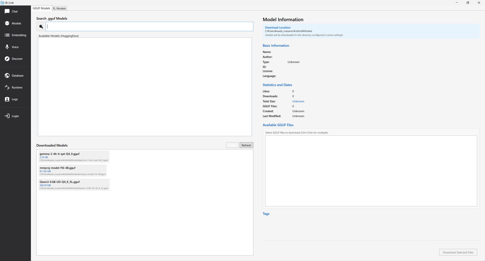

---

2. モデルを検索する
   上部の検索バーにモデル名を⼊⼒すると、該当する候補が⼀覧に表⽰されます。
   例︓Qwen3-0.6B と⼊⼒すると、該当するGGUFモデルがリストに出てきます。
   絞り込み可能です（部分⼀致）。

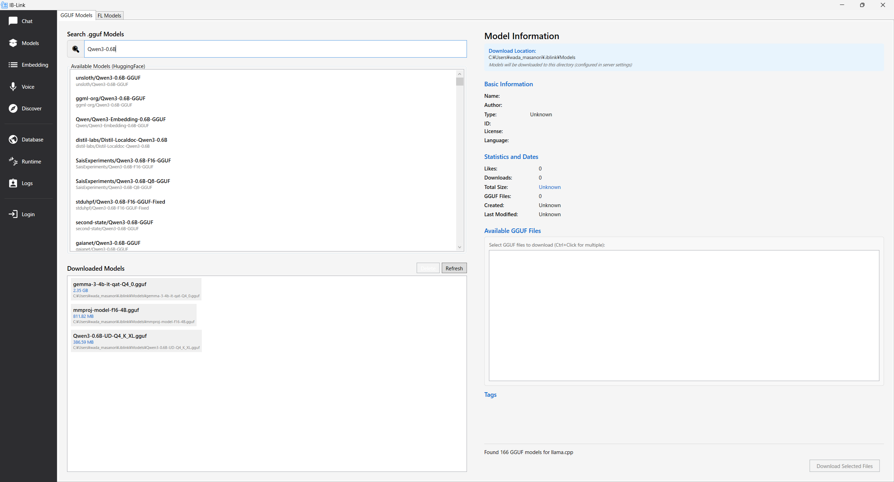

---

3. モデルの詳細を確認する
   任意のモデルをクリックすると、右側にモデル情報が表⽰されます。
   作成者、種類、ファイルサイズ、作成⽇、最終更新⽇などが確認可能です。
   複数のGGUFファイルがある場合、それぞれ選択できます。

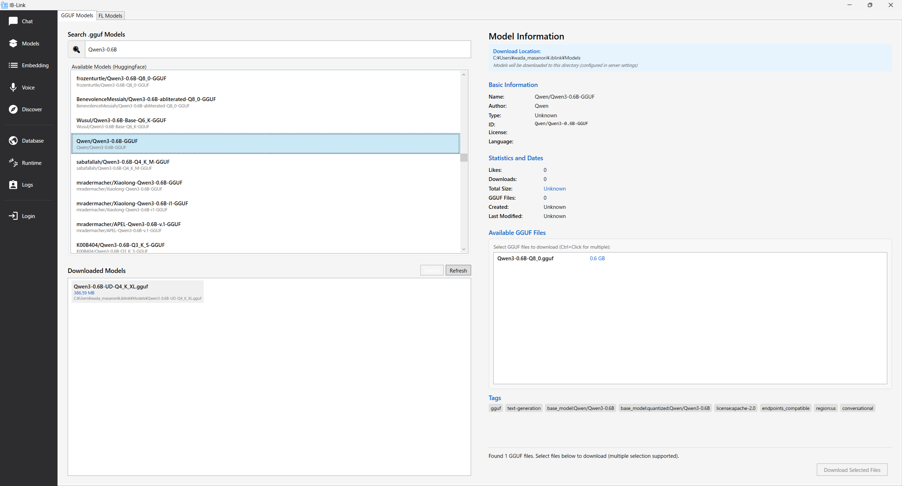

---

4. モデルのダウンロード
   使⽤するGGUFファイルをプルダウンから選び、「Download Selected GGUF File」ボタンをクリックしま
   す。
   ダウンロードの進捗が画⾯下に表⽰されます（例︓5.6%）。
   複数ファイルがある場合は、任意の精度（例︓q5_k, q8_0など）を選択できます。

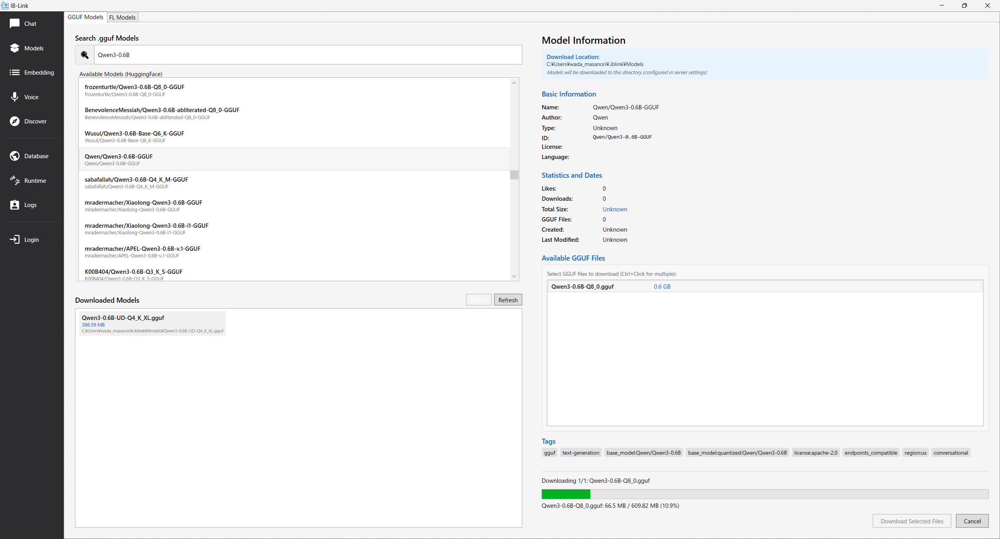

---

5. ダウンロード完了メッセージ
   ダウンロードが完了すると、モデルファイルが保存されたことと、UIへの通知メッセージが表⽰されます。
   保存先︓C:\Users\<ユーザー名>\.iblink\Models
   チャット画⾯でモデルが使⽤可能になります。

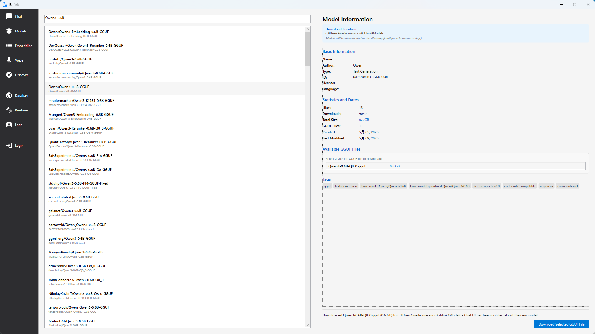

---

### 3.2 モデル選択と起動⼿順
ダウンロード済みのモデルを選択し、起動するための⼿順を解説します。

1. 現在のモデル確認とチャット初期状態
   IB-Linkが起動し、チャット画⾯でモデルが表⽰されている状態。
   右上のStop Serverをクリックするとサーバが停⽌します。
   Statusが Server stopped になれば停⽌状態になります。

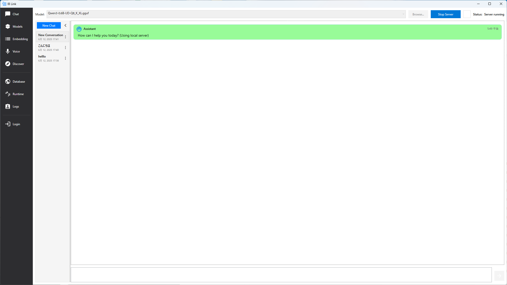

---

2. サーバー停⽌後の状態
   StatusがServer stopped の場合は機能しません。
   モデルは選択済みでも、サーバーを起動しなければ使⽤できません。

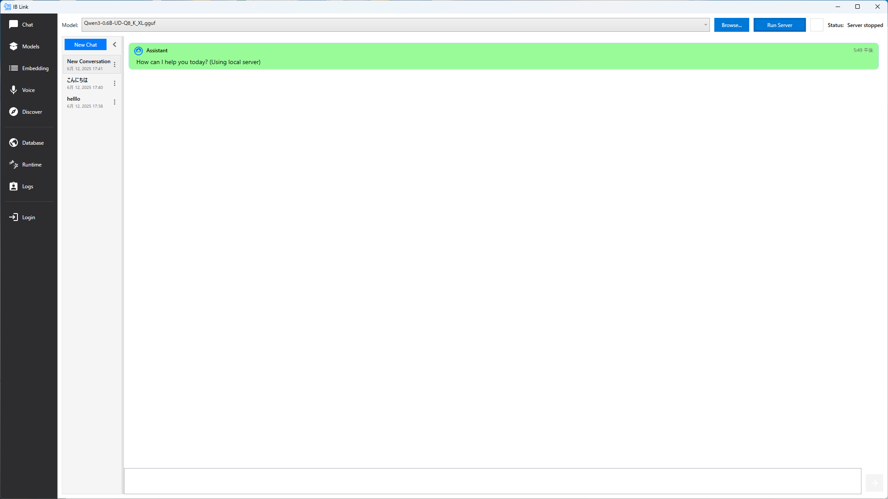

---

3. モデル選択⼿順
   画⾯上部の Model: ドロップダウンをクリックし、使⽤したいモデル（例︓Qwenやtinyswallow）を選びま
   す。
   .gguf 形式のモデルファイルから選べます。

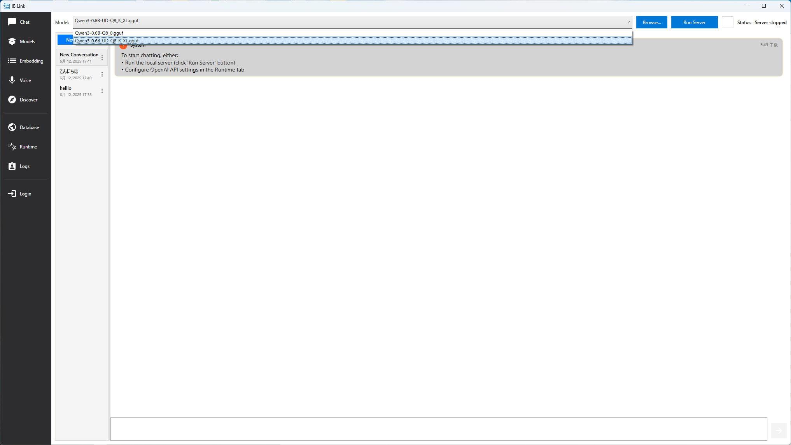

---

4. サーバー起動の必要メッセージ
   モデルを選んでも、サーバーを起動していないと以下のような警告が表⽰されます。
   To start chatting, either:
   Run the local server (click 'Run Server' button)
   Configure OpenAI API settings in the Runtime tab

---

5. サーバーを起動する
   右上の Run Server ボタンをクリックすると、ローカルモデルのロードが始まります。
   ステータス︓Loading model... → Server running になると起動完了になります。

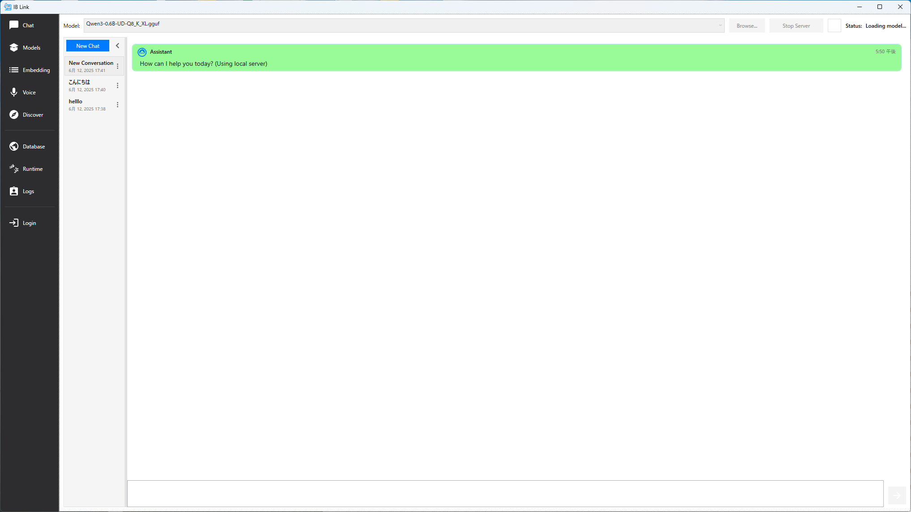

---

### 3.3 マルチモーダルモデル
マルチモーダルモデルを使⽤する⼿順を記載します。
⼿順

1. Models でモデルを検索
   左側サイドバーで Models を開き、検索ボックスに次を⼊⼒します。
   ggml-org/gemma-3-4b-it-qat-gguf
2. リポジトリを選択して内容を確認
   検索結果から ggml-org/gemma-3-4b-it-gguf を選択します。右側の Model Information に基本情報と利⽤
   可能な GGUF ファイルが表⽰されます。
   Available GGUF Files に以下の 2 つが⾒えることを確認します。
   gemma-3-4b-it-qat-Q4_0.gguf（約 2.35GB）
   mmproj-model-f16-4B.gguf（約 0.79GB）

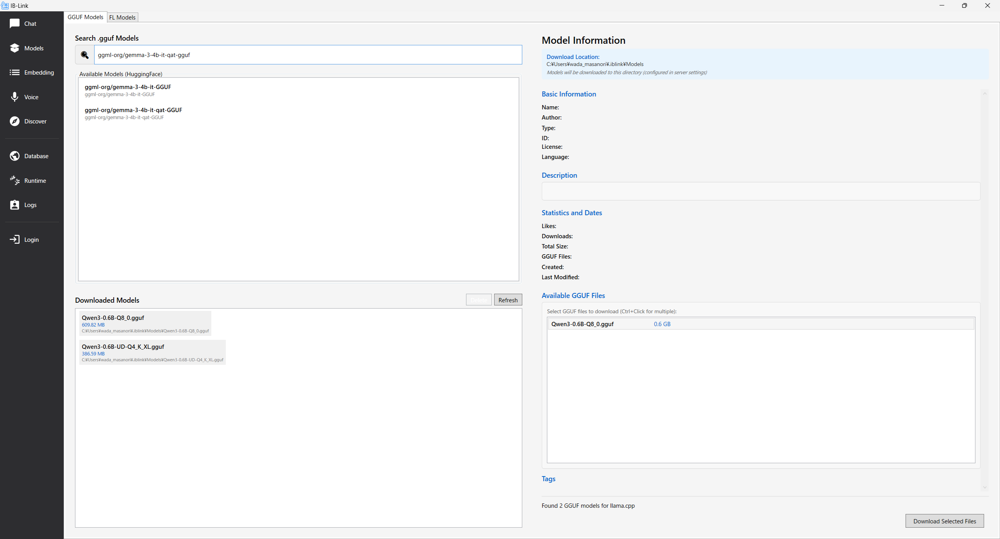

---

3. Gemma 本体（Q4_0）をダウンロード
   gemma-3-4b-it-qat-Q4_0.gguf を選択し、右下の Download Selected GGUF File をクリック。進捗が下部
   に表⽰されます。
   ダウンロード完了メッセージが出るまで待ちます。

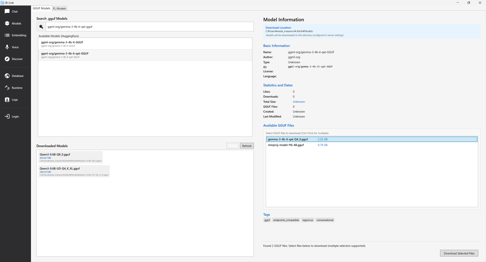

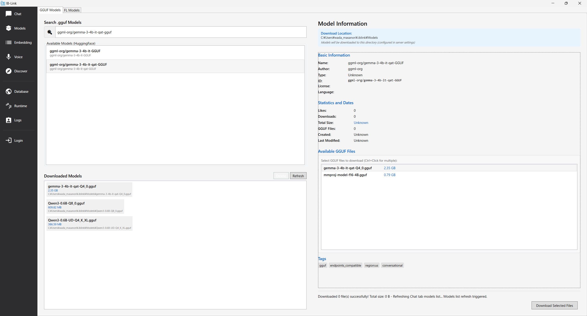

---

4. mmproj（投影モデル）をダウンロード
   続けて mmproj-model-f16-4B.gguf を選択して同様にダウンロードします。
   完了を確認します。

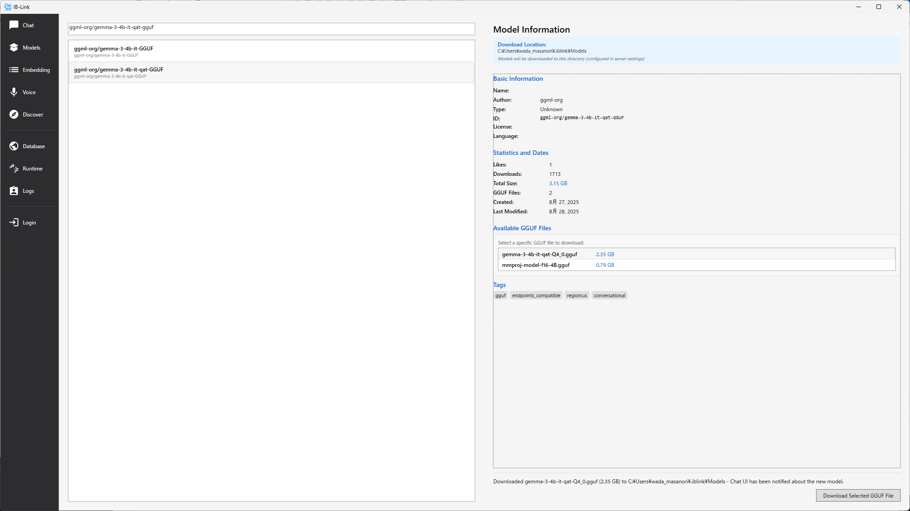

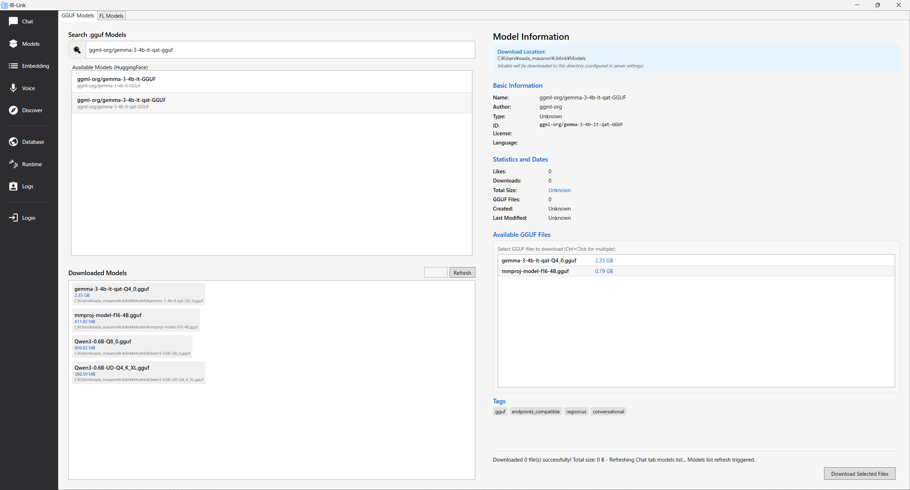

---

5. ローカルサーバーを停⽌
   左側サイドバーで Chat を開く。 右上の Stop Server をクリックしてサーバーを起動します。ステータスが
   Server stopped になることを確認する。
   上部の Model ドロップダウンから gemma-3-4b-it-qat-Q4_0.gguf を選択します。
   <>アイコンを押下して、詳細設定ページを開きます。
   Custom Arguments に mmproj を追加します︓

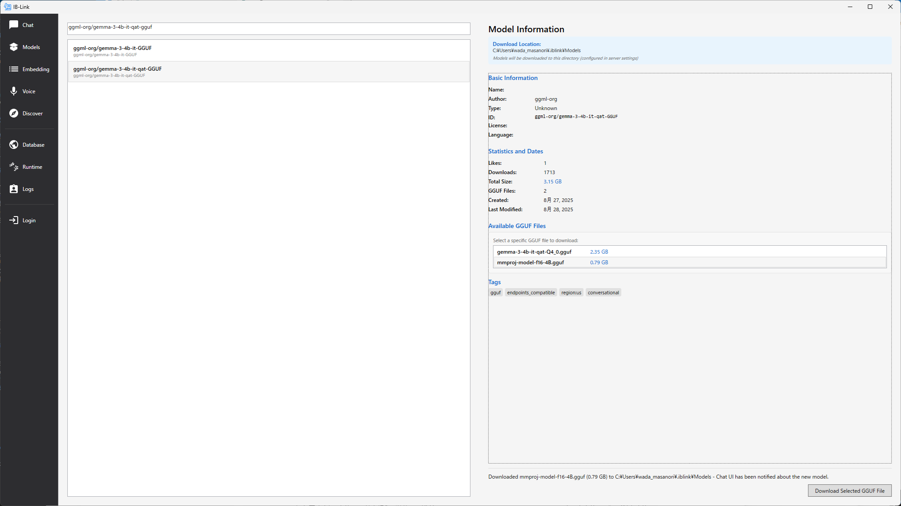

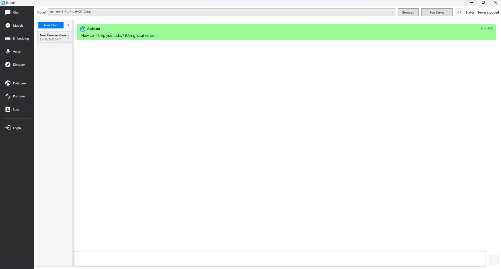

---

追加ボタン（Add Custom Argument）を押し、名前に --mmproj、値に C:\Users\<ユーザー名

>\.iblink\Modelsmmproj-model-f16-4B.gguf を⼊⼒
>（モデルと同じディレクトリにある前提・相対指定が可能です）
>Save Setting をクリック
>プレビュー（Command Preview）に --mmproj "mmproj-model-f16-4B.gguf" が含まれていることを確認
>します。

6. ローカルサーバーを起動
   右上の Run Server をクリックしてサーバーを起動します。ステータスが Server running になったら、下部
   の⼊⼒欄からチャットを開始できます。
7. D-app再起動
   D-appを再起動してください。
   うまくいかないときは
   モデルが⾒つからない/読み込めない
   Download Location（…\.iblink\Models）にファイルがあるか確認
   モデル名の拡張⼦が .gguf で⼀致しているか確認
   mmproj が効いていない
   Custom Arguments に --mmproj mmproj-model-f16-4B.gguf が⼊っているか、Command
   Preview に反映されているか確認

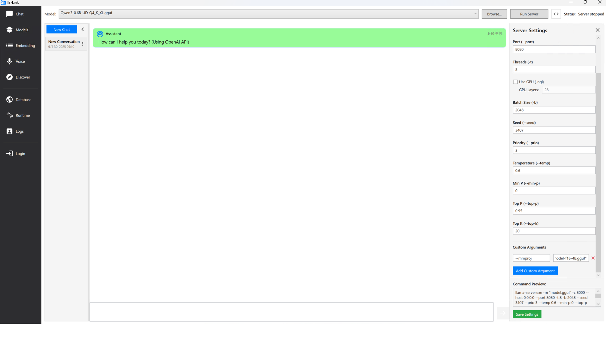

---

### 3.4 IB-Link 停⽌⼿順

1. IB-Linkが起動中であることを確認
   IB-Link の画⾯右上にある Status: Server running を確認します。
2. 「Stop Server」ボタンをクリック
   上部の「Stop Server」ボタンをクリックして、ローカルサーバを停⽌します。

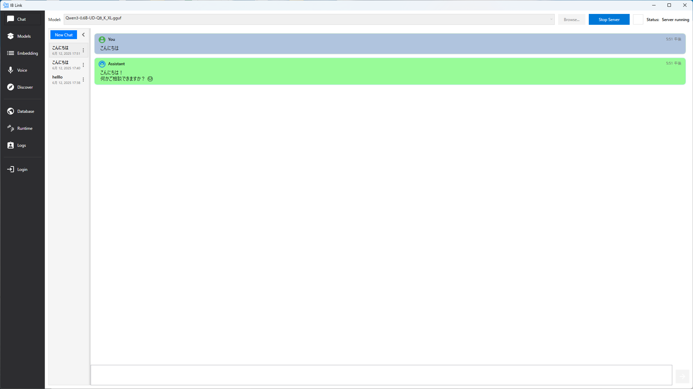

---

3. IB-Link停⽌を確認
   「Status」が Server stopped に変わっていることを確認します。
4. タスクトレイから IB-Link を終了（必要に応じて）
   タスクバーのトレイアイコンから IB-Link を右クリックし、Exit を選択します。

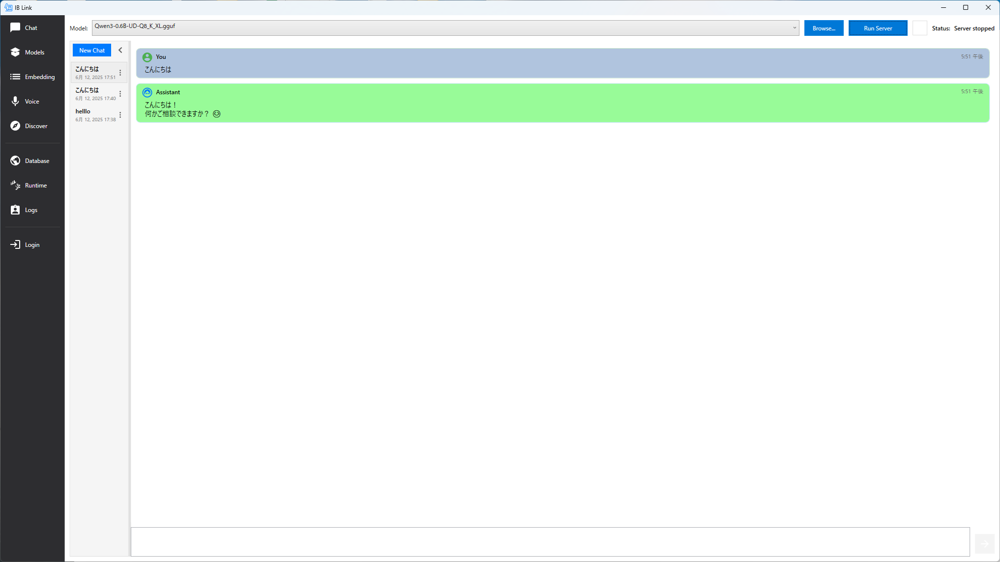

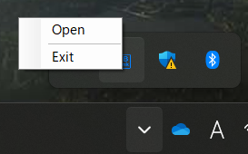

---

## 4. 開発者向け機能
### 4.1 チャットの使い⽅
5. チャットの新規作成
   左上の New Chat ボタンをクリックすると、新しい会話が作成されます。

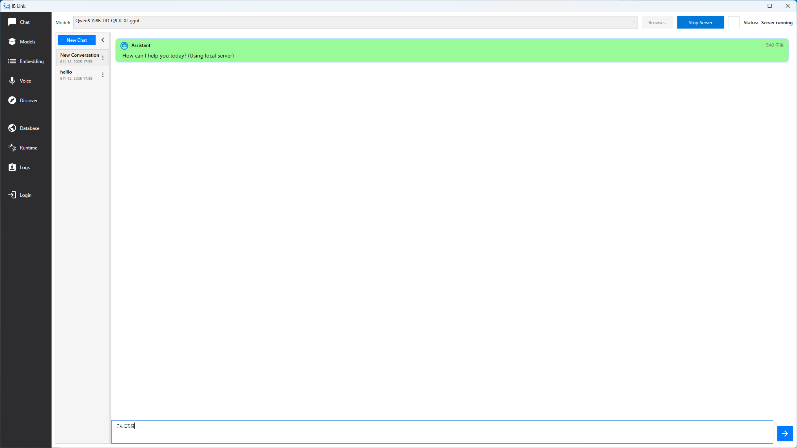

---

2. メッセージの⼊⼒と送信
   下部のテキストボックスにメッセージを⼊⼒し、右側の ⻘い⽮印ボタン をクリックして送信します。

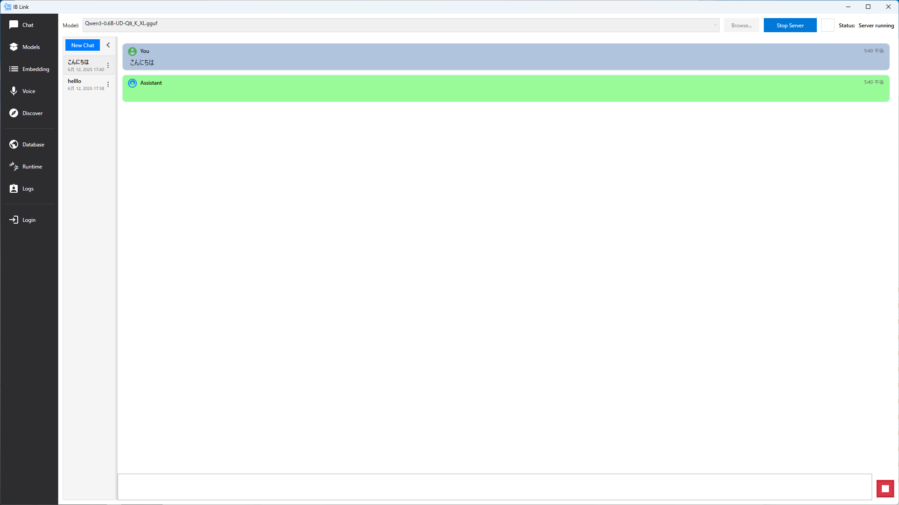

---

3. 応答の確認
   アシスタントの返信が緑⾊の背景で表⽰されます。

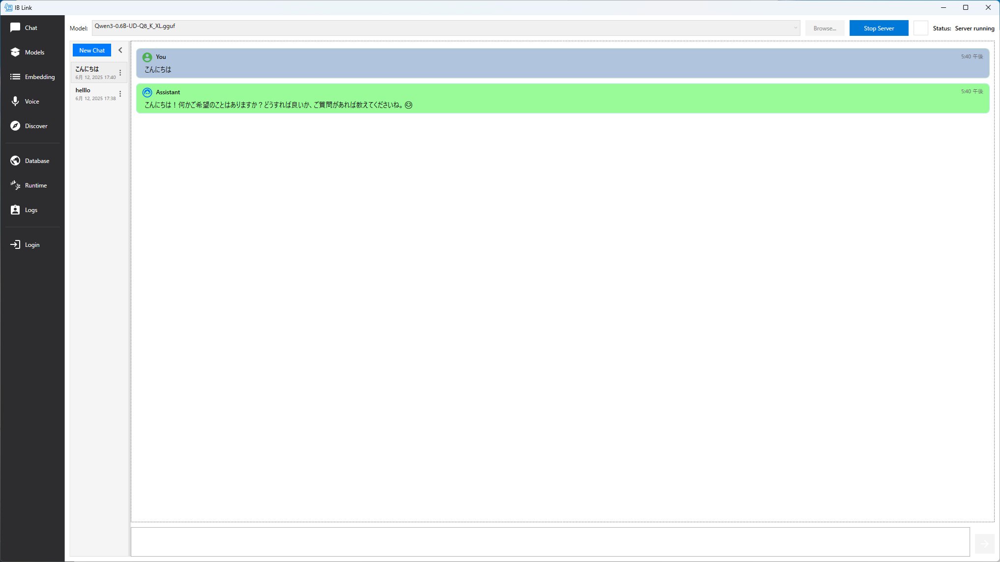

---

### 4.2 Runtime 設定
Runtime タブでは、ローカルモデルの実⾏に必要な Llamaサーバー設定 と API設定 を構成できます。
初期状態 デフォルトの Llama が選択され、使⽤可能な状態になっています。
ハードウェアに合わせた最適化 ⾃PCの命令セットに合う Llama バイナリを選ぶことで推論速度を最⼤
化できます。

1. Llama Server 設定タブ
   ローカル実⾏⽤ Llama サーバーの .exe 実⾏パスを指定し、任意のバージョンを選択またはダウンロードで
   きます。
2. 操作⼿順
3. llama-server.exe を指定
   Browse ボタンで任意のバイナリファイルを選択
4. Select from Downloaded Servers から⾃動抽出されたバージョンを選択
   選択するとそのパスが有効になります
5. 必要に応じて Release Tag と Zip File Name を⼊⼒し、モデルをダウンロード可能
   例: b5085, llama-b5085-bin-win-avx2-x64

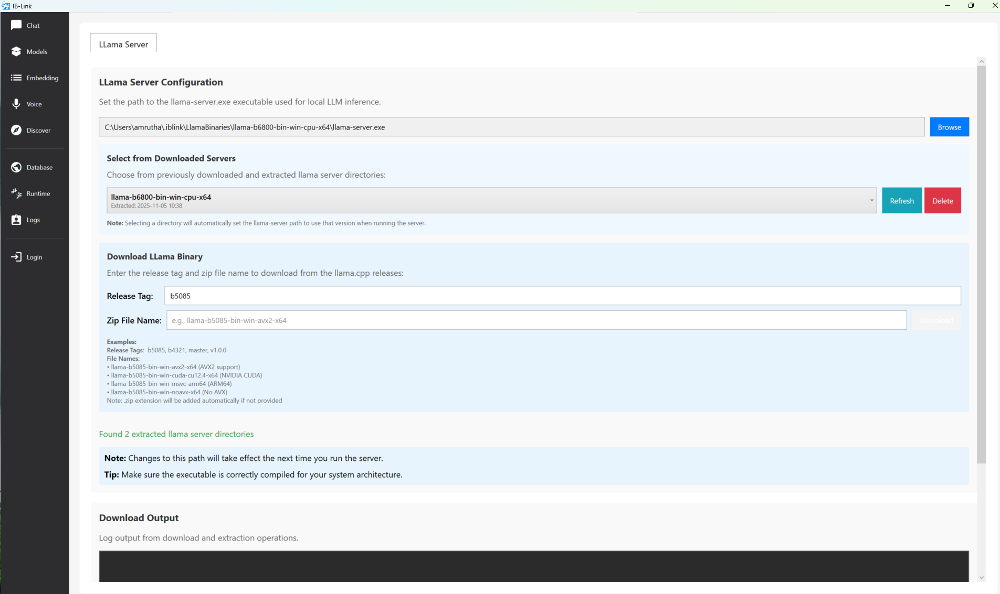

---

3. API Settings タブ
   APIを⽤いたチャットやレポート⽣成の設定ができます。
4. 設定内容︓
   項⽬
   説明
   API Key
   APIキー（例: sk-...）
   Model
   利⽤モデル（例: gpt-4, gpt-3.5-turbo）
   Base URL
   APIのエンドポイントURL（例: http://localhost:8080/v1）
   Temperature
   応答のランダム性（0.0 = 決定的, 2.0 = ランダム）
   Max Tokens
   応答トークンの最⼤数（例: 1000）
   操作ボタン︓
   Save Settings︓設定を保存
   Reset to Defaults︓デフォルトに戻す
   Test Connection︓API接続をテスト
5. Embeddigs API タブ
   このタブは機能として提供しておりません。
   設定を変更いただかないようお願いいたします。
   注意事項
   設定変更後は再度 Run Server しないと反映されません。

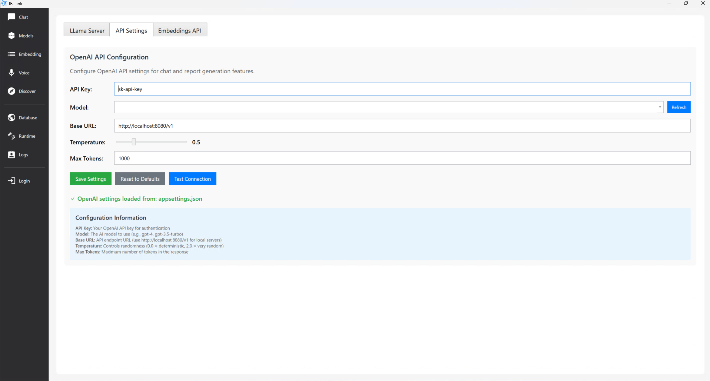

---

### 4.3 Logs機能
Server Logs の確認
上部タブから Server Logs を選択します。
アプリ起動時の状態、モデルロード、OCR設定、バックグラウンドサービスの状態などが時系列で表
⽰されます。
例: APIキーの読込、ローカルサーバの起動、OCR対象ディレクトリ数、エラー/警告 等。
API Logs の確認
上部タブから API Logs を選択します。
すべてのAPIログを⼀覧で確認できます。

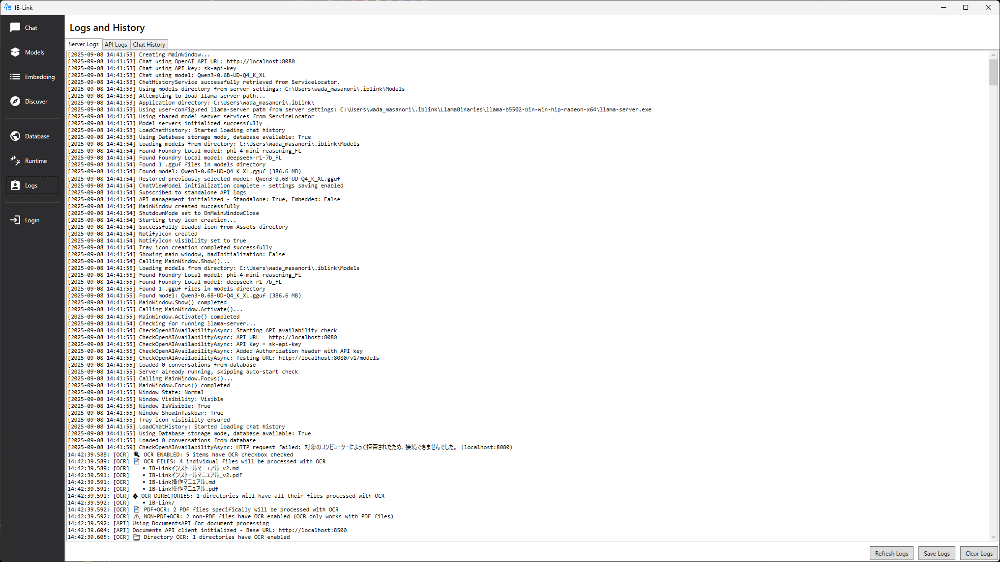

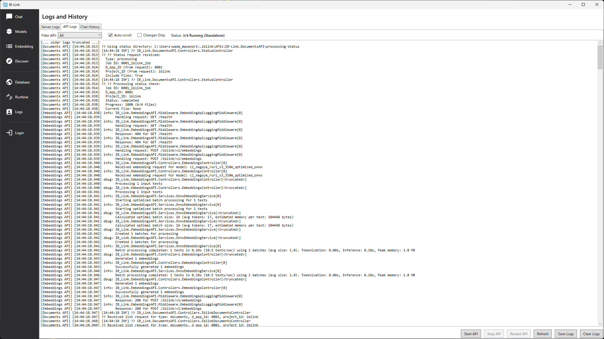

---

API の絞り込み（Filter API）

1. 画⾯上部の Filter API ドロップダウンをクリックします。
2. All / Documents API / Embeddings API / Retriever API / Audio API などから対象を選択します。
   Documents API のログを⾒る
   Documents API を選択すると、ドキュメント処理（OCR、分割、チャンク数、進捗％、成功/失敗件
   数、ストレージ使⽤量など）の詳細が確認できます。
   例:
   「Processed file」「Strategy: Sync」「Chunks」「Progress」「Succeeded/Failed」 などの⾏で処
   理結果を確認

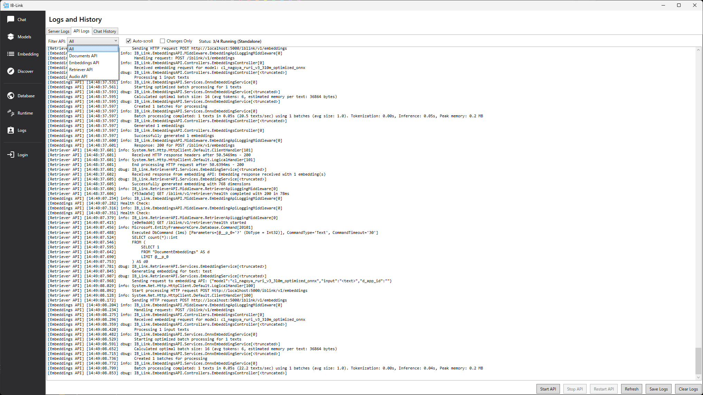

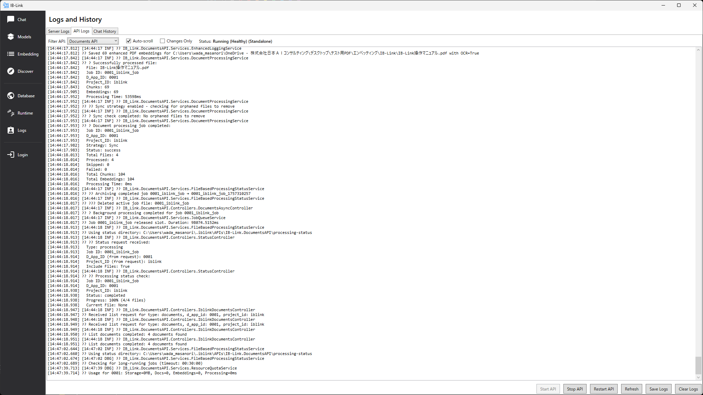

---

OCR=True/False、分割戦略、チャンク数、実⾏時間、リソース使⽤量
（Storage/DB/Embeddings/Processing）等
Embeddings API のログを⾒る
Embeddings API を選択すると、トークン化、推論時間、バッチサイズ、メモリ使⽤量、⽣成された
埋め込み数などが確認できます。
Retriever API のログを⾒る
Retriever API を選択すると、問い合わせテキストに対する埋め込み⽣成、RDBクエリ（例: SELECT
COUNT(*) FROM "DocumentEmbeddings"）実⾏、応答時間（ms）などが確認できます。
共通操作（⾃動スクロール・差分のみ・保存/クリア）

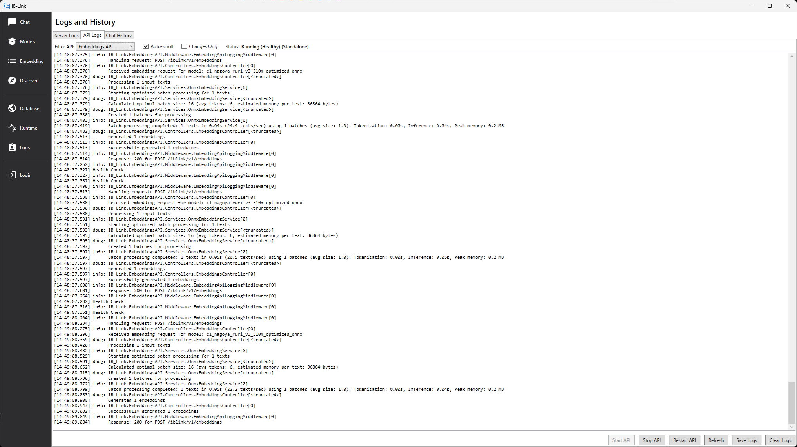

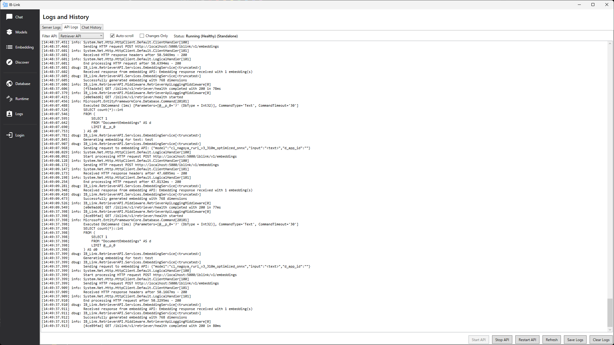

---

Auto-scroll: 新しいログが出ると⾃動で末尾へ追従します。⻑時間の監視に便利です。
Changes Only: 変化のある⾏だけを表⽰してノイズを減らします。
Status: 現在の稼働状態（例: Running (Healthy) (Standalone)）が表⽰されます。
Refresh: 表⽰を更新します。
Save Logs: 現在の表⽰内容をファイルに保存します（監査・共有⽤）。
Clear Logs: 画⾯上のログ表⽰をクリアします（※サーバ側のログ消去とは異なる場合があります）。
Start/Stop/Restart API: 埋め込みやリトリーバー等のAPIサービスの起動/停⽌/再起動を⾏います（権
限・構成に依存）。
トラブルシューティングのヒント
エラーが出た時刻を基点に Server Logs と API Logs を併読し、原因箇所（起動直後・ドキュメント処
理・埋め込み⽣成・検索処理など）を切り分けます。
Filter API で対象を絞り、Changes Only をオンにして差分だけを追うと効率的です。

---

### 4.4 ドキュメント埋め込み

1. 画⾯を開く
2. IB-Link を起動し、左メニューから Embedding を開く。
3. ルートフォルダを選択
4. 左 Document Library の Root Directory で Browse… をクリックし、埋め込み対象フォルダを選択。
5. ツリーに出たファイルへチェック（Select All でも可）。
6. スキャンPDFはツリー上部の OCR を有効化。
7. 埋め込み処理の開始

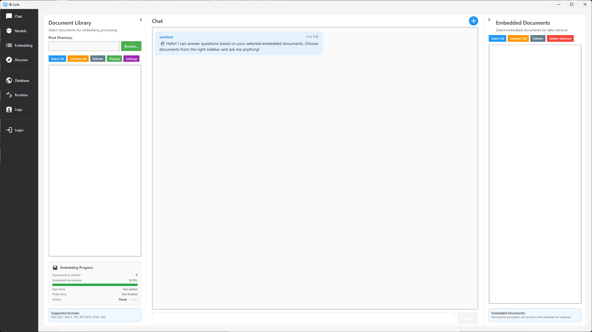

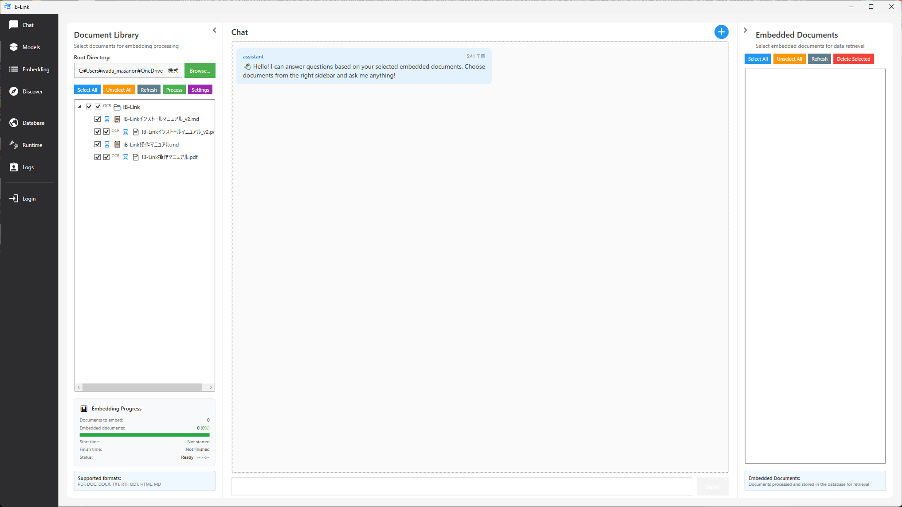

---

1. Process をクリックして埋め込み開始。
2. 進捗は下部 Embedding Progress に表⽰。
3. 処理完了の確認
4. 「Processing Complete」ダイアログが出たら OK。
5. Documents to embed が 100% で、Completed Files に並んでいることを確認。
   「Files processed: 0 (no new files needed processing)」は差分なし／対象外の意味。更新やOCR
   設定、選択状態を確認。

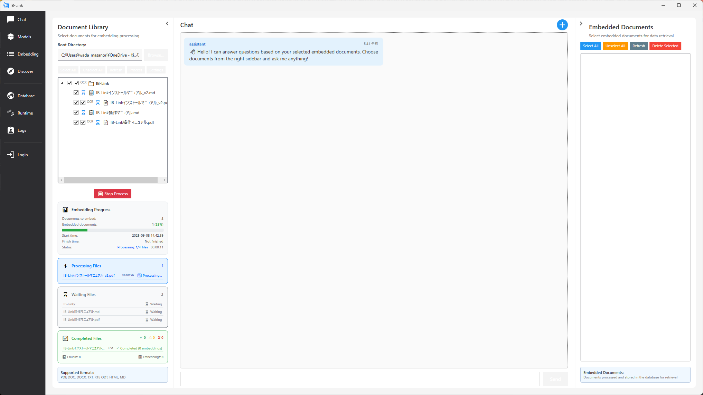

---

5. 埋め込み済みドキュメントの選択
6. 右 Embedded Documents で Refresh。
7. 使いたいドキュメントにチェック（Select All も可）。不要なら Delete Selected。
8. チャットで質問（検索）
9. 上部 Chat に移動。

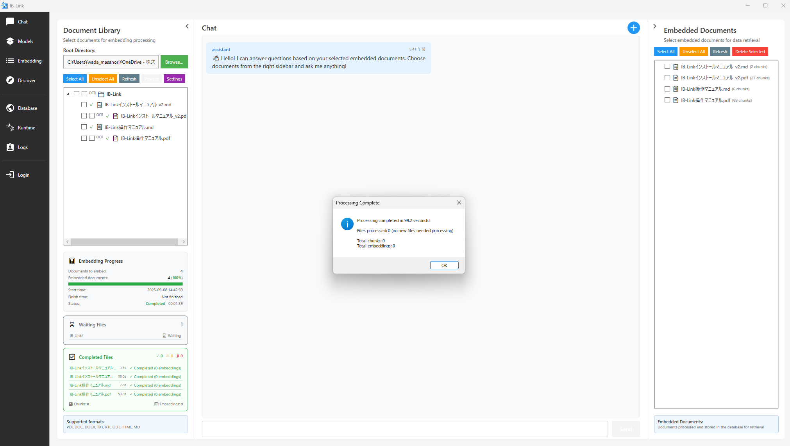

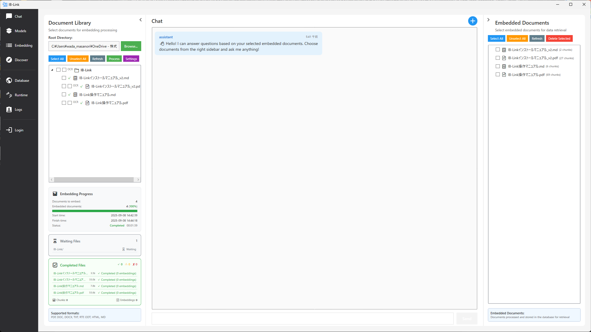

---

2. 右で選択したドキュメントを根拠に回答されるので、質問を⼊⼒して送信。

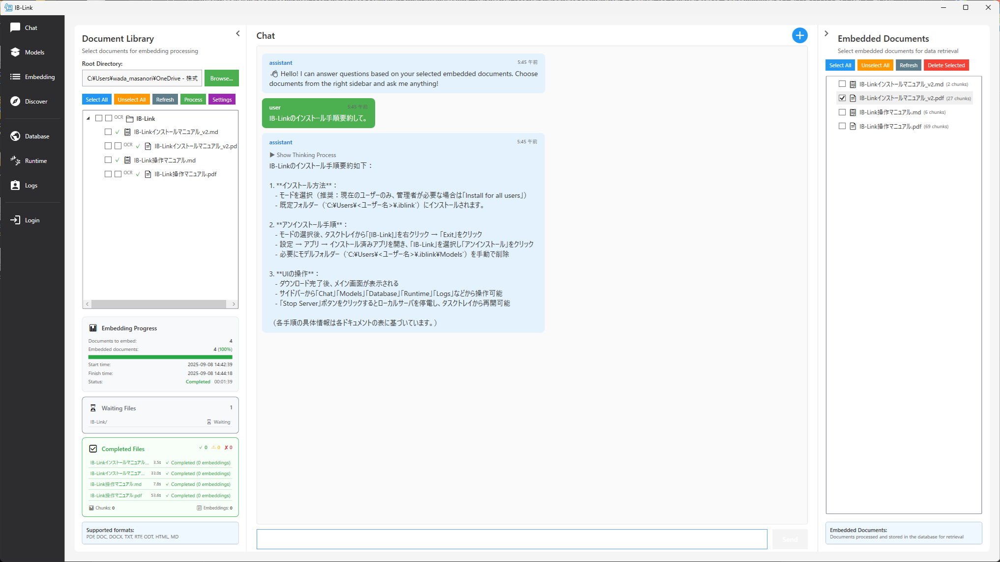

---

### 4.5 データベース

1. Database 画⾯を開く
   左メニューの Database を開きます。
2. データベース接続を設定する
3. 画⾯上部の Setup Database Connection をクリック。
4. 表⽰されたダイアログに接続情報を⼊⼒します（例）
   Host: localhost
   Port: 5432
   Database: iblink
   Username: postgres
   Password: （PostgreSQL のパスワード）
5. Test Connection を押して「Connection successful!」を確認。
6. Setup Database を押して反映。

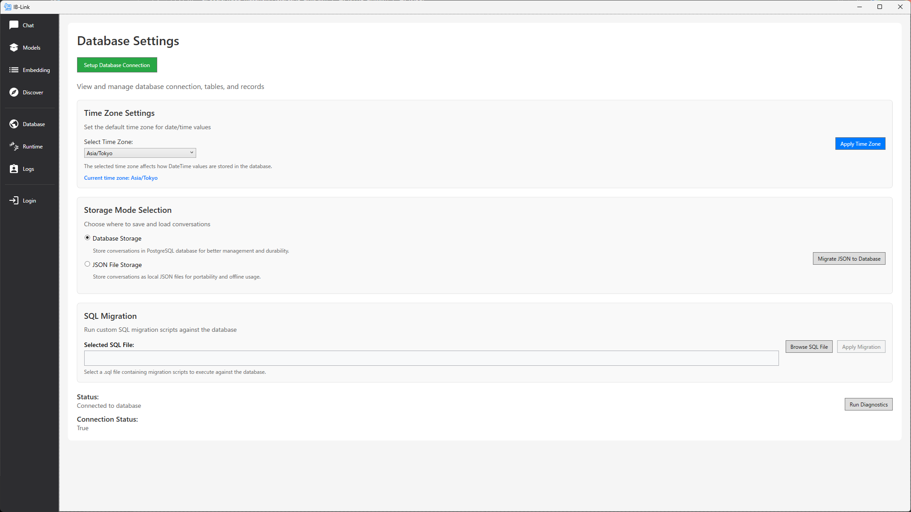

---

接続後、Database Settings 画⾯の Connection Status が True になっていることを確認します。

3. タイムゾーン設定（任意）
4. Time Zone Settings の Select Time Zone で Asia/Tokyo を選択。
5. Apply Time Zone をクリックして保存。
6. ストレージモード選択
   既定は Database Storage（バージョン3はデータベース必須）︓会話データを PostgreSQL に保存。
   JSON File Storage︓ポータビリティ重視のローカル JSON 保存。
   もし JSON から DB に移⾏する場合は Migrate JSON to Database を実⾏。
7. SQL マイグレーション（必要に応じて）

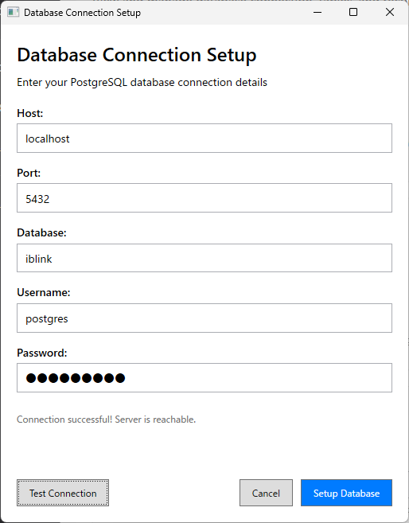

---

1. SQL Migration セクションで Browse SQL File をクリック。
2. 実⾏したい .sql ファイルを選択。
3. Apply Migration を押して適⽤。
4. 診断の実⾏（動作確認）
5. 右下の Run Diagnostics をクリック。
6. Status が Diagnostic completed、Connection Status が True であること、 必要なテーブルが検出され
   ていることを確認します。
   トラブルシューティング（要点）
   接続エラー時︓ホスト名/ポート、ユーザー名/パスワード、DB名の誤り、PostgreSQL 起動状況、
   Firewall を確認。
   マイグレーション失敗時︓エラーメッセージを確認し、DDL/制約（NOT NULL・FK など）や対象テー
   ブルの有無を⾒直す。
   タイムゾーン変更後は、⽇時の保存・表⽰が期待通りかをテストする。

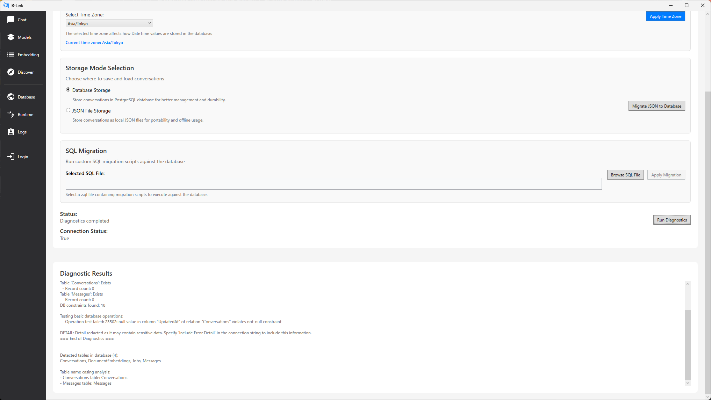

---

### 4.6 API 仕様
Documents API、Retriever API、Audio APIの仕様について記載します。
#### Documents API
概要
Documents API は、ドキュメントの処理、埋め込み（embedding）⽣成、セマンティック検索を提供する
RESTful API サービスです。 ドキュメントを⾮同期で処理し、意味的な類似検索のためのベクトル埋め込みを
⽣成し、包括的なドキュメント管理機能を備えています。
クイックスタート
ベースURL
http://localhost:8500/iblink/v1
コンテンツタイプ
すべてのリクエストには次を含める必要があります:
Content-Type: application/json
基本的な利⽤フロー

1. ドキュメントを処理して埋め込みを作成（POST /documents/process）
2. 処理状況を確認（POST /documents/status）
3. ⾃然⾔語で検索（POST /documents/search）
4. 埋め込みを作成せずに内容を抽出（POST /documents/extract）
   サポートされるファイル形式
   ドキュメント
   Office: .docx, .xlsx, .pptx, .doc, .xls, .ppt
   PDF: .pdf（OCR対応）
   テキスト: .txt, .md, .rtf
   Web: .html, .htm, .xml, .json
   データ: .csv, .ipynb（Jupyter Notebook）
   フィード: .rss, .atom
   画像（OCR対応）
   .jpg, .jpeg, .png, .bmp, .tiff, .tif, .gif, .webp

---

API エンドポイント

1. ドキュメント処理 (⾮同期)
   埋め込みを⾮同期で作成します。システムへのファイル取り込みの主要なエンドポイントです。
   POST /documents/process
   リクエスト例
   {
     "files": [
    "C:/documents/report.pdf",
    {
      "file_path": "C:/images/diagram.png",
      "enable_ocr": true
    }
     ],
     "directories": ["C:/documents/project"],
     "d_app_id": "my-app-123",
     "project_id": "project-456",
     "chunk_size": 500,
     "chunk_overlap": 50,
     "enable_ocr": false,
     "batch_processing": true,
     "duplicate_strategy": "skip",
     "force_update": false
   }
   主要パラメータ説明
   files : ファイルパスまたはファイル設定オブジェクトの配列
   directories : 再帰的に処理するディレクトリ⼀覧
   d_app_id : テナント識別⼦
   project_id : プロジェクト識別⼦
   chunk_size : 埋め込み⽣成時のテキスト分割サイズ
   chunk_overlap : チャンク間の重なり
   enable_ocr : OCRを有効化
   duplicate_strategy : 重複時の動作（skip/update/add/sync）
   レスポンス例（202 Accepted）
   {
     "job_id": "my-app-123_project-456_job_20250129_143022",
     "status": "queued",
     "message": "Document processing job created successfully",

---

"status_url": "/iblink/v1/documents/status",
  "created_at": "2025-01-29T14:30:22Z"
}

2. 処理状況の確認
   ジョブの進捗やキュー状態を確認します。
   POST /documents/status
   リクエスト例
   {
     "status_type": "processing",
     "job_id": "my-app-123_project-456_job_20250129_143022",
     "include_files": true
   }
   主な status_type
   processing : 特定ジョブの進捗
   queue : キューの状態
   quota : リソース使⽤量
   health : サービスの健全性
   dependency : 外部依存の状態
   jobs : すべてのジョブ⼀覧
   レスポンス例（処理中）
   {
     "status_type": "processing",
     "status": "processing",
     "processing": {
    "progress": 45,
    "total_files": 10,
    "processed_files": 4,
    "current_file": "document5.pdf",
    "started_at": "2025-01-29T14:30:23Z",
    "estimated_completion": "2025-01-29T14:35:00Z"
     }
   }
3. ドキュメント検索

---

処理済みのドキュメントを意味的類似度で検索します。
POST /documents/search
リクエスト例
{
  "query": "How to configure authentication in the system?",
  "d_app_id": "my-app-123",
  "project_id": "project-456",
  "directories": ["C:/documents/guides"],
  "limit": 10,
  "similarity_threshold": 0.7
}
レスポンス例
{
  "query": "How to configure authentication in the system?",
  "results": [
    {
      "document_id": "550e8400-e29b-41d4-a716-446655440001",
      "content": "To configure authentication, first navigate to the Settings >
Security section...",
      "similarity_score": 0.92,
      "file_name": "security-guide.pdf",
      "file_path": "C:/documents/guides/security-guide.pdf",
      "page_range": "12-13"
    }
  ],
  "total_results": 2
}

4. コンテンツ抽出
   埋め込みを⽣成せずにテキストを抽出します。
   POST /documents/extract
   リクエスト例

---

{
  "files": [
    "C:/documents/report.pdf",
    {
      "file_path": "C:/images/scan.jpg",
      "enable_ocr": true
    }
  ],
  "d_app_id": "my-app-123",
  "project_id": "project-456",
  "include_metadata": true
}
レスポンス例
{
  "status": "success",
  "extracted_files": [
    {
      "file_name": "report.pdf",
      "content": "Annual Report 2024...",
      "content_length": 8542,
      "metadata": {
        "file_type": ".pdf",
        "file_size": 2048576
      }
    }
  ]
}

5. ドキュメント⼀覧
   処理済みのドキュメントまたはプロジェクトIDの⼀覧を取得します。
   POST /documents/list
   リクエスト例（ドキュメント⼀覧）
   {
     "list_type": "documents",
     "d_app_id": "my-app-123",
     "project_id": "project-456",
     "file_extension": ".pdf"
   }

---

レスポンス例
{
  "documents": [
    {
      "document_id": "550e8400-e29b-41d4-a716-446655440004",
      "file_name": "user-manual.pdf",
      "file_size": 5242880,
      "created_at": "2025-01-28T09:30:00Z"
    }
  ],
  "total_count": 2
}

6. ドキュメント削除
   埋め込み済みのドキュメントを削除します。
   DELETE /documents/delete
   リクエスト例
   {
     "d_app_id": "my-app-123",
     "project_id": "project-456",
     "file_paths": ["C:/documents/old-doc.pdf"],
     "delete_all": false
   }
   レスポンス例
   {
     "status": "success",
     "deleted_count": 3,
     "message": "Successfully deleted 3 document(s) with 45 total embeddings"
   }
7. サービス状態確認
   健康状態チェック

---

{
  "status_type": "health"
}
キュー状態確認
{
  "status_type": "queue",
  "d_app_id": "my-app-123"
}
クオータ確認
{
  "status_type": "quota",
  "d_app_id": "my-app-123"
}

8. API情報取得
   GET /documents/info
   レスポンス例
   {
     "service": "IB-Link Documents API (Standalone)",
     "version": "1.0.0",
     "description": "Enhanced document processing and embedding generation service",
     "supported_file_types": [".pdf", ".txt", ".md", ".docx", ".xlsx", ".pptx", ...],
     "database": { "provider": "PostgreSQL with pgvector" }
   }
   エラーハンドリング
   標準的なエラーレスポンス:
   {
     "error": "エラーの概要",
     "message": "詳細な説明",

---

"timestamp": "2025-01-29T15:20:00Z"
}
よく使われるHTTPステータスコード
200 OK: 成功
202 Accepted: ⾮同期ジョブ作成成功
400 Bad Request: パラメータ不備
404 Not Found: ジョブ/ドキュメントが存在しない
429 Too Many Requests: レート/キュー制限超過
500 Internal Server Error: サーバー内部エラー
503 Service Unavailable: 依存サービスが利⽤不可
507 Insufficient Storage: 容量制限超過
ベストプラクティス
バッチ処理を推奨: 複数ファイルを⼀度に送信
適切なチャンクサイズを選択: ⼩さい⽂書は 300〜500、⼤きい⽂書は 500〜1000
ジョブ状態を定期的に確認: ポーリングを活⽤
OCR は必要な場合のみ有効化: パフォーマンスを最適化
重複戦略を活⽤: 更新時は update、完全同期は sync
統合サンプル
Python
client = DocumentsAPIClient()

result = client.process_documents(
    files=["report.pdf", "guide.docx"],
    d_app_id="my-app",
    project_id="docs"
)
print(f"Processed {result['successful_files']} files successfully")

results = client.search("authentication", "my-app")
for r in results["results"]:
    print(f"Score: {r['similarity_score']} - {r['file_name']}")
Node.js
const client = new DocumentsAPIClient();

const result = await client.processDocuments(
  ['report.pdf', 'guide.docx'],

---

'my-app',
  'docs'
);
console.log(`Processed ${result.successful_files} files successfully`);

const searchResults = await client.search('authentication', 'my-app');
searchResults.results.forEach(r => {
  console.log(`Score: ${r.similarity_score} - ${r.file_name}`);
});
設定例
{
  "ConnectionStrings": {
    "DefaultConnection":
"Host=localhost;Database=iblink_documents;Username=postgres;Password=your_password
"
  },
  "DocumentsApi": {
    "ChunkSize": 500,
    "EnableOcr": true
  },
  "EmbeddingApi": {
    "BaseUrl": "http://localhost:5000",
    "Model": "cl_nagoya_ruri_v3_310m_optimized_onnx"
  }
}
トラブルシューティング
ジョブが進まない場合: ログ確認・依存サービスのヘルスチェック
OCR が動作しない: Tesseract のデータやパスを確認
検索結果が出ない: 埋め込み⽣成が完了しているか確認、しきい値を下げる
容量制限超過: 古いドキュメントを削除または管理者に拡張を依頼
パフォーマンス最適化
10〜50ファイルを⼀括処理すると効率的
OCRは必要なときだけ有効化
低レイテンシの埋め込みAPI接続を確保
結果キャッシュを活⽤
セキュリティ
d_app_id によるマルチテナント分離

---

ディレクトリトラバーサル防⽌、SQLインジェクション対策
データはローカルに保存、外部送信なし（埋め込みAPI先を除く）
サポート
logs/ ディレクトリのアプリログを確認
ステータスエンドポイントで依存状況を確認
提供されている cURL サンプルで動作確認

---

#### Retriever API
概要
Retriever API は、ドキュメントの埋め込み（embedding）を活⽤したセマンティック検索およびドキュメン
ト取得を⾏う独⽴型サービスです。 ベクトルベース検索とハイブリッド検索の両⽅をサポートし、類似度検
索と全⽂検索を統合したインターフェースを提供します。
主な機能
ベクトルセマンティック検索: 埋め込みを使って意味的に類似したドキュメントを検索
ハイブリッド検索: ベクトル類似度と全⽂検索を組み合わせて精度向上
ハイブリッド RRF 検索: Reciprocal Rank Fusion を使って複数のランキング信号を統合
マルチテナント対応: d_app_id と project_id によるデータ分離
ドキュメントフィルタリング: ドキュメント ID やディレクトリパスで絞り込み可能
PostgreSQL + pgvector: 効率的なベクトル演算を実現
アーキテクチャ構成

1. コントローラ層
   RetrieverController (src/IB-Link.RetrieverAPI/Controllers/RetrieverController.cs:13)
   メイン API エンドポイント: POST /iblink/v1/retriever
   ヘルスチェック: GET /iblink/v1/retriever/health
   API 情報: GET /iblink/v1/retriever/info
2. サービス層
   CustomRetrieverService (src/IB-
   Link.RetrieverAPI/Services/CustomRetrieverService.cs:14)
   すべての検索モードのロジックを実装
   DB クエリ管理と結果の整形を担当
   EmbeddingService (src/IB-Link.RetrieverAPI/Services/EmbeddingService.cs:9)
   外部の埋め込み API を使⽤して埋め込みを⽣成
   デフォルトエンドポイント: http://localhost:5000/iblink/v1/embeddings
3. データ層
   RetrieverDbContext (src/IB-Link.RetrieverAPI/Data/RetrieverDbContext.cs:10)
   PostgreSQL + pgvector 拡張を使⽤
   DocumentEmbeddings テーブルを管理
   API エンドポイント
   メイン検索エンドポイント

---

POST /iblink/v1/retriever
ベクトル類似度および/または全⽂検索を⽤いてドキュメント検索を実⾏します。
リクエスト形式
{
  "text": "検索クエリ",
  "d_app_id": "app-123",
  "project_id": "proj-456",
  "limit": 10,
  "search_mode": "vector",
  "files_directories": ["dir1", "dir2"],
  "file_paths": ["/path/to/file1.pdf", "/path/to/file2.txt"],
  "documents_id": ["guid1", "guid2"],
  "vector_weight": 0.7,
  "text_weight": 0.3,
  "rrf_k": 60,
  "enable_phrase_matching": true
}
レスポンス形式
{
  "query": "検索クエリ",
  "d_app_id": "app-123",
  "project_id": "proj-456",
  "total_results": 10,
  "total_unfiltered_results": 150,
  "filtered_directories": ["dir1", "dir2"],
  "filtered_file_paths": ["/path/to/file1.pdf", "/path/to/file2.txt"],
  "results": [
    {
      "id": "uuid-string",
      "text": "ドキュメントの⼀部テキスト...",
      "score": 0.95,
      "metadata": {
        "source": "document.pdf",
        "directory": "/path/to/docs",
        "file_path": "/full/path/to/document.pdf",
        "chunk_index": 5,
        "page_range": "10-12",
        "start_page": 10,
        "end_page": 12,
        "chunk_category": "PDF",
        "document_id": "doc-uuid",
        "vector_score": 0.95,
        "text_score": 0.8,
        "text_rank": 1.0
      }

---

}
  ]
}
ヘルスチェックエンドポイント
GET /iblink/v1/retriever/health
API と依存サービスの稼働状況を返します。
{
  "status": "healthy",
  "timestamp": "2024-01-15T10:30:00Z",
  "service": "retriever-api",
  "version": "1.0.0",
  "port": 6500,
  "dependencies": {
    "database": {
      "status": "healthy",
      "message": "Database connection healthy"
    },
    "embeddingApi": {
      "status": "healthy",
      "message": "Embedding API available",
      "url": "http://localhost:5000"
    }
  }
}
情報エンドポイント
GET /iblink/v1/retriever/info
API の構成情報を返します。
検索モード

1. ベクトル検索（デフォルト）
   クエリとドキュメントの埋め込み間のコサイン類似度を使⽤
   ⾔い換えや類義語にも強い
2. ハイブリッド検索
   ベクトル類似度と全⽂検索を組み合わせ
   スコア: 最終スコア = (vector_score * vector_weight) + (text_score * text_weight)
   デフォルト重み: ベクトル70％、テキスト30％
3. ハイブリッド RRF 検索

---

Reciprocal Rank Fusion による順位融合
式: RRF_score = 1/(k + vector_rank) + 1/(k + text_rank)
デフォルト k=60
SQL クエリ例
ベクトル検索クエリ
ハイブリッド検索（重み付き）
ハイブリッド RRF 検索
（※元のドキュメントの SQL サンプルを⽇本語コメント付きでそのまま保持）
テキスト検索処理
フレーズマッチング: 単語間の近接検索や接頭辞検索をサポート
標準検索: 単語間を AND で接続し、接頭辞マッチを適⽤
データベーススキーマ
DocumentEmbeddings テーブルの列構成（Id, Content, Embedding, FileName, FilePath, …）
pgvector によるベクトルインデックス利⽤
埋め込み API 連携
リクエスト/レスポンス形式例
OpenAI の text-embedding-ada-002 をデフォルト利⽤可能
設定
appsettings.json の設定例
環境変数でポートや DB 接続を上書き可能
エラーハンドリング
エラー JSON の形式
エラー種別（invalid_request_error / service_unavailable など）
コード例（missing_parameter / database_unavailable など）
パフォーマンス考慮点

1. pgvector によるベクトルインデックス最適化
2. ハイブリッド検索で内部的に 3 倍の候補を取得
3. スコア閾値で低品質マッチを除外
4. EF Core 接続プール
5. 埋め込みのキャッシュ推奨
   セキュリティ機能
6. マルチテナントによるデータ分離
7. パラメータ化クエリで SQL インジェクション防⽌

---

3. ⼊⼒バリデーション
4. エラー時に機密情報を⾮表⽰
5. ログのサニタイズ
   テスト⽤ページ
   /wwwroot/test.html – 基本検索テスト
   /wwwroot/test-hybrid.html – ハイブリッド検索テスト
   デプロイメント要件
   デフォルトポート 6500
   PostgreSQL（pgvector 拡張付き）必須
   埋め込み API へのアクセス
   .NET ランタイム環境

---

#### Audio API
概要
Audio API Server は、OpenAI 互換の⾳声⽂字起こし（Transcription）API を提供し、 リアルタイムストリ
ーミング機能を追加したサーバーです。 Snapdragon NPU による⾼速化をサポートしつつ、CPU フォールバ
ックにも対応しています。
ベースURL
http://localhost:8000
認証
デフォルトでは認証は不要です。 API キー認証を有効にするには、.env ファイルに API_KEY を設定しま
す。
エンドポイント

1. ヘルスチェック
   GET /health
   サーバーが稼働しているかを確認します。
   レスポンス例
   {
     "status": "healthy",
     "timestamp": "2025-01-08T12:00:00Z"
   }
2. サーバーステータス
   GET /status
   サーバーの詳細な稼働状況と設定を取得します。
   レスポンス例
   {
     "status": "running",
     "uptime": 3600,

---

"total_requests": 150,
  "active_connections": 2,
  "config": {
    "model": "whisper-large-v3-turbo",
    "npu_enabled": true,
    "target_runtime": "qnn_dlc"
  }
}

3. ⾳声⽂字起こし（OpenAI 互換）
   POST /v1/audio/transcriptions
   ⾳声をテキストに変換します。
   リクエスト:
   メソッド: POST
   Content-Type: multipart/form-data
   パラメータ
   パラメータ
   型
   必須
   説明
   file
   file
   はい
   ⾳声ファイル（WAV, MP3, M4A など）
   model
   string
   いいえ
   モデル名（デフォルト: whisper-large-v3-turbo）
   language
   string
   いいえ
   ⾔語コード（例: "en", "ja"）または "auto"
   response_format
   string
   いいえ
   出⼒形式: "json", "text", "srt", "vtt", "verbose_json"
   prompt
   string
   いいえ
   モデルに指⽰を与えるオプションのプロンプト
   temperature
   float
   いいえ
   サンプリング温度 (0.0-1.0)
   リクエスト例
   curl -X POST http://localhost:8000/v1/audio/transcriptions \
     -F "file=@audio.wav" \
     -F "model=whisper-large-v3-turbo" \
     -F "response_format=verbose_json"
   レスポンス例（verbose_json）
   {
     "task": "transcribe",
     "language": "en",
     "duration": 30.0,

---

"text": "This is the transcribed text...",
  "segments": [
    {
      "id": 0,
      "seek": 0,
      "start": 0.0,
      "end": 5.0,
      "text": "This is the transcribed text",
      "tokens": [50364, 1668, 307, 264, 1145, 17820, 2078],
      "temperature": 0.0,
      "avg_logprob": -0.25,
      "compression_ratio": 1.2,
      "no_speech_prob": 0.01
    }
  ]
}
レスポンス例（json）
{
  "text": "This is the transcribed text..."
}
レスポンス例（text）
This is the transcribed text...

4. ⾳声翻訳
   POST /v1/audio/translations
   ⾳声を英語テキストに翻訳します。 リクエスト形式は⽂字起こしと同じです。 レスポンスも同様ですが、結
   果のテキストが英語になります。
5. WebSocket ストリーミング
   WS /v1/audio/stream
   リアルタイムで⾳声をストリーミングしながら⽂字起こしします。
   接続例
   const ws = new WebSocket('ws://localhost:8000/v1/audio/stream');

---

プロトコル

1. 設定を送信（JSON）
   {
     "model": "whisper-large-v3-turbo",
     "language": "auto",
     "response_format": "json"
   }
2. ⾳声データを送信（バイナリ）
   16kHz / 16bit / モノラルの PCM
   またはファイルのチャンクを送信
3. ⽂字起こし結果を受信（JSON）
   部分結果（partial）
   {
     "type": "partial",
     "text": "This is being transcribed",
     "timestamp": 1704715200,
     "segment_id": 0
   }
   最終結果（final）
   {
     "type": "final",
     "text": "This is being transcribed in real time.",
     "timestamp": 1704715205,
     "segment_id": 0,
     "segments": [...]
   }
   クライアント例
   const ws = new WebSocket('ws://localhost:8000/v1/audio/stream');

ws.onopen = () => {
  ws.send(JSON.stringify({
    model: 'whisper-large-v3-turbo',
    language: 'auto'
  }));
  streamAudioChunks(ws);

---

};

ws.onmessage = (event) => {
  const result = JSON.parse(event.data);
  console.log('Transcription:', result.text);
};

6. リアルタイム⾳声⼊⼒（マイク）
   WS /v1/audio/realtime
   マイク⼊⼒からリアルタイムで⽂字起こしします。
   プロトコル
7. 接続時の設定
   {
     "action": "start",
     "config": {
    "language": "auto",
    "vad_enabled": true,
    "energy_threshold": 1000
     }
   }
8. 制御コマンド
   {"action": "pause"}
   {"action": "resume"}
   {"action": "stop"}
9. 結果の受信
   {
     "type": "transcription",
     "text": "Hello, this is real-time transcription",
     "is_final": true,
     "confidence": 0.95,
     "timestamp": 1704715200
   }
   エラーハンドリング

---

エラーレスポンス形式
{
  "error": {
    "message": "エラー説明",
    "type": "error_type",
    "code": "ERROR_CODE"
  }
}
⼀般的なエラーコード
コード
HTTP ステータス
説明
INVALID_AUDIO
400
無効または破損した⾳声ファイル
FILE_TOO_LARGE
413
ファイルサイズが上限を超過
UNSUPPORTED_FORMAT
415
⾮対応の⾳声形式
MODEL_NOT_FOUND
404
指定モデルが存在しない
NPU_ERROR
500
NPU 処理失敗（CPU フォールバックあり）
TIMEOUT
408
リクエストタイムアウト
レート制限
デフォルト設定（変更可能）:
1分あたり 100 リクエスト / IP
同時接続 10 / IP
最⼤ファイルサイズ 100MB
レスポンスフォーマット
SRT 形式
1
00:00:00,000 --> 00:00:05,000
This is the first subtitle.

2
00:00:05,000 --> 00:00:10,000
This is the second subtitle.
VTT 形式

---

WEBVTT

00:00:00.000 --> 00:00:05.000
This is the first subtitle.

00:00:05.000 --> 00:00:10.000
This is the second subtitle.
クライアント実装例
Python
import requests

with open("audio.wav", "rb") as f:
    response = requests.post(
        "http://localhost:8000/v1/audio/transcriptions",
        files={"file": f},
        data={"model": "whisper-large-v3-turbo"}
    )
    print(response.json()["text"])
JavaScript / Node.js
const FormData = require('form-data');
const fs = require('fs');
const axios = require('axios');

const form = new FormData();
form.append('file', fs.createReadStream('audio.wav'));
form.append('model', 'whisper-large-v3-turbo');

axios.post('http://localhost:8000/v1/audio/transcriptions', form)
  .then(response => console.log(response.data.text));
cURL
curl -X POST http://localhost:8000/v1/audio/transcriptions \
  -H "Content-Type: multipart/form-data" \
  -F "file=@audio.wav" \
  -F "model=whisper-large-v3-turbo" \
  -F "response_format=json"

---

パフォーマンス向上のヒント

1. NPU 加速を利⽤すると 5〜10倍⾼速化
2. ⻑い⾳声は 30 秒ごとに分割すると最適化可能
3. VAD（Voice Activity Detection）を有効化して無⾳部分をスキップ
4. 適切な精度設定を選択︓NPU では w8a8、CPU では float32
5. 単⼀ワーカープロセスで NPU の競合を回避
6. ストリーミングを活⽤してリアルタイム⽤途に最適化
   OpenAI 互換性
   この API は OpenAI の Whisper API と互換性があり、既存のクライアントを簡単に置き換えることができま
   す。

# OpenAI クライアント（従来）

from openai import OpenAI
client = OpenAI(api_key="...")
transcription = client.audio.transcriptions.create(
  model="whisper-1",
  file=audio_file
)

# この API を利⽤する場合

client = OpenAI(
  api_key="not-needed",
  base_url="http://localhost:8000/v1"
)
transcription = client.audio.transcriptions.create(
  model="whisper-large-v3-turbo",
  file=audio_file
)
© 2025 IB-Link / J-AIC 本ドキュメントの無断転載を禁じます。

---