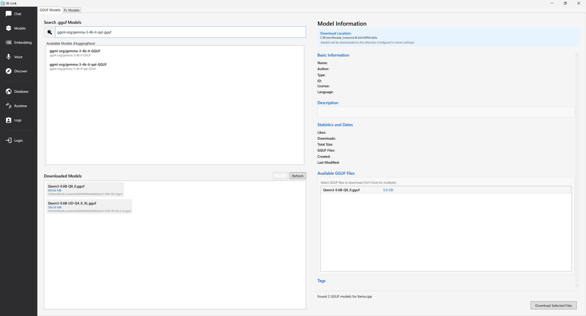
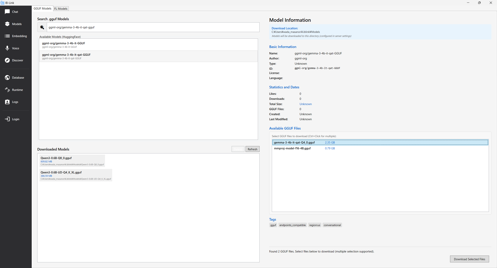
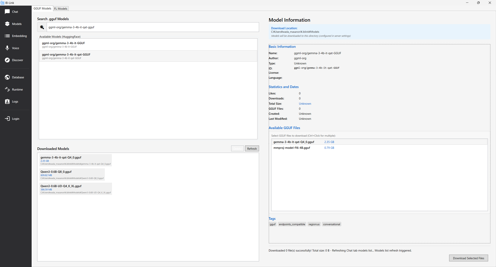
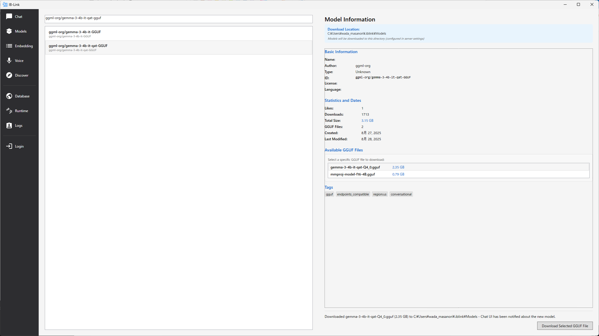
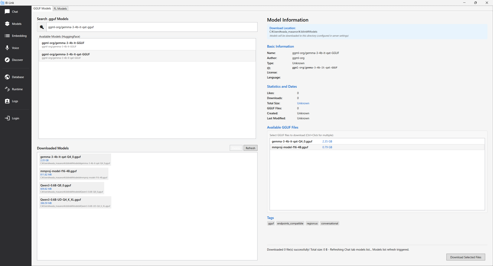
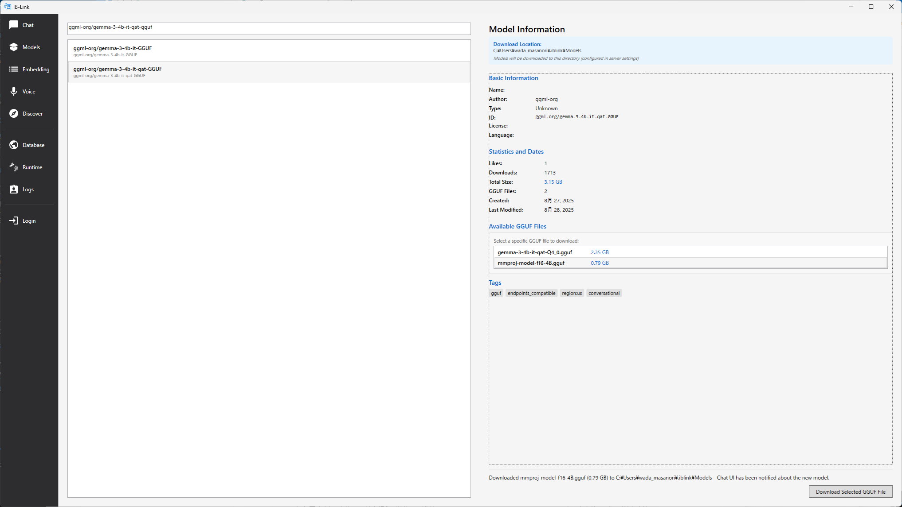
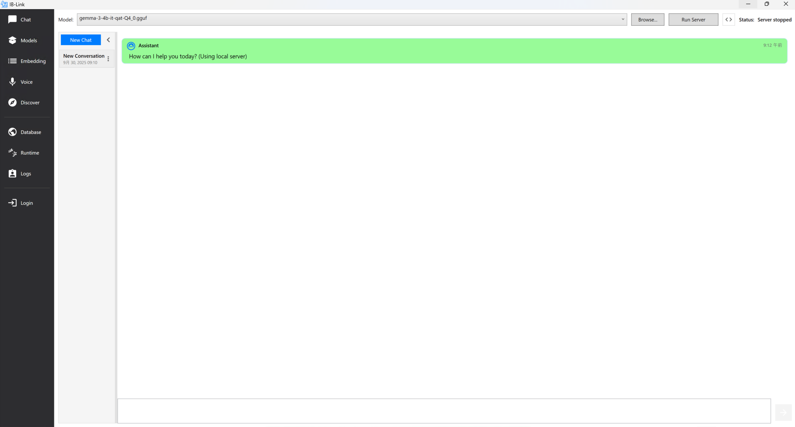
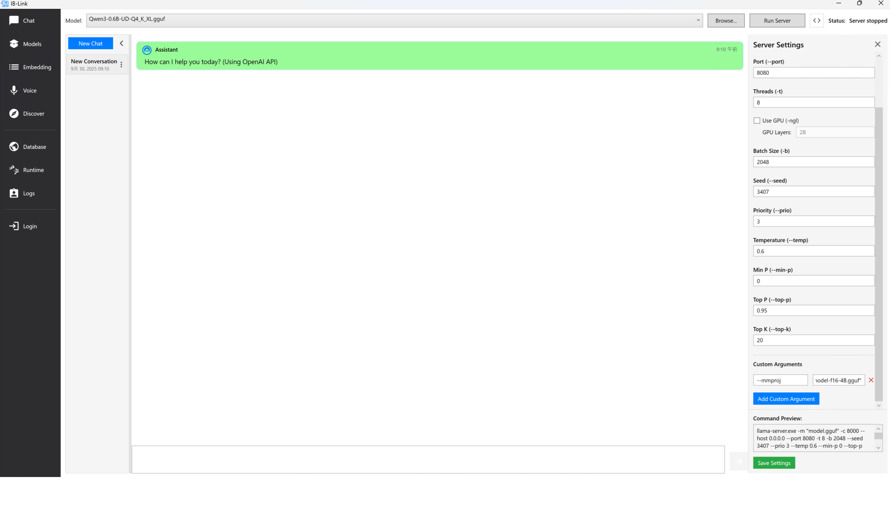
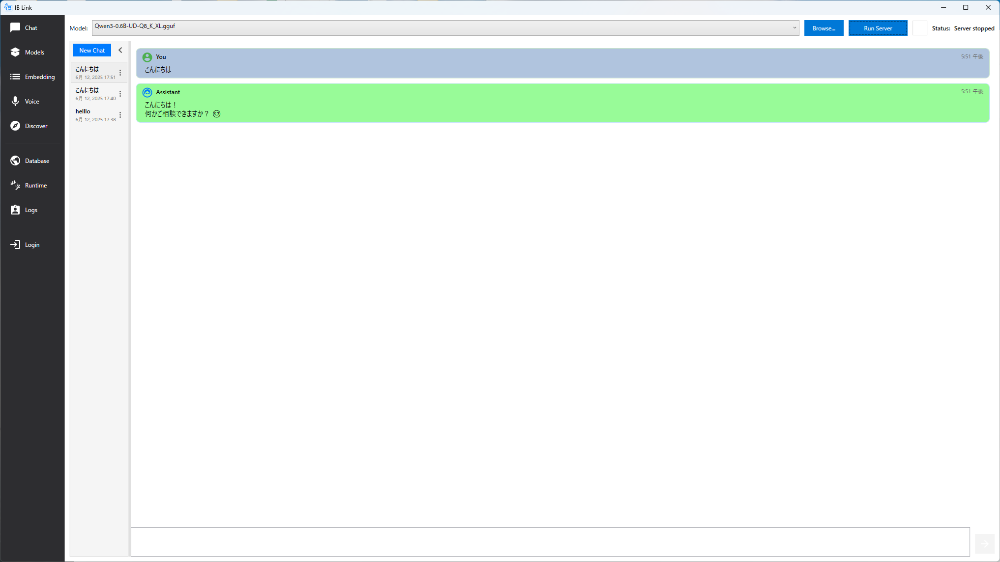
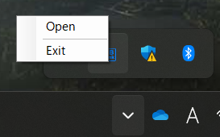

# IB-Link 操作マニュアル
## 更新履歴
2026/03/23 UI画面スクリーンショット更新、ドキュメント修正
2026/02/13 推奨モデル追記
2026/01/29 バージョン4.0対応  
2025/12/12 モデル切り替えAPI追記  
2025/11/21 モデル操作修正  
2025/11/17 Document API利用フロー追記およびRuntime設定修正  
2025/11/11 Chat APIおよび補足追記  
2025/09/30 バージョン3.0対応  
2025/09/09 バージョン2.0対応  
2025/07/15 「IB-Link」表記修正  
2025/06/25 「利⽤者向け機能」「開発者向け機能」章分け  
2025/06/18  初版  

## ⽬次

1. システム概要
2. 機能概要
3. 利⽤者向け機能
   3.1. モデル操作
   3.2. サービス
   3.3. マルチモーダルモデル
   3.4. IB-Link 停⽌⼿順
   3.5. セットアップ
4. 開発者向け機能
   4.1. チャットの使い⽅
   4.2. Runtime（ランタイム）設定
   4.3. Logs機能
   4.4. ドキュメント埋め込み
   4.5. Voice（音声文字起こし）
   4.6. Documents API
   4.7. Retriever API
   4.8. Audio API
   4.9. AudioNPU API
   4.10. Embeddings API
   4.11. LlamaServer API
   4.12. FoundryLocal API
   4.13. LLM推論エンドポイント
   4.14. 音声管理エンドポイント
   4.15. 7000/realtime（SignalR / WebSocket）
## 1.システム概要
   ⼤規模⾔語モデル（LLM）をPC上で実⾏・実験できるLLM利⽤アプリケーションです。
## 2.機能概要
   利⽤者向け機能と開発者向け機能が⽤意されています。
   利⽤者向け機能 （D-アプリをご利⽤いただくための機能になります。）
   モデル操作
   サービス
   ディスカバー（未実装）
   ログイン（未実装）
   セットアップ
   開発者向け機能
   チャット
   ドキュメント埋め込み機能
   Voice（⾳声⽂字起こし）
   Runtime(ランタイム)設定
   ログ操作


## 3.利⽤者向け機能
### 3.1 モデル操作
#### 3.1.1 GGUF形式のLLMモデル操作
「Models」タブでは、利⽤するGGUF形式のLLMモデルを検索・選択・ダウンロードできます。
初期状態 デフォルトのモデルが選択され、使⽤可能な状態になっています。
最適なモデル選定 速度重視の軽量モデル／精度重視の⼤型モデルを簡単に切り替え、⽤途に合った
LLMを試せます。
モデルバージョン管理 旧版も併存させて⽐較しながら検証できるので、アップグレード判定がスムー
ズ。

1. 「GGUF Models」タブをクリックすると、モデル管理画⾯が表⽰されます。
   右側にモデルの詳細情報が表⽰されます。
   モデルは C:\Users\<ユーザー名>\.iblink\Models に保存されます。

2. モデルを検索する
   上部の検索バーにモデル名を⼊⼒すると、該当する候補が⼀覧に表⽰されます。
   例︓Qwen3-0.6B と⼊⼒すると、該当するGGUFモデルがリストに出てきます。
   絞り込み可能です（部分⼀致）。

3. 任意のモデルをクリックすると、右側にモデル情報が表⽰されます。
   作成者、種類、ファイルサイズ、作成⽇、最終更新⽇などが確認可能です。
   モデルに関連するタグ（例：gguf）も表示されます。
   複数のGGUFファイルがある場合、それぞれ選択できます。

4. 「Available GGUF Files」からダウンロードするファイルを選び、「Download Selected Files」ボタンをクリックします。
   ダウンロードの進捗が画⾯下に表⽰されます（例︓10.9%）。
   ダウンロード中に「Cancel」ボタンをクリックすると、ダウンロードを中止できます。
   複数ファイルがある場合は、任意の精度（例︓q5_k, q8_0など）を選択できます。

5. ダウンロード完了メッセージ
   ダウンロードが完了すると、Downloaded Modelsにモデルが表示されます。
   保存先︓C:\Users\<ユーザー名>\.iblink\Models
   チャット画⾯でモデルが使⽤可能になります。
   ダウンロード後にモデルが表示されない場合は、「Refresh」ボタンをクリックしてダウンロード済みモデルの一覧を更新してください。

6. モデルの削除は、「Downloaded Models」の削除対象のモデルを選択し、「Delete」をクリックします。
  OKをクリックすると削除されます。


---
#### 3.1.2 Foundry LocalのLLMモデル操作　（Intel版は本機能がございません）
「FL Models」タブでは、Foundry Localのモデルを管理できます。GGUF Modelsとは異なり、検索機能はありません。

1. FL Modelsタブを開く
   利用可能なモデルの一覧が表示されます。「Refresh Models」をクリックするとモデル一覧を更新できます。
   以下のフィルターでモデルを絞り込むことができます。
   - **Device**: ALL / CPU / NPU でデバイス別にフィルタリングできます。
   - **Task**: タスク種別（例：chat-completion）でフィルタリングできます。
   - **Max Size**: モデルの最大サイズでフィルタリングできます。

2. モデルのダウンロード
   利用可能なモデルを選択し、画面右下の「Download Model」ボタンをクリックするとダウンロードが開始されます。
   ダウンロード中は進捗バーが表示され、「Cancel」ボタンでダウンロードを中止できます。
   ダウンロード済みのモデルには「Downloaded」タグが表示されます。

3. ダウンロードが完了すると、「Downloaded Models」セクションにモデルが表示されます。
   モデルをクリックすると、モデル名、モデルID、デバイス、タスク、ファイルサイズの詳細が確認できます。

4. モデルの削除は、「Downloaded Models」に表示されているモデルから対象を選択します。

5. 「Delete Models」をクリックします。


---
#### 3.1.3 推奨モデル（Intel版）
Intel版で利用できる推奨モデルを以下に示します。

##### 1. unsloth/Qwen3-VL-2B-Instruct-1M-GGUF ※マルチモーダル
画像とテキストの両方を理解できるマルチモーダルモデルです。  

**推奨ファイル:**
- モデル: `Qwen3-VL-2B-Instruct-1M-UD-Q5_K_XL.gguf`
- Visionエンコーダー: `mmproj-F16.gguf`

##### 2. unsloth/Qwen3-VL-2B-Thinking-1M-GGUF
思考プロセスを重視したモデルです。複雑な推論タスクに適しています。

**推奨ファイル:**
- モデル: `Qwen3-VL-2B-Thinking-1M-UD-Q5_K_XL.gguf`

##### 3. LiquidAI/LFM2.5-1.2B-JP-GGUF
日本語に特化した軽量モデルです。日本語タスクで高い性能を発揮します。

**推奨ファイル:**
- モデル: `LFM2.5-1.2B-JP-Q6_K.gguf`

##### 4. mradermacher/shisa-v2.1-lfm2-1.2b-GGUF
日本語と英語の両方に対応したモデルです。

**推奨ファイル:**
- モデル: `shisa-v2.1-lfm2-1.2b.Q6_K.gguf`

##### 5. unsloth/Qwen3-4B-Instruct-2507-GGUF
汎用的な指示実行タスクに適した4Bパラメータモデルです。

**推奨ファイル:**
- モデル: `Qwen3-4B-Instruct-2507-UD-Q4_K_XL.gguf`

---

#### 3.1.4 推奨モデル（Qualcomm版）
Qualcomm版で利用できる推奨モデルを以下に示します。

##### 1. unsloth/Qwen3-0.6B-GGUF     
軽量で扱いやすいモデルです。高精度な量子化で性能を保ちます。

**推奨ファイル:**
- モデル: `Qwen3-0.6B-UD-Q8_K_XL.gguf`

##### 2. ggml-org/gemma-3-4b-it-qat-gguf ※マルチモーダル   
画像とテキストの両方を理解できるマルチモーダルモデルです。 

**推奨ファイル:**
- モデル: `gemma-3-4b-it-qat-Q4_0.gguf`
- Visionエンコーダー: `mmproj-model-f16-4B.gguf`

---
### 3.2 サービス
「Service」サブメニューでは、LLMサーバーとAudioサーバーの管理を行います。「LLM Server」と「Audio Server」の2つのタブがあります。

#### 3.2.1 LLM Server
##### サーバーステータス
サーバーの実行状態が表示されます。「Run Server」または「Stop Server」ボタンでサーバーの起動・停止を操作できます。

##### モデル選択
ダウンロード済みのモデルバイナリを選択できます。「Browse」ボタンでモデルファイルの場所を参照・追加できます。また、ドロップダウンからダウンロード済みのローカルモデル一覧を選択することもできます。

##### サーバー設定
コンテキストサイズ、ホスト、ポート、スレッド数などのサーバー設定を構成できます。「Add Custom Argument」ボタンでカスタム引数を追加できます。設定を変更した後、「Save Settings」ボタンで保存します。「Command Preview」で、サーバーに渡されるパラメータを確認できます。

#### 3.2.2 Audio Server
Audio Whisperサーバーの起動・停止を操作できます。サーバーのステータスとAudioサーバーの情報が表示されます。


---
### 3.3 マルチモーダルモデル
マルチモーダルモデルを使⽤する⼿順を記載します。

> **補足:** 以下の手順は `ggml-org/gemma-3-4b-it-qat-gguf` を例に説明していますが、Intel版の推奨マルチモーダルモデル `unsloth/Qwen3-VL-2B-Instruct-1M-GGUF`（3.1.3 参照）でも同じ手順で利用できます。その場合、モデルファイル名を `Qwen3-VL-2B-Instruct-1M-UD-Q5_K_XL.gguf`、Visionエンコーダーを `mmproj-F16.gguf` に読み替えてください。

1. Models でモデルを検索
   左側サイドバーで Models を開き、検索ボックスに次を⼊⼒します。
   ggml-org/gemma-3-4b-it-qat-gguf
2. リポジトリを選択して内容を確認  
   検索結果から ggml-org/gemma-3-4b-it-qat-gguf を選択します。右側の Model Information に基本情報と利⽤可能な GGUF ファイルが表⽰されます。  
   Available GGUF Files に以下の 2 つが⾒えることを確認します。
   gemma-3-4b-it-qat-Q4_0.gguf（約 2.35GB）
   mmproj-model-f16-4B.gguf（約 0.79GB）





---


3. Gemma 本体（Q4_0）をダウンロード  
   gemma-3-4b-it-qat-Q4_0.gguf を選択し、右下の「Download Selected Files」をクリック。進捗が下部に表⽰されます。  
   ダウンロード完了メッセージが出るまで待ちます。








---


4. mmproj（投影モデル）をダウンロード  
   続けて mmproj-model-f16-4B.gguf を選択して同様にダウンロードします。
   完了を確認します。








---


5. ローカルサーバーを停⽌  
   左側サイドバーで Chat を開きます。 右上の Stop Server をクリックしてサーバーを停止します。ステータスが Server stopped になることを確認します。  
   上部の Model ドロップダウンから gemma-3-4b-it-qat-Q4_0.gguf を選択します。  
   <>アイコンを押下して、詳細設定ページを開きます。
   Custom Arguments に mmproj を追加します︓








---


   追加ボタン（Add Custom Argument）を押し、名前に --mmproj、値に C:\Users\<ユーザー名>\.iblink\Models\mmproj-model-f16-4B.gguf を⼊⼒します。
   （モデルと同じディレクトリにある前提・相対指定が可能です）
   「Save Settings」をクリックします。
   プレビュー（Command Preview）に --mmproj "mmproj-model-f16-4B.gguf" が含まれていることを確認します。  

6. ローカルサーバーを起動
   右上の Run Server をクリックしてサーバーを起動します。ステータスが Server running になったら、下部
   の⼊⼒欄からチャットを開始できます。
7. D-Appを再起動してください。
   うまくいかないときは、モデルが⾒つからない/読み込めないDownload Location（…\.iblink\Models）にファイルがあるか確認します。  
   モデル名の拡張⼦が .gguf で⼀致しているか確認します。  
   mmproj が効いていない  
   Custom Arguments に --mmproj mmproj-model-f16-4B.gguf が⼊っているか、Command Preview に反映されているか確認します。  





---


### 3.4 IB-Link 停⽌⼿順

1. IB-Linkが起動中であることを確認
   左側サイドバーで「Service」を開き、「LLM Server」タブの Server Status が「Running」になっていることを確認します。
2. 「Stop Server」ボタンをクリック
   「Stop Server」ボタンをクリックして、ローカルサーバを停⽌します。


---

3. IB-Link停⽌を確認
   Server Status が「Ready」（赤丸）に変わっていることを確認します。  
4. タスクトレイから IB-Link を終了（必要に応じて）  
   タスクバーのトレイアイコンから IB-Link を右クリックし、Exit を選択します。  








### 3.5 セットアップ
「Setup」サブメニューでは、IB-Linkの初期化状態の確認と再初期化、データベース設定、および設定のインポートを行うことができます。

#### セットアップステータス
画面上部にセットアップの進行状況がステップごとに表示されます。各ステップの状態（Done / In Progress / Error）が確認できます。
- **Prerequisites** — 前提条件の確認
- **Foundry** — Foundry Localのセットアップ
- **Database** — データベースのセットアップ
- **App Setup** — アプリケーションのセットアップ
- **Whisper** — Whisperモデルのセットアップ
- **Models** — モデルのセットアップ
- **Finalize** — 最終処理

すべてのステップが完了すると「Initialization Complete — All selected setup tasks have been completed.」と表示され、進捗バーが100%になります。

#### 再初期化（Re-run Initialization Steps）
初回起動（初期化）が途中で失敗した場合、失敗したステップのみを選択して再実行できます。

1. 画面下部の「Activity Log」で失敗理由（ネットワークエラー、依存関係の導入失敗など）を確認します。
2. 「Re-run Initialization Steps」で、再実行したいステップにチェックを入れます（Prerequisites、FoundryLocal、Database、App Setup、Whisper、Models、Finalize）。
3. 「Re-initialize Selected」をクリックして再実行します。
4. 実行中はステップが「In Progress」になり、進捗とログが更新されます。完了すると「Done」（緑のチェック）になります。

##### ネットワークエラー（Prerequisites）が出る場合
依存コンポーネント（例：Visual C++ Redistributable）の取得でネットワークが必要になる場合があります。
- 「Network Connection Required」の警告が表示されたら、ネットワーク接続を確認し「Retry」をクリックします。
- 繰り返し失敗する場合は、警告内に表示されるダウンロードURLから手動導入し、再度「Retry」をクリックします。

##### 再実行がうまくいかない場合の確認ポイント
- **ログ確認**: 「Activity Log」を確認し、失敗要因を切り分けます。ログファイル: `C:\Users\<ユーザー名>\.iblink\logs\initialization_*.log`
- **ネットワーク**: 企業プロキシ／FW 環境では外部取得がブロックされることがあります。必要に応じて手動導入後に再実行します。
- **権限**: 依存導入で管理者権限が必要になることがあります。
- **ディスク容量**: 「Models」再実行はモデル取得で容量が必要です。

#### Database Settings
- **Time Zone Settings** — タイムゾーンをドロップダウンから選択し（例：Asia/Tokyo）、「Apply」ボタンで適用します。データベースにおけるDateTime値の保存方法に影響します。
- **Database Actions** — 「Setup / Fix Database Connection」ボタンでデータベース接続のセットアップまたは修復を行います。「Run Diagnostics」ボタンで診断を実行できます。接続状態（例：Connected to PostgreSQL database）が表示されます。

##### Database Connection Setup（接続設定）
「Setup / Fix Database Connection」をクリックすると、Database Connection Setup画面が表示されます。以下の接続情報を入力します。

- **Host**: `localhost`
- **Port**: `5432`
- **Database**: データベース名
- **Username**: `postgres`
- **Password**: PostgreSQL のパスワード

入力後、「Test Connection」をクリックして接続テストを実行します。「Connection successful! Server is reachable.」と表示されれば接続成功です。

接続テスト成功後、DB作成／初期化が必要な場合は「Setup Database」をクリックします。既存DBに接続するだけの運用では不要な場合があります。

#### Import Configuration
TOML設定ファイル（appsettings.toml）からランタイム設定をインポートできます。「Browse」ボタンでファイルを選択し、「Apply」ボタンで適用します。

#### Activity Log
画面下部にアクティビティログが表示されます。「Save Log」でログをファイルに保存、「Clear」でログ表示をクリアできます。


---

## 4. 開発者向け機能
### 4.1 チャットの使い⽅
「Chat」サブメニューでは、モデル名とサーバーステータスが表示されます。会話履歴が一覧表示され、会話をクリックすると過去のチャットを読み込んで続けることができます。各会話の三点アイコン（⋮）をクリックすると、会話の名前変更、削除、またはファイルエクスプローラーでチャット履歴を表示することができます。

1. チャットの新規作成
   左上の New Chat ボタンをクリックすると、新しい会話が作成されます。

2. メッセージの⼊⼒と送信
   下部のテキストボックスにメッセージを⼊⼒し、右側の⻘い⽮印ボタンをクリックして送信します。

3. 応答の確認
   アシスタントの返信が緑⾊の背景で表⽰されます。


---


### 4.2 Runtime 設定
Runtime タブでは、ローカルモデルの実⾏に必要な Llamaサーバー設定 と API設定 を構成できます。
初期状態 デフォルトの Llama が選択され、使⽤可能な状態になっています。
ハードウェアに合わせた最適化 ⾃PCの命令セットに合う Llama バイナリを選ぶことで推論速度を最⼤化できます。 
Embedding APIも利用可能です。

#### 4.2.1 Llama Server タブ
ローカル実⾏⽤ Llama サーバーの .exe 実⾏パスを指定し、任意のバージョンを選択またはダウンロードできます。

1. llama-server.exe を指定
   Browse ボタンで任意のバイナリファイルを選択
2. Select from Downloaded Servers から⾃動抽出されたバージョンを選択するとそのパスが有効になります。
3. 必要に応じて Release Tag と Zip File Name を⼊⼒し、バイナリをダウンロードします。  
   例: b5085, llama-b5085-bin-win-avx2-x64


---

#### 4.2.2 Embeddings API タブ
Embeddings APIタブでは、Hugging FaceからONNX埋め込みモデルをダウンロードして管理できます。

1. **Current Loaded Repository** — 現在読み込まれているリポジトリが表示されます。
2. **Model Settings** — 高度なカスタムファイルパスを設定できます。
3. **Downloaded Models** — ダウンロード済みのモデル一覧が表示され、使用するモデルを選択できます。
4. **Refresh** — ダウンロード済みモデルの一覧を更新するボタンです。
5. **Log Window** — 操作に関連するログが表示されます。


---

### 4.3 Logs機能

#### Server Logs の確認
上部タブから Server Logs を選択します。
アプリ起動時の状態、モデルロード、OCR設定、バックグラウンドサービスの状態などが時系列で表⽰されます。
例: APIキーの読込、ローカルサーバの起動、OCR対象ディレクトリ数、エラー/警告 等。


#### API Logs の確認
上部タブから API Logs を選択します。すべてのAPIログを⼀覧で確認できます。

##### API の絞り込み（Filter API）
1. 画⾯上部の Filter API ドロップダウンをクリックします。
2. All / Documents API / Embeddings API / Retriever API / Audio API などから対象を選択します。

- **Documents API** を選択すると、ドキュメント処理（OCR、分割、チャンク数、進捗％、成功/失敗件数、ストレージ使⽤量など）の詳細が確認できます。例:「Processed file」「Strategy: Sync」「Chunks」「Progress」「Succeeded/Failed」 などの⾏で処理結果を確認できます。
- **Embeddings API** を選択すると、トークン化、推論時間、バッチサイズ、メモリ使⽤量、⽣成された埋め込み数などが確認できます。
- **Retriever API** を選択すると、問い合わせテキストに対する埋め込み⽣成、RDBクエリ（例: SELECT COUNT(*) FROM "DocumentEmbeddings"）実⾏、応答時間（ms）などが確認できます。


#### Chat History の確認
上部タブから Chat History を選択します。チャット履歴が表示され、内容をコピーして利用することができます。


#### 共通操作（⾃動スクロール・差分のみ・保存/クリア）
- **Auto-scroll**: 新しいログが出ると⾃動で末尾へ追従します。⻑時間の監視に便利です。
- **Changes Only**: 変化のある⾏だけを表⽰してノイズを減らします。
- **Status**: 現在の稼働状態（例: Running (Healthy) (Standalone)）が表⽰されます。
- **Refresh**: 表⽰を更新します。
- **Save Logs**: 現在の表⽰内容をファイルに保存します（監査・共有⽤）。
- **Clear Logs**: 画⾯上のログ表⽰をクリアします（※サーバ側のログ消去とは異なる場合があります）。
- **Start/Stop/Restart API**: 埋め込みやリトリーバー等のAPIサービスの起動/停⽌/再起動を⾏います（権限・構成に依存）。

#### トラブルシューティングのヒント
エラーが出た時刻を基点に Server Logs と API Logs を併読し、原因箇所（起動直後・ドキュメント処理・埋め込み⽣成・検索処理など）を切り分けます。
Filter API で対象を絞り、Changes Only をオンにして差分だけを追うと効率的です。

---


### 4.4 ドキュメント埋め込み

#### 埋め込み設定
「Settings」ボタンをクリックすると、埋め込み設定画面が開きます。現在設定されている埋め込みモデルと、「Refresh」ボタンで埋め込みモデルのステータスを確認できます。

1. ドロップダウンから利用可能な埋め込みモデルの一覧を表示できます。
2. 使用するモデルを選択し、「Load Selected Model」をクリックしてモデルを読み込みます。
3. 現在の埋め込みモデルを解除するには、「Unload Model」をクリックします。
4. 処理設定（Processing Configuration）では、チャンクサイズ（Chunk Size）とチャンクオーバーラップ（Chunk Overlap）を設定できます。また、重複戦略（Duplication Strategy）の設定、オーバーラップの設定、バッチ処理（Batch Processing）の有効・無効の切り替えが可能です。

#### 埋め込み手順
1. 画⾯を開く
   IB-Link を起動し、左メニューから Embedding を開く。

2. ルートフォルダを選択
   左 Document Library の Root Directory で Browse… をクリックし、埋め込み対象フォルダを選択。
   ツリーに出たファイルへチェック（Select All でも可）。
   スキャンPDFはツリー上部の OCR を有効化。

3. 埋め込み処理の開始
   Process をクリックして埋め込み開始。
   進捗は下部 Embedding Progress に表⽰。

4. 処理完了の確認
   「Processing Complete」ダイアログが出たら OK。
   Documents to embed が 100% で、Completed Files に並んでいることを確認。
   「Files processed: 0 (no new files needed processing)」は差分なし／対象外の意味。更新やOCR設定、選択状態を確認。

5. 埋め込み済みドキュメントの選択
   右 Embedded Documents で「Refresh」をクリックすると、埋め込み済みドキュメントの一覧が更新されます。
   使いたいドキュメントにチェック（「Select All」で全選択、「Unselect」で全選択解除も可）。不要なら「Delete Selected」で削除。

6. チャットで質問（検索）
   上部 Chat に移動。
   右で選択したドキュメントを根拠に回答されるので、質問を⼊⼒して送信。


---
### 4.5 Voice（音声文字起こし）
「Voice」サブメニューでは、リアルタイム音声文字起こし機能を利用できます。

以下の要素が画面に表示されます。

1. **Server URL** — 接続先のサーバーURLを入力するテキストボックスです。
2. **Language** — 文字起こしの言語を選択するドロップダウンです。
3. **Energy Threshold** — 音声検出のエネルギー閾値を設定します。
4. **Record Timeout** — 録音のタイムアウト時間を設定します。
5. **Phrase Timeout** — フレーズのタイムアウト時間を設定します。
6. **Connect & Start** — Whisperモデルに接続し、リアルタイム文字起こしを開始するボタンです。クリックするとサーバーに接続され、音声の文字起こし機能が利用可能になります。
7. **Clear** — 文字起こし結果をクリアするボタンです。
8. **Connection Logs** — 画面下部にあり、クリックするとドロップダウンが開き、サーバーに関連するログを確認できます。


---

### 4.6 DocumentsAPI
概要  
DocumentsAPI は、IB-Link（Documents サービス）に対して **ドキュメント取り込み（非同期）/状態取得/検索/抽出/一覧/削除** を行う HTTP API です。

---

#### Base URL
- `http://localhost:8500/iblink/v1`
  - `http://localhost:8500/iblink` を base にして `/v1/documents/...` を組み立てる構成もあります。

---

#### 共通
- Headers
  - `Content-Type: application/json`（`charset=utf-8` を付ける場合があります）

---

#### Endpoints
- 取り込み（非同期）: POST `/documents/process`
- 状態取得: POST `/documents/status`
- 検索: POST `/documents/search`
- 抽出（埋め込み生成なし）: POST `/documents/extract`
- 一覧: POST `/documents/list`
- 削除: DELETE `/documents/delete`
- 情報: GET `/documents/info`
- ヘルス: GET `/documents/health`

補足
- 本節は **`http://localhost:8500/iblink/v1` 配下の `/documents/*`** を扱います。
- DocumentsAPI（`POST /documents/search`）と RetrieverAPI（`POST /retriever`）は **別系統**です（Base URL が異なり、レスポンス形状も異なります）。

---

#### 代表フロー
1. **取り込み**（POST `/documents/process`）でジョブ作成 → `job_id` を受け取る
2. **進捗/完了確認**（POST `/documents/status`）を `status_type: "processing"` でポーリングする
3. **検索**（POST `/documents/search`）で取り込み済みコンテンツを参照する
4. **削除**（DELETE `/documents/delete`）で対象を消す（必要に応じてファイル側も削除する）

---

#### Request / Response

1) 取り込み（非同期）: POST `/documents/process`  
必須: `files` または `directories`, `d_app_id`, `project_id`  
補足: `files` の要素は「文字列パス」または `{ file_path, enable_ocr }` を指定できます。  

```json
{
  "d_app_id": "my-app",
  "project_id": "project-001",
  "duplicate_strategy": "sync",
  "files": [
    { "file_path": "C:\\Documents\\report.pdf", "enable_ocr": false },
    { "file_path": "C:\\Scans\\receipt.png", "enable_ocr": true }
  ]
}
```

呼び出し例

```bash
curl -X POST http://localhost:8500/iblink/v1/documents/process \
  -H "Content-Type: application/json" \
  -d '{"files":["C:\\Documents\\report.pdf"],"d_app_id":"my-app","project_id":"project-001"}'
```

レスポンス（例: 202）

```json
{
  "job_id": "my-app_project-001_20250120_103000",
  "status": "pending",
  "status_url": "/iblink/v1/documents/status"
}
```

2) 状態取得: POST `/documents/status`  
（`status_type: "processing"` の例）送信フィールド: `status_type`, `job_id`, `include_files`, `d_app_id`, `project_id`  

```json
{
  "status_type": "processing",
  "d_app_id": "my-app",
  "project_id": "project-001",
  "job_id": "my-app_project-001_20250120_103000",
  "include_files": true
}
```

呼び出し例

```bash
curl -X POST http://localhost:8500/iblink/v1/documents/status \
  -H "Content-Type: application/json" \
  -d '{"status_type":"processing","d_app_id":"my-app","project_id":"project-001","job_id":"my-app_project-001_20250120_103000","include_files":true}'
```

`status_type`
- `processing`: ジョブ進捗
- `queue`: キュー状態
- `quota`: 使用量
- `health`: ヘルス
- `dependency`: 依存状態
- `jobs`: ジョブ一覧

3) 検索: POST `/documents/search`  
送信フィールド（例）: `query`, `d_app_id`, `project_id`  

```json
{
  "query": "検索クエリ",
  "d_app_id": "my-app",
  "project_id": "project-001",
  "limit": 5,
  "directories": ["C:\\Documents\\manuals"],
  "document_ids": ["550e8400-e29b-41d4-a716-446655440000"],
  "similarity_threshold": 0.7,
  "search_mode": "hybrid"
}
```

呼び出し例

```bash
curl -X POST http://localhost:8500/iblink/v1/documents/search \
  -H "Content-Type: application/json" \
  -d '{"query":"検索クエリ","d_app_id":"my-app","project_id":"project-001"}'
```

補足
- 任意: `limit` / `directories` / `document_ids` / `similarity_threshold` / `search_mode` を指定します。
- 入力キーとして `text` を受け取る場合は、送信前に `query` へ正規化します。

4) 削除: DELETE `/documents/delete`  
送信フィールド（例）: `d_app_id`, `project_id`, `file_paths`, `delete_all`  

```json
{
  "d_app_id": "my-app",
  "project_id": "project-001",
  "file_paths": ["C:\\Documents\\old-doc.pdf"],
  "delete_all": false
}
```

呼び出し例

```bash
curl -X DELETE http://localhost:8500/iblink/v1/documents/delete \
  -H "Content-Type: application/json" \
  -d '{"d_app_id":"my-app","project_id":"project-001","file_paths":["C:\\Documents\\old-doc.pdf"]}'
```

プロジェクト全削除（`delete_all`）

```bash
curl -X DELETE http://localhost:8500/iblink/v1/documents/delete \
  -H "Content-Type: application/json" \
  -d '{"d_app_id":"my-app","project_id":"project-001","delete_all":true}'
```

5) 抽出（埋め込み生成なし）: POST `/documents/extract`
送信フィールド（例）: `files`, `d_app_id`, `project_id`, `include_metadata`

```json
{
  "d_app_id": "my-app",
  "project_id": "project-001",
  "files": ["C:\\Documents\\report.pdf"],
  "include_metadata": true
}
```

呼び出し例

```bash
curl -X POST http://localhost:8500/iblink/v1/documents/extract \
  -H "Content-Type: application/json" \
  -d '{"files":["C:\\Documents\\report.pdf"],"d_app_id":"my-app","project_id":"project-001"}'
```

6) 一覧: POST `/documents/list`
送信フィールド（例）: `list_type`, `d_app_id`, `project_id`, `file_extension`

```json
{
  "list_type": "documents",
  "d_app_id": "my-app",
  "project_id": "project-001",
  "file_extension": ".pdf"
}
```

呼び出し例

```bash
curl -X POST http://localhost:8500/iblink/v1/documents/list \
  -H "Content-Type: application/json" \
  -d '{"list_type":"documents","d_app_id":"my-app","project_id":"project-001"}'
```

7) 情報: GET `/documents/info`

```bash
curl http://localhost:8500/iblink/v1/documents/info
```

8) ヘルス: GET `/documents/health`

```bash
curl http://localhost:8500/iblink/v1/documents/health
```


---

### 4.7 RetrieverAPI
概要  
RetrieverAPI は、取り込み済みドキュメント（チャンク）に対して **ベクトル検索/ハイブリッド検索** を実行し、該当チャンク（`results[]`）を返すHTTP APIです。

---

#### Base URL
- `http://localhost:6500/iblink/v1/retriever`

---

#### 共通
- Headers
  - `Content-Type: application/json`（JSON body を送るPOSTのみ）

---

#### Endpoints
- 検索: POST `/retriever`
- ヘルス: GET `/retriever/health`
- 情報: GET `/retriever/info`
- テスト： GET `/retriever/test`

補足
- DocumentsAPI の `POST /documents/search` と RetrieverAPI の `POST /retriever` は **別系統**です（Base URL が異なり、レスポンス形状も異なります）。

---

#### 代表フロー
1. DocumentsAPI（4.6）でドキュメントを取り込む（埋め込み作成が完了している前提を作る）
2. RetrieverAPI（POST `/retriever`）へクエリを投げ、`results[]` の `text` と `metadata` をUI/プロンプトへ利用する

---

#### Request / Response

1) 検索: POST `/retriever`  
必須: `text`  

```json
{
  "text": "検索クエリ",
  "d_app_id": "app-123",
  "project_id": "proj-456",
  "limit": 10,
  "search_mode": "vector",
  "files_directories": ["C:\\Docs\\Guides"],
  "documents_id": ["550e8400-e29b-41d4-a716-446655440000"]
}
```

呼び出し例

```bash
curl -X POST http://localhost:6500/iblink/v1/retriever \
  -H "Content-Type: application/json" \
  -d '{"text":"検索クエリ","d_app_id":"app-123","project_id":"proj-456","limit":10,"search_mode":"vector"}'
```

レスポンス（例）

```json
{
  "query": "検索クエリ",
  "project_id": "proj-456",
  "d_app_id": "app-123",
  "total_results": 10,
  "results": [
    {
      "id": "doc-123-chunk-5",
      "text": "ドキュメントの一部テキスト...",
      "score": 0.92,
      "metadata": {
        "file_path": "C:\\Docs\\Guides\\guide.pdf",
        "chunk_index": 5,
        "page_range": "12-14",
        "document_id": "550e8400-e29b-41d4-a716-446655440000"
      }
    }
  ]
}
```

2) ヘルス: GET `/retriever/health`  
3) 情報: GET `/retriever/info`

```bash
curl http://localhost:6500/iblink/v1/retriever/health
curl http://localhost:6500/iblink/v1/retriever/info
```

---

### 4.8 AudioAPI
概要  
AudioAPI は、IB-Link（Audio サービス）に対して **音声文字起こし（音声ファイル → テキスト）** と **ヘルス/システム情報取得** を行う HTTP API です（Whisper Server のHTTP/WSは 4.9 を参照）。

---

#### Base URL
- `http://localhost:7000/iblink/v1`

補足
- 本節（4.8）は **7000/iblink/v1 の `/audio/*`** を扱います。
- `http://localhost:7000/realtime`（SignalR / WebSocket）は `/audio/*` とは別系統です（本書では 4.15 側で扱います）。

---

#### Endpoints
- 文字起こし: POST `/audio/transcriptions`（`multipart/form-data`）
- ヘルス: GET `/audio/health`
- システム情報: GET `/audio/system/info`

---

#### 代表フロー
1. `GET /audio/health` で到達性/初期化状態を確認する
2. 必要に応じて `POST /audio/transcriptions` に音声ファイルを送信し、`text` を取得してUI/後段処理に渡す

---

#### Request / Response

1) ヘルス: GET `/audio/health`

```json
{ "status": "healthy" }
```

呼び出し例

```bash
curl http://localhost:7000/iblink/v1/audio/health
```

2) 文字起こし: POST `/audio/transcriptions`  
Content-Type: `multipart/form-data`（`FormData` を使用）
- 必須: `file`
- 例: `model=whisper-1`

レスポンス（例）

```json
{ "text": "This is the transcribed text from the audio file." }
```

呼び出し例

```bash
curl -X POST http://localhost:7000/iblink/v1/audio/transcriptions \
  -F "file=@audio.mp3" \
  -F "model=whisper-1"
```

3) システム情報: GET `/audio/system/info`

```bash
curl http://localhost:7000/iblink/v1/audio/system/info
```

### 4.9 AudioNPUAPI
概要  
AudioNPUAPI は、Whisper Server（既定: `http://localhost:8000`）に対して **音声文字起こし（HTTP）** と **リアルタイム文字起こし（WebSocket）** を行うためのAPIです。

---

#### Base URL
- HTTP: `http://localhost:8000`
- WebSocket（Realtime）: `ws://127.0.0.1:8000/v1/audio/realtime`
  - `localhost` が IPv6 の `::1` を解決する環境では接続に失敗することがあるため、`127.0.0.1` を用いる例があります。

補足
- 本節（4.9）は **8000系（Whisper Server + WS realtime）** を扱います。
- 7100（`/api/whisperserver/*` の起動/停止/状態）は **別系統（4.14）**です。

---

#### Endpoints
- ヘルス: GET `/health`
- ステータス: GET `/status`
- 文字起こし（音声ファイル）: POST `/v1/audio/transcriptions`（`multipart/form-data`）
- 翻訳（音声ファイル→英語）: POST `/v1/audio/translations`（`multipart/form-data`）
- リアルタイム（WebSocket）: WS `/v1/audio/realtime`

---

#### 代表フロー
1. `GET /health` で到達性/初期化状態を確認する（`status=healthy` を待つ例があります。`whisper.status` が返る場合に `initialized` を待つ例もあります）
2. リアルタイムの場合は WS `/v1/audio/realtime` に接続し、開始設定（JSON）を送信してからPCM（16kHz/mono）を送信する
3. 受信したJSONの `text`（または `transcript` 等）をUIへ反映し、`type` / 確定フラグ（例: `is_final` / `final` / `phrase_complete`）で確定を判定する

---

#### Request / Response

1) ヘルス: GET `/health`

```bash
curl http://localhost:8000/health
```

2) ステータス: GET `/status`

```bash
curl http://localhost:8000/status
```

3) 文字起こし（音声ファイル）: POST `/v1/audio/transcriptions`

```bash
curl -X POST http://localhost:8000/v1/audio/transcriptions \
  -F "file=@audio.wav" \
  -F "model=whisper-large-v3-turbo" \
  -F "response_format=json"
```

4) 翻訳（音声ファイル→英語）: POST `/v1/audio/translations`

```bash
curl -X POST http://localhost:8000/v1/audio/translations \
  -F "file=@audio.wav" \
  -F "model=whisper-large-v3-turbo" \
  -F "response_format=json"
```

5) リアルタイム（WebSocket）: WS `/v1/audio/realtime`

開始設定（実装差分あり）
- 方式A: `{"action":"start","config":{...}}`
- 方式A（別例）: `config.vad` を含める
- 方式B: `{...}`（設定オブジェクトをそのまま送信）

方式A（送信例）

```json
{
  "action": "start",
  "config": {
    "model": "whisper-large-v3-turbo",
    "language": "auto",
    "response_format": "json",
    "sample_rate": 16000,
    "vad_enabled": true,
    "energy_threshold": 1000,
    "record_timeout": 2.0,
    "phrase_timeout": 1.0
  }
}
```

方式A（送信例: `config.vad`）

```json
{
  "action": "start",
  "config": {
    "model": "whisper-large-v3-turbo",
    "language": "auto",
    "response_format": "json",
    "sample_rate": 16000,
    "vad": {
      "enabled": true,
      "energy_threshold": 0.015,
      "silence_duration_ms": 3000,
      "min_voice_ms": 120
    }
  }
}
```

方式B（送信例）

```json
{
  "language": "auto",
  "energy_threshold": 1000,
  "record_timeout": 2.0,
  "phrase_timeout": 1.0
}
```

送信
- 開始設定の送信後、音声フレームを **バイナリ**で送信します（Int16 PCM の `ArrayBuffer` / `Uint8Array` 等）。

```javascript
// 例: Int16 PCM を送る
const int16Pcm = new Int16Array([0, 1, -1]);
ws.send(int16Pcm.buffer);
```

受信
- `payload.text` / `payload.transcript` / `payload.full_text` 等を表示テキストとして扱う実装があります
- `payload.type`（例: `partial` / `final` / `transcription`）を見て分岐する実装があります
- 確定判定は `payload.is_final === true` / `payload.final === true` / `payload.phrase_complete === true`、または `payload.type === "final"` を使う実装があります

受信例

```json
{ "type": "partial", "text": "こん", "is_final": false }
```

```json
{ "type": "final", "text": "こんにちは", "is_final": true }
```

### 4.10 EmbeddingsAPI
概要  
EmbeddingsAPI は、テキスト入力から **埋め込みベクトル（embeddings）**を生成するHTTP APIです。

補足
- 本API（`http://localhost:5000/iblink/v1`）は実装済みで、Runtime の Embeddings API タブからモデルの管理・読み込みが可能です。

---

#### Base URL
- `http://localhost:5000/iblink/v1`

---

#### 共通
- Headers
  - `Content-Type: application/json`（JSON body を送るPOSTのみ）

---

#### Endpoints
- 埋め込み生成: POST `/embeddings`
- モデル一覧: GET `/models`
- モデル情報: GET `/models/{modelId}`
- ヘルス: GET `/embeddings/health`
- ステータス: GET `/iblink/v1/status`
- ダウンロード済みモデル一覧: GET `/iblink/v1/models/downloaded`
- ONNXモデル読み込み: POST `/iblink/v1/models/load`
- 現在のモデル解除: POST `/iblink/v1/models/unload`
- モデル削除: DELETE `/iblink/v1/models/{modelName}`
- HuggingFaceの利用可能モデル一覧: GET `/iblink/v1/models/available`
- モデルダウンロード（非同期）: POST `/iblink/v1/models/download`
- モデルダウンロード（同期）: POST `/iblink/v1/models/download/sync`
- ダウンロード進捗取得: GET `/iblink/v1/models/download/{downloadId}`
- ダウンロード一覧: GET `/iblink/v1/models/downloads`
- ダウンロードキャンセル: DELETE `/iblink/v1/models/download/{downloadId}`
- プリセットモデルダウンロード: POST `/iblink/v1/models/download/preset/{presetName}`
- モデルディレクトリパス取得: GET `/iblink/v1/models/directory`
- モデル情報・ファイル一覧取得: GET `/iblink/v1/models/info/{modelName}`
- ルートアクセス時のリダイレクト: GET `/` → `/swagger`

---

#### 代表フロー
1. `GET /embeddings/health` で到達性を確認する
2. `GET /models` で利用可能な `model` を選ぶ
3. `POST /embeddings` に `input` と `model` を送信し、`data[].embedding` を取得する

---

#### Request / Response

1) ヘルス: GET `/embeddings/health`

```bash
curl http://localhost:5000/iblink/v1/embeddings/health
```

2) モデル一覧: GET `/models`

```bash
curl http://localhost:5000/iblink/v1/models
```

3) モデル情報: GET `/models/{modelId}`

```bash
curl http://localhost:5000/iblink/v1/models/all-MiniLM-L6-v2
```

4) 埋め込み生成（単発）: POST `/embeddings`

送信フィールド（例）
- `input`: string または string[]
- `model`: string
- `encoding_format`: string（例: `float`）
- `dimensions`: number

```bash
curl -X POST http://localhost:5000/iblink/v1/embeddings \
  -H "Content-Type: application/json" \
  -d '{
    "input": "The quick brown fox jumps over the lazy dog",
    "model": "all-MiniLM-L6-v2"
  }'
```

レスポンス（例）

```json
{
  "object": "list",
  "data": [
    { "object": "embedding", "embedding": [0.023064375, -0.009327292], "index": 0 }
  ],
  "model": "all-MiniLM-L6-v2",
  "usage": { "prompt_tokens": 12, "total_tokens": 12 }
}
```

5) 埋め込み生成（バッチ）: POST `/embeddings`

```bash
curl -X POST http://localhost:5000/iblink/v1/embeddings \
  -H "Content-Type: application/json" \
  -d '{
    "input": ["text-1", "text-2"],
    "model": "all-MiniLM-L6-v2"
  }'
```

---

### 4.11 LlamaServerAPI

---

概要  
LlamaServerAPI は、`llama-server.exe`（llama.cpp）を **起動/停止/状態確認/モデル切り替え**するためのHTTP APIです。加えて、ローカルGGUFモデルの列挙/削除や、HuggingFaceからのモデル取得（SSE進捗）等を提供します。

---

#### Base URL
- `http://localhost:9000/iblink/v1/llama-server`

補足
- `GET /health` は `http://localhost:9000/health`（Base URL 直下）です。
- `POST /start` / `POST /switch-model` のレスポンスには `endpoint: "http://localhost:{port}/v1"` が含まれます（例: `http://localhost:8080/v1`）。この `/v1/*` は本章の対象外です（4.13 側で扱います）。

---

#### 共通
- Headers
  - `Content-Type: application/json`（JSON body を送るPOSTのみ）

---

#### Endpoints
- Server Management
  - 起動: POST `/start`
  - 停止: POST `/stop`
  - 状態: GET `/status`
  - モデル切替: POST `/switch-model`
- Model Management
  - ローカルモデル一覧: GET `/models`
  - ローカルモデル削除: DELETE `/models`（query: `modelPath`）
- Model Download（HuggingFace）
  - 検索: POST `/models/search`
  - リポジトリ情報: GET `/models/info`（query: `repository`）
  - ダウンロード: POST `/models/download`
  - ダウンロード（SSE）: POST `/models/download-stream`
- Binary Management
  - バイナリ一覧: GET `/binaries`
  - バイナリ情報: GET `/binaries/info`（query: `binaryPath`）
  - バイナリ設定: POST `/binaries/set`
- Configuration
  - 情報: GET `/info`
  - 設定更新: POST `/config`
- Monitoring
  - ログ取得: GET `/logs`（query: `lines`, `level`）
  - ログ配信（SSE）: GET `/logs/stream`
  - APIヘルス: GET `http://localhost:9000/health`

---

#### 代表フロー
1. `GET http://localhost:9000/health` で到達性を確認する
2. `GET /models` で利用可能なGGUFモデルを確認する
3. `POST /start`（または `POST /switch-model`）で推論サーバを起動し、レスポンスの `endpoint`（`http://localhost:{port}/v1`）を取得する
4. 必要に応じて `GET /status` / `GET /logs` で状態を監視し、`POST /stop` で停止する

---

#### Request / Response

1) APIヘルス: GET `http://localhost:9000/health`

```bash
curl http://localhost:9000/health
```

2) 状態: GET `/status`

```bash
curl http://localhost:9000/iblink/v1/llama-server/status
```

3) ローカルモデル一覧: GET `/models`

```bash
curl http://localhost:9000/iblink/v1/llama-server/models
```

4) 起動: POST `/start`

```bash
curl -X POST http://localhost:9000/iblink/v1/llama-server/start \
  -H "Content-Type: application/json" \
  -d '{
    "model_path": "C:\\Models\\model.gguf",
    "port": 8080,
    "options": {}
  }'
```

5) 停止: POST `/stop`

```bash
curl -X POST http://localhost:9000/iblink/v1/llama-server/stop
```

6) モデル切替: POST `/switch-model`

```bash
curl -X POST http://localhost:9000/iblink/v1/llama-server/switch-model \
  -H "Content-Type: application/json" \
  -d '{
    "model_path": "C:\\Models\\Different-Model.gguf",
    "binary_path": "C:\\llama-cpp\\x64\\llama-server.exe"
  }'
```

7) モデル削除: DELETE `/models`（query: `modelPath`）

```bash
curl -X DELETE "http://localhost:9000/iblink/v1/llama-server/models?modelPath=C:\\Models\\model-to-delete.gguf"
```

8) HuggingFace検索: POST `/models/search`

```bash
curl -X POST http://localhost:9000/iblink/v1/llama-server/models/search \
  -H "Content-Type: application/json" \
  -d '{"query":"gemma gguf"}'
```

9) リポジトリ情報: GET `/models/info`

```bash
curl "http://localhost:9000/iblink/v1/llama-server/models/info?repository=ggml-org/gemma-2-2b-it-Q4_K_M-GGUF"
```

10) ダウンロード: POST `/models/download`

```bash
curl -X POST http://localhost:9000/iblink/v1/llama-server/models/download \
  -H "Content-Type: application/json" \
  -d '{
    "repository":"ggml-org/gemma-2-2b-it-Q4_K_M-GGUF",
    "files":["gemma-2-2b-it-Q4_K_M.gguf"]
  }'
```

11) ダウンロード（SSE）: POST `/models/download-stream`

```bash
curl -X POST http://localhost:9000/iblink/v1/llama-server/models/download-stream \
  -H "Content-Type: application/json" \
  -d '{"repository":"ggml-org/gemma-2-2b-it-Q4_K_M-GGUF","files":["gemma-2-2b-it-Q4_K_M.gguf"]}' \
  -N
```

12) バイナリ一覧: GET `/binaries`

```bash
curl http://localhost:9000/iblink/v1/llama-server/binaries
```

13) バイナリ情報: GET `/binaries/info`

```bash
curl "http://localhost:9000/iblink/v1/llama-server/binaries/info?binaryPath=C:\\llama-cpp\\x64\\llama-server.exe"
```

14) バイナリ設定: POST `/binaries/set`

```bash
curl -X POST http://localhost:9000/iblink/v1/llama-server/binaries/set \
  -H "Content-Type: application/json" \
  -d '{"binary_path":"C:\\llama-cpp\\x64\\llama-server.exe"}'
```

15) 情報: GET `/info`

```bash
curl http://localhost:9000/iblink/v1/llama-server/info
```

16) 設定更新: POST `/config`

```bash
curl -X POST http://localhost:9000/iblink/v1/llama-server/config \
  -H "Content-Type: application/json" \
  -d '{"models_directory":"D:\\AI\\Models"}'
```

17) ログ取得: GET `/logs`

```bash
curl "http://localhost:9000/iblink/v1/llama-server/logs?lines=50"
```

18) ログ配信（SSE）: GET `/logs/stream`

```bash
curl -N http://localhost:9000/iblink/v1/llama-server/logs/stream
```

---

### 4.12 FoundryLocalAPI
概要  
FoundryLocalAPI は、FoundryLocal のローカル推論サーバを **起動/停止/状態確認/モデル切替**するためのHTTP APIです。加えて、モデルの列挙/ダウンロード/削除、ログ取得（SSE）、ヘルス確認を提供します。

---

#### Base URL
- `http://localhost:9500/iblink/v1/foundry-local`

補足
- `POST /start` / `POST /switch-model` のレスポンスには `endpoint: "http://127.0.0.1:{port}/v1"` と `api_key` が含まれます（`/v1/*`）。この `/v1/*` は本章の対象外です（4.13 側で扱います）。
- モデル一覧: `GET http://localhost:9500/v1/models`（Base URL 直下ではありません。詳細は 4.13 側で扱います）

---

#### 共通
- Headers
  - `Content-Type: application/json`（JSON body を送るPOSTのみ）

---

#### Endpoints
- Server Management
  - 起動: POST `/start`
  - 起動（SSE）: POST `/start-stream`
  - 停止: POST `/stop`
  - 状態: GET `/status`
  - モデル切替: POST `/switch-model`
- Model Management
  - モデル一覧: GET `/models`
  - ダウンロード済み一覧: GET `/models/downloaded`
  - ロード済み一覧: GET `/models/loaded`
  - 全アンロード: POST `/models/unload-all`
  - ダウンロード: POST `/models/{modelName}/download`
  - ダウンロード（SSE）: POST `/models/{modelName}/download-stream`
  - 削除: DELETE `/models/{modelName}`
- Configuration and Info
  - 情報: GET `/info`
  - 設定更新: POST `/config`
- Logging
  - ログ取得: GET `/logs`（query: `count`）
  - ログ配信（SSE）: GET `/logs/stream`
- Health
  - ヘルス: GET `/health`

---

#### 代表フロー
1. `GET /health` で到達性を確認する
2. `GET /models` で利用可能な `model_name` を確認する
3. 必要なら `POST /models/{modelName}/download` でモデルを取得する
4. `POST /start`（または `POST /switch-model`）で推論サーバを起動し、レスポンスの `endpoint`（`http://127.0.0.1:{port}/v1`）と `api_key` を取得する
5. 必要に応じて `GET /status` / `GET /logs` で状態を監視し、`POST /stop` で停止する

---

#### Request / Response

1) ヘルス: GET `/health`

```bash
curl http://localhost:9500/iblink/v1/foundry-local/health
```

2) 状態: GET `/status`

```bash
curl http://localhost:9500/iblink/v1/foundry-local/status
```

3) モデル一覧: GET `/models`

```bash
curl http://localhost:9500/iblink/v1/foundry-local/models
```

4) ダウンロード済み一覧: GET `/models/downloaded`

```bash
curl http://localhost:9500/iblink/v1/foundry-local/models/downloaded
```

5) ロード済み一覧: GET `/models/loaded`

```bash
curl http://localhost:9500/iblink/v1/foundry-local/models/loaded
```

6) ダウンロード: POST `/models/{modelName}/download`

```bash
curl -X POST "http://localhost:9500/iblink/v1/foundry-local/models/Qwen2.5-0.5B-Instruct-Q8_0-GGUF/download"
```

7) ダウンロード（SSE）: POST `/models/{modelName}/download-stream`

```bash
curl -N -X POST "http://localhost:9500/iblink/v1/foundry-local/models/Qwen2.5-0.5B-Instruct-Q8_0-GGUF/download-stream"
```

8) 全アンロード: POST `/models/unload-all`

```bash
curl -X POST http://localhost:9500/iblink/v1/foundry-local/models/unload-all
```

9) 削除: DELETE `/models/{modelName}`

```bash
curl -X DELETE "http://localhost:9500/iblink/v1/foundry-local/models/Qwen2.5-0.5B-Instruct-Q8_0-GGUF"
```

10) 起動: POST `/start`

```bash
curl -X POST http://localhost:9500/iblink/v1/foundry-local/start \
  -H "Content-Type: application/json" \
  -d '{"model_name":"Qwen2.5-0.5B-Instruct-Q8_0-GGUF"}'
```

11) 起動（SSE）: POST `/start-stream`

```bash
curl -N -X POST http://localhost:9500/iblink/v1/foundry-local/start-stream \
  -H "Content-Type: application/json" \
  -d '{"model_name":"Qwen2.5-0.5B-Instruct-Q8_0-GGUF"}'
```

12) モデル切替: POST `/switch-model`

```bash
curl -X POST http://localhost:9500/iblink/v1/foundry-local/switch-model \
  -H "Content-Type: application/json" \
  -d '{"model_name":"Qwen2.5-3B-Instruct-Q4_K_M-GGUF"}'
```

13) 停止: POST `/stop`

```bash
curl -X POST http://localhost:9500/iblink/v1/foundry-local/stop
```

14) 情報: GET `/info`

```bash
curl http://localhost:9500/iblink/v1/foundry-local/info
```

15) 設定更新: POST `/config`

```bash
curl -X POST http://localhost:9500/iblink/v1/foundry-local/config \
  -H "Content-Type: application/json" \
  -d '{"models_directory":"D:\\AI\\Models"}'
```

16) ログ取得: GET `/logs`

```bash
curl "http://localhost:9500/iblink/v1/foundry-local/logs?count=50"
```

17) ログ配信（SSE）: GET `/logs/stream`

```bash
curl -N http://localhost:9500/iblink/v1/foundry-local/logs/stream
```

---

### 4.13 LLM推論エンドポイント（`/v1/chat/completions`）
概要  
本節は、Dアプリが利用している推論エンドポイント（`/v1/models`, `/v1/chat/completions`）を「URL/パス」で識別してまとめます。

---

#### Base URL（推論サーバ）
- `http://localhost:{port}/v1`
  - Dアプリ既定の例: `http://localhost:8080/v1`
- FoundryLocal の起動レスポンスが返す例: `http://127.0.0.1:{port}/v1`（`api_key` を伴う）

補足
- `.../iblink/v1` 配下のAPI（Documents/Retriever/各管理API）とは **別系統**です。
- 管理API（4.11/4.12）の `POST /start` レスポンスに含まれる `endpoint` が、この推論Base URLになります。
- `api_key` がある場合は、推論リクエストで `Authorization: Bearer {api_key}` を送る実装があります。

---

#### Endpoints
- モデル一覧: GET `/models`
- チャット補完: POST `/chat/completions`

---

#### 代表フロー
1. `GET /v1/models` で到達性/起動完了を確認する
2. `POST /v1/chat/completions` に `messages` を送信する
3. `stream:true` の場合は、SSE（`data: {json}\n` / `data: [DONE]\n`）を行単位で処理する

---

#### Request / Response

1) モデル一覧: GET `/models`

```bash
curl http://localhost:8080/v1/models
```

2) チャット補完（非ストリーミング）: POST `/chat/completions`

```bash
curl -X POST http://localhost:8080/v1/chat/completions \
  -H "Content-Type: application/json" \
  -d '{
    "model": "localmodel",
    "messages": [
      { "role": "system", "content": "あなたはアシスタントです。" },
      { "role": "user", "content": "返答をどうぞ。" }
    ],
    "temperature": 0.3,
    "max_tokens": 200
  }'
```

3) チャット補完（ストリーミング）: POST `/chat/completions`（SSE）

```bash
curl -X POST http://localhost:8080/v1/chat/completions \
  -H "Content-Type: application/json" \
  -d '{
    "model": "localmodel",
    "messages": [{ "role": "user", "content": "Hello!" }],
    "stream": true
  }' \
  -N
```

補足
- `503` かつ本文に `Loading model` を含む場合に、待機して再試行する実装があります。

4) チャット補完（`api_key` を送る例）: POST `/chat/completions`

```bash
curl -X POST http://127.0.0.1:1234/v1/chat/completions \
  -H "Authorization: Bearer fl-YourApiKey123" \
  -H "Content-Type: application/json" \
  -d '{
    "model": "Qwen/Qwen2.5-0.5B-Instruct-Q8_0-GGUF",
    "messages": [{ "role": "user", "content": "Hello!" }]
  }'
```

---

### 4.14 音声管理エンドポイント（7100）
概要  
本節は、Whisper Server（8000）の起動/停止を制御する **音声“管理”エンドポイント**（7100系）を「URL/パス」で識別してまとめます（7000/realtime や Whisper 本体とは別系統）。

---

#### Base URL
- `http://127.0.0.1:7100/api/whisperserver`

---

#### Endpoints
- 生存確認: GET `/api/whisperserver/ping`
- ステータス: GET `/api/whisperserver/status`
- 起動: POST `/api/whisperserver/start`
- 停止: POST `/api/whisperserver/stop`
- ヘルス: GET `/api/whisperserver/health`
- シャットダウン: POST `/api/whisperserver/shutdown`
- 文字起こし: POST `/api/whisperserver/transcribe`


---

#### 代表フロー
1. `GET /api/whisperserver/status` で起動済みか確認する
2. `POST /api/whisperserver/start` で起動する（必要に応じて `model` / `port` / `host` / `detached` を指定）
3. `GET /api/whisperserver/health` で健全性を確認する
4. `POST /api/whisperserver/stop` で停止する（誤停止を避けるため「自分が起動したものだけ止める」等の安全策を入れる実装があります）

---

#### 呼び出し例

```bash
curl http://127.0.0.1:7100/api/whisperserver/status
curl http://127.0.0.1:7100/api/whisperserver/health
curl http://127.0.0.1:7100/api/whisperserver/info
curl "http://127.0.0.1:7100/api/whisperserver/logs?lines=200"

curl -X POST http://127.0.0.1:7100/api/whisperserver/start \
  -H "Content-Type: application/json" \
  -d '{"model":"base","port":8000,"host":"127.0.0.1","detached":true}'

curl -X POST http://127.0.0.1:7100/api/whisperserver/stop \
  -H "Content-Type: application/json" \
  -d '{}'
```

---

### 4.15 7000/realtime（SignalR / WebSocket）
概要  
本節は、音声のリアルタイム文字起こしで利用される `http://localhost:7000/realtime` を、**URL/パス**で識別してまとめます（通信方式は SignalR の WebSocket です）。

---

#### URL / 関連URL
- `http://localhost:7000/realtime`（SignalR / WebSocket）
- ヘルス（HTTP）: `http://localhost:7000/iblink/v1/audio/health`

---

#### 代表フロー
1. `http://localhost:7000/realtime`（`/realtime`）へWebSocket接続する
2. 受信イベント（例: `TranscriptionResult` 等）を購読し、`text` と完了フラグ（例: `phrase_complete` / `is_final` / `final`）をUIへ反映する
3. `UpdateSettings` を呼び、`SendAudio` でPCMのバイト列（`Array<number>`）を送信する（実装で観測）。必要に応じて `FlushAudio` を呼ぶ

---

#### 実装参照

```javascript
// SignalR（WebSocket）接続
const hubUrl = 'http://localhost:7000/realtime';
const conn = new signalR.HubConnectionBuilder()
  .withUrl(hubUrl, { skipNegotiation: true, transport: signalR.HttpTransportType.WebSockets })
  .withAutomaticReconnect([0, 2000, 10000, 30000])
  .build();

conn.on('TranscriptionResult', (payload) => console.log(payload));
conn.on('Connected', (payload) => console.log(payload));
await conn.start();
await conn.invoke('UpdateSettings', { chunkDurationMs: 2000, language: null, returnFinalOnly: false, enableVAD: true });
// 音声フレーム: Int16 PCM -> Uint8Array -> Array<number>
const byteArray = new Uint8Array(int16Pcm.buffer);
await conn.invoke('SendAudio', Array.from(byteArray));
// 終了時（必要に応じて）
await conn.invoke('FlushAudio');
```

到達性確認（HTTP）

```bash
curl http://localhost:7000/iblink/v1/audio/health
```

---

© 2026 IB-Link / J-AIC   
本ドキュメントの無断転載を禁じます。  

---
