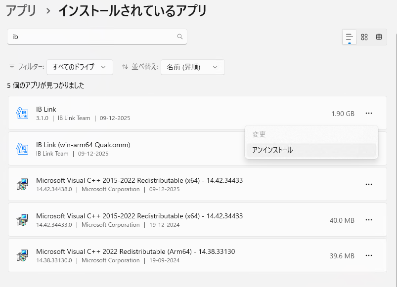
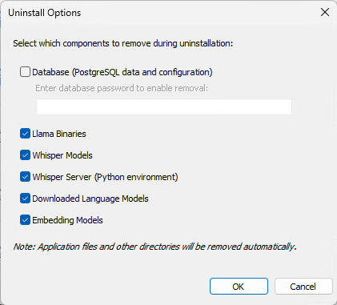
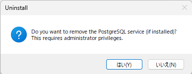
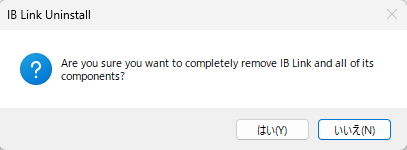
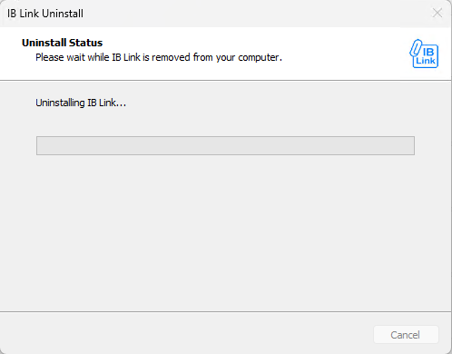
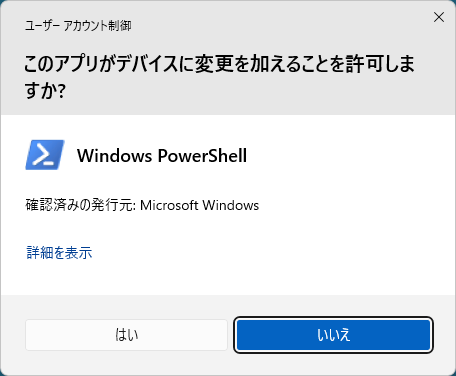
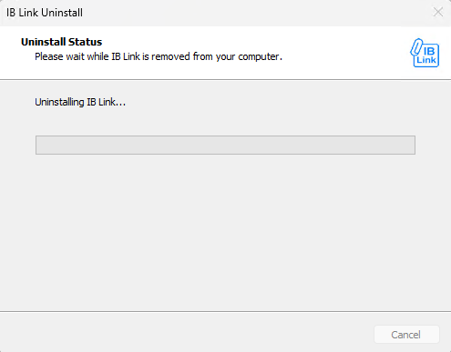
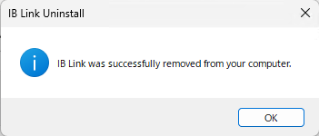

# IB-Link インストールマニュアル（v3.1）

## 1. 概要

本書は、ダウンロードしたインストーラーを用いて IB-Linkを Windows PCにインストールし、初回起動まで完了させる手順を説明します。

---

## 2. 事前準備

- 対象 OS：Windows 11
- 対応デバイス：Copilot+PC
- インストール用ファイル  
  - [ダウンロードサイト](https://docs.insightbuddy.cloud/installer/index.html)
- インターネット接続：インストール時、モデルダウンロード時必要となります

---

## 3. インストール手順

### 3.1 セットアップの起動（Welcome 画面）

1. セットアップファイルをダブルクリックして起動します。
2. 「Welcome to the IB Link Setup Wizard」と表示されます。
3. 他のアプリケーションを終了したうえで、**［Next］** をクリックします。

---

### 3.2 インストール先の選択

1. 「Select Destination Location」画面が表示されます。
2. 既定値（例：`C:\Users\<ユーザー名>\.iblink`）で問題ない場合は、そのまま **［Next］** をクリックします。
3. 変更したい場合は **［Browse…］** をクリックし、任意のフォルダを選択してから **［Next］** をクリックします。

---

### 3.3 一般オプション（ショートカット・自動起動）

1. 「General Options」画面で以下の設定を行います。
   - **Create a desktop icon**  
     デスクトップにショートカットを作成する場合はチェック（通常は ON 推奨）。
   - **Run IB Link at Windows startup**  
     Windows 起動時に IB Link を自動起動する場合はチェック。
2. 必要に応じてチェックを調整し、**［Next］** をクリックします。

---

### 3.4 Visual C++ ランタイム確認

1. 「Visual C++ Redistributable」画面が表示されます。
2. すでに「Microsoft Visual C++ Redistributable 2015–2022 (x64)」がインストールされている場合は、再インストール不要と表示されます。
3. そのまま **［Next］** をクリックします。

---

### 3.5 データベースオプション（PostgreSQL + pgvector）

1. 「Database Options」画面で  
   **Install PostgreSQL database with pgvector extension** にチェックが入っていることを確認します。
2. **［Next］** をクリックします。

---

### 3.6 データベースパスワード設定

1. 「Database Password」画面で、PostgreSQL のパスワードを設定します。
2. **PostgreSQL Password** に 8 文字以上のパスワードを入力します。
3. **Confirm Password** に同じパスワードを再入力します。
4. **入力したパスワードは、後で利用できるように安全な場所に保存してください。**  
5. **［Next］** をクリックします（2 つの入力が一致しない場合はエラーになります）。

---

### 3.7 Python 環境（Whisper サーバー）

1. 「Python Environment」画面で  
   **Setup Python environment for Whisper server** にチェックが入っていることを確認します。
2. Whisper 用の Python 仮想環境と依存ライブラリがセットアップされます。
3. **［Next］** をクリックします。

---

### 3.8 モデル設定（Gemma 3 4B）

1. 「Model Options」画面で以下を確認します。
   - **Load model automatically on startup**  
     IB Link 起動時に自動でモデルを読み込む場合はチェック（通常は ON 推奨）。
   - **Download Gemma 3 4B models during installation (main + vision)**  
     インストール時に Gemma 3 4B（本体 + vision）をダウンロードする場合はチェック（推奨）。
2. モデルサイズは合計約 3.4GB（main 約 2.5GB + vision 約 851MB）です。  
   ディスク容量と通信環境を確認してください。
3. 設定後、**［Next］** をクリックします。

---

### 3.9 Microsoft Foundry Local のインストール（Qualcomm版のみ）

1. 「Foundry Local Options」画面で  
   **Install Microsoft Foundry Local** にチェックが入っていることを確認します（ローカル推論を利用する場合は ON 推奨）。
2. **［Next］** をクリックします。

---

### 3.10 インストール開始（Ready to Install）

1. 「Ready to Install」画面で、インストール内容の概要が表示されます。  
   - Destination location（インストール先）が表示されていることを確認します。
2. 設定内容に問題なければ、**［Install］** をクリックしてインストールを開始します。
3. 設定をやり直したい場合は **［Back］** をクリックして各画面に戻ります。

---

### 3.11 インストールの進行状況

1. 「Installing」画面では、ファイルの展開およびコピー処理の進行状況が表示されます。
2. 進行バーが右端まで進むまで待ちます。
3. 必要に応じて **［Cancel］** をクリックするとインストールを中止できますが、  
   原則として処理が完了するまで待ってください。

---

### 3.12 ユーザー アカウント制御（UAC）の確認

1. インストール途中で、Windows の「ユーザー アカウント制御」ダイアログが表示される場合があります。
2. 「このアプリがデバイスに変更を加えることを許可しますか？」と表示されたら、  
   発行元が **Microsoft Windows** であることを確認します。
3. 問題なければ **［はい］** をクリックして処理を許可します。  
   （ここで［いいえ］を選択すると、必要な設定が完了せずインストールが失敗する可能性があります。）

---

### 3.13 セットアップ完了

1. 「Completing the IB Link Setup Wizard」画面が表示されたら、インストールは完了です。
2. **Launch IB Link** にチェックが入っている場合は、**［Finish］** をクリックすると  
   そのまま IB Link が起動します。
3. すぐには起動しない場合はチェックを外し、**［Finish］** をクリックしてください。  
   後からデスクトップアイコンやスタートメニューから起動できます。

---

### 3.14 初回起動とモデルダウンロード

1. 初回起動時、**「IB Link Initialization」** 画面が表示され、  
   モデルのダウンロードおよび初期設定が自動的に実行されます。
2. 上部のプログレスバーと下部のパーセンテージ（例：20%）で進行状況を確認できます。
3. 画面下部には以下のボタンが表示されます。
   - **Skip Qwen3 0.6B**：Qwen3 0.6B モデルのダウンロードをスキップする場合に使用します。
   - **Cancel**：初期化処理を中止します（通常は押さずに完了するまで待ってください）。
4. モデルサイズやネットワーク環境によっては、ダウンロードに時間がかかる場合があります。  
   中断せずに完了するまでお待ちください。

---

### 3.15 IB Link メイン画面の確認

1. 初期化が完了すると、IB Link のメイン画面（Chat 画面）が表示されます。
2. 画面上部の **Model** 欄に、現在選択されているローカルモデル名が表示されます。  
   右側の **Status** が `running` になっていることを確認します。
3. 左側メニューには、Chat / Models / Embedding / Voice / Discover / Database / Runtime / Logs / Login などのメニューが表示されます。
4. 中央のチャットエリアに「How can I help you today? (Using local server)」などのメッセージが表示されていれば、  
   ローカルサーバーとモデルの起動が正常に完了しています。
5. 画面下部の入力欄にテキストを入力し、送信ボタンを押すことでチャットを開始できます。

---

## 4. インストール後の確認と注意事項

1. デスクトップアイコンまたはスタートメニューから IB Link を再度起動し、正常に起動できることを確認します。
2. モデルダウンロード完了後は、ネットワークに接続していない状態でもローカルモデルを利用できます。
3. PostgreSQL のパスワードなど、インストール時に設定した情報は忘れないよう、安全な場所に保管してください。

---

# IB-Link アンインストール手順　　

本章では、Windows 11 から **IB Link** をアンインストールする手順を説明します。  

---

## 1. アンインストール前の注意事項

- IB-Link を削除すると、アプリケーション本体と関連コンポーネントが削除されます。
- 「Database (PostgreSQL data and configuration)」を削除すると、IB-Link 用データベース（保存されている設定や履歴など）も完全に削除され、元に戻せません。
- データベースを残したい場合は、「Database」のチェックを **付けない** でください。

---

## 2. アプリ一覧画面を開く

1. **スタートメニュー** → **設定** を開きます。
2. **アプリ** → **インストールされているアプリ** を開きます。
3. 画面上部の検索ボックスに `ib` と入力し、**IB-Link** を表示させます。

- 「IB-Link」と、「IB-Link (win-arm64 Qualcomm)」の2つが表示される場合があります。
- 「IB-Link」の方をアンインストールしますと、両方アンインストールされます。

---

## 3. アンインストールの開始

1. アンインストールしたい **IB-Link** の行の右端にある **…（3点リーダー）** をクリックします。
2. 表示されたメニューから **「アンインストール」** を選択します。

---

## 4. 削除するコンポーネントの選択

IB-Link のアンインストーラーが起動し、削除する項目を選択する画面が表示されます。

各項目の意味は以下のとおりです。

- **Database (PostgreSQL data and configuration)**  
  - IB Link が利用している PostgreSQL データベース本体と設定を削除します。  
  - データをすべて消してよい場合のみチェックします。
- **Llama Binaries**  
  - Llama 関連の実行ファイルを削除します。
- **Whisper Models**  
  - Whisper 音声認識モデルを削除します。
- **Whisper Server (Python environment)**  
  - Whisper Server 用の Python 環境を削除します。
- **Downloaded Language Models**  
  - ダウンロード済みの各種言語モデルを削除します。
- **Embedding Models**  
  - 埋め込み用モデルを削除します。

通常、IB Link を完全に削除する場合は、すべてのチェックを有効にします。

---

## 5. データベースも削除する場合

データベースも含めて完全削除したい場合は、次の操作を行います。

1. **「Database (PostgreSQL data and configuration)」にチェック**を入れます。
2. 「Enter database password to enable removal:」に、導入時に設定した **PostgreSQL のパスワード** を入力します。

設定が終わったら、画面右下の **「OK」** をクリックします。

> **注意**  
> Database を削除すると、IB Link に保存されていたデータは元に戻せません。

---

## 6. PostgreSQL サービス削除の確認

次の確認メッセージが表示されます。

> `Do you want to remove the PostgreSQL service (if installed)? This requires administrator privileges.`

- PostgreSQL 自体もアンインストールしたい場合：  
  → **「はい (Y)」** をクリック
- PostgreSQL を他の用途でも使っている場合や、残しておきたい場合：  
  → **「いいえ (N)」** をクリック

---

## 7. IB Link のアンインストール確認

続いて、IB Link の削除確認画面が表示されます。

> `Are you sure you want to completely remove IB Link and all of its components?`

内容を確認し、問題なければ **「はい (Y)」** をクリックします。

---

## 8. アンインストールの進行

アンインストールが進行している間は、次のような画面が表示されます。

しばらくそのまま待ちます。

---

## 9. ユーザーアカウント制御 (UAC) の確認

アンインストールの途中で、Windows のユーザーアカウント制御ダイアログが表示される場合があります。

> `このアプリがデバイスに変更を加えることを許可しますか?`  
> 発行元: Microsoft Windows (Windows PowerShell)

IB Link のアンインストール処理の一部ですので、内容を確認のうえ問題なければ **「はい」** をクリックします。

その後、再度アンインストール進行画面が表示されます。

処理が完了するまで待ちます。

---

## 10. アンインストール完了

アンインストールが正常に完了すると、次のメッセージが表示されます。

> `IB Link was successfully removed from your computer.`

**「OK」** をクリックして画面を閉じます。

---
© 2025 IB-Link / J-AIC  
本ドキュメントの無断転載を禁じます。
