# IB-Link インストール手順書（v4.0）

## 1. 概要

本書は、ダウンロードしたインストーラーを用いて **IB-Link** を Windows PC にインストールし、初回起動（初期化）まで完了させる手順を説明します。

---

## 2. 事前準備

- **対象 OS**：Windows 11
- **インストール用ファイル**
  - [ダウンロードサイト](https://docs.insightbuddy.cloud/installer/index.html)
- **インターネット接続**：インストール時、および初回起動時のイニシャライズ処理に必要です
- **推奨HDD容量の目安**
  - インストール本体：画面表示上は **500GB**（環境により変動）

---

## 3. インストール手順

### 3.1 セットアップの起動（Welcome 画面）

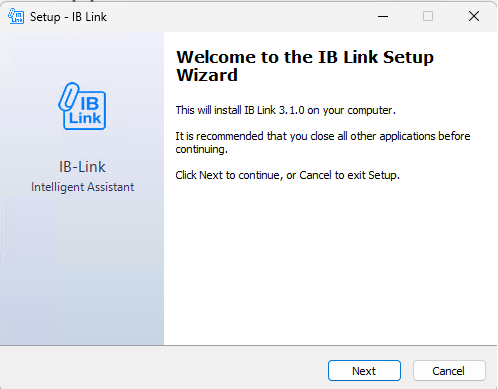

1. セットアップファイルをダブルクリックして起動します。
2. 「Welcome to the IB Link Setup Wizard」と表示されたら、他のアプリケーションを終了したうえで **［Next］** をクリックします。

---

### 3.2 インストール先の選択

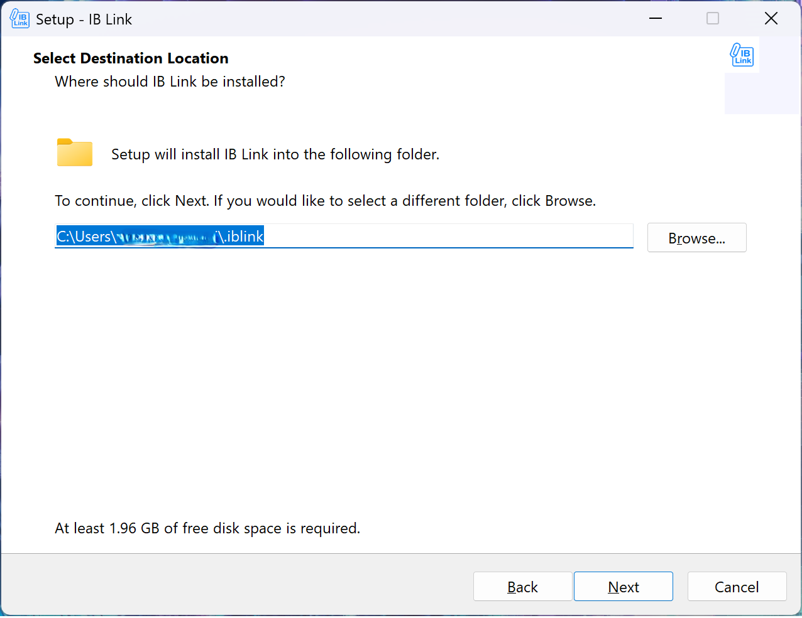

1. 「Select Destination Location」画面でインストール先フォルダを確認します。
2. 既定値で問題ない場合は、そのまま **［Next］** をクリックします。
3. 変更したい場合は **［Browse…］** をクリックして任意のフォルダを選択し、**［Next］** をクリックします。

---

### 3.3 一般オプション（ショートカット・自動起動）

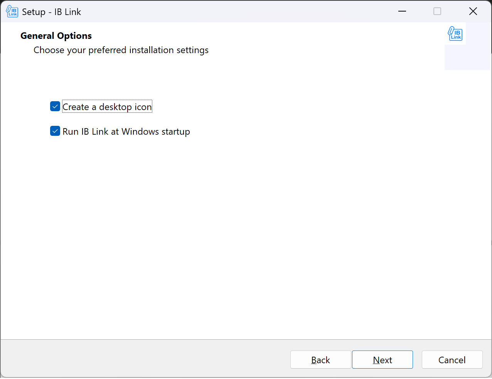

1. 「General Options」画面で以下を必要に応じて設定します。
   - **Create a desktop icon**：デスクトップにショートカットを作成する
   - **Run IB Link at Windows startup**：Windows 起動時に IB-Link を自動起動する
2. 設定後、**［Next］** をクリックします。

---

### 3.4 Visual C++ ランタイムの導入

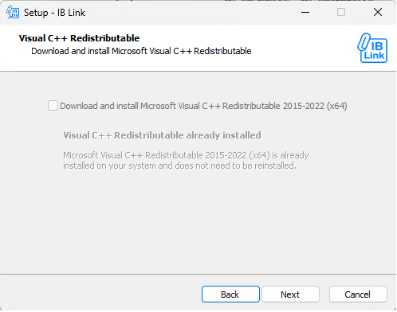

1. 「Visual C++ Redistributable」画面で  
   **Download and install Microsoft Visual C++ Redistributable 2015-2022 (x64)** にチェックが入っていることを確認します。
2. **［Next］** をクリックします。

---

### 3.5 Vulkan SDK の導入（Intel GPU 加速）

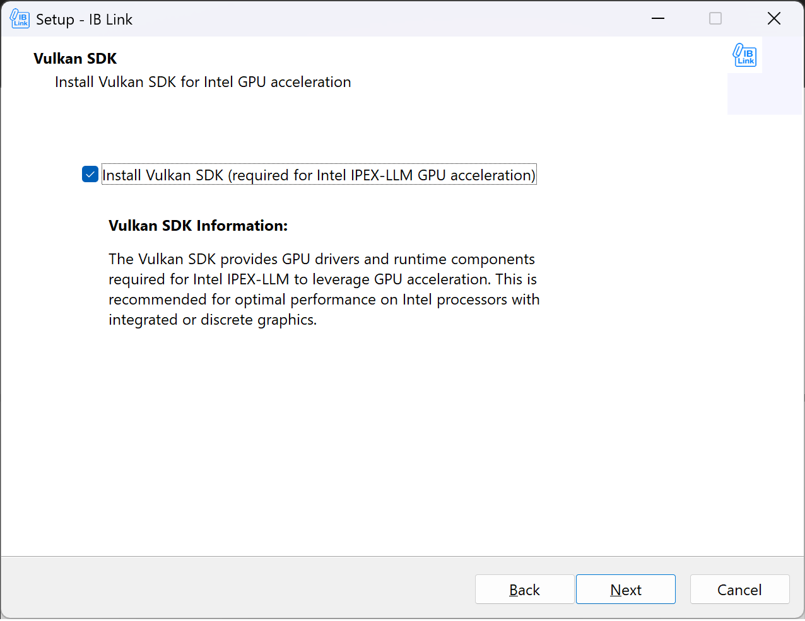

1. 「Vulkan SDK」画面で  
   **Install Vulkan SDK (required for Intel IPEX-LLM GPU acceleration)** にチェックが入っていることを確認します。
2. **［Next］** をクリックします。

---

### 3.6 Git の導入（モデルのダウンロード・更新）

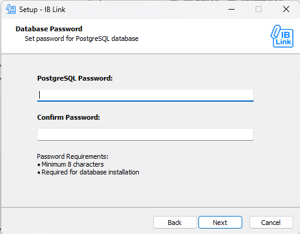

1. 「Git」画面で  
   **Install Git (required for model downloads and updates)** にチェックが入っていることを確認します。
2. **［Next］** をクリックします。

---

### 3.7 データベースオプション（PostgreSQL + pgvector）

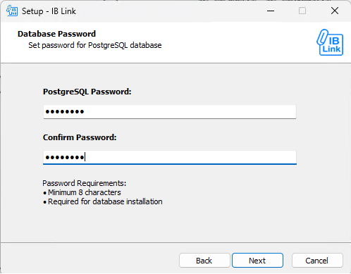

1. 「Database Options」画面で  
   **Install PostgreSQL database with pgvector extension** にチェックが入っていることを確認します。
2. **［Next］** をクリックします。

---

### 3.8 データベースパスワード設定

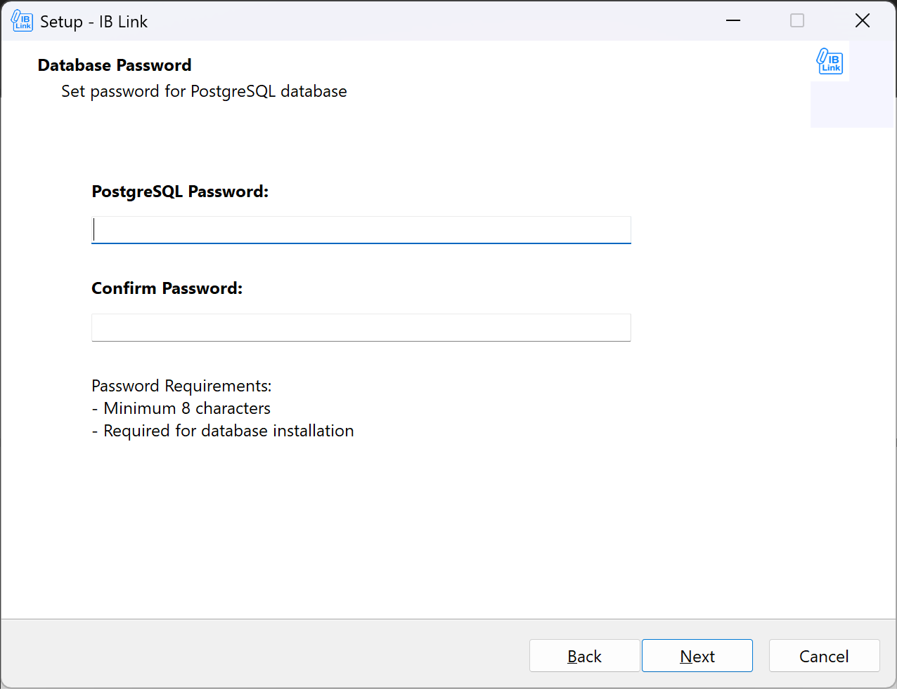

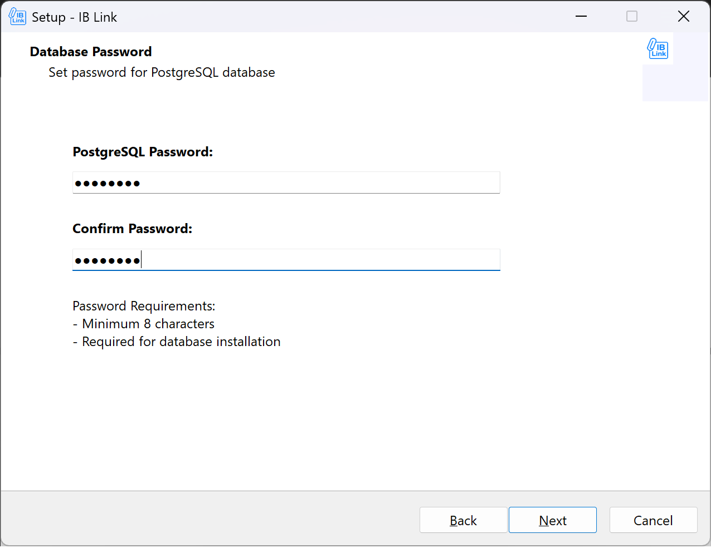

1. 「Database Password」画面で、PostgreSQL のパスワードを設定します。
2. **PostgreSQL Password** に **8 文字以上**のパスワードを入力します。
3. **Confirm Password** に同じパスワードを再入力します。
4. **入力したパスワードは、後で利用できるように安全な場所に保存してください。**
5. **［Next］** をクリックします（2 つの入力が一致しない場合はエラーになります）。

---

### 3.9 Python 環境（Whisper サーバー）

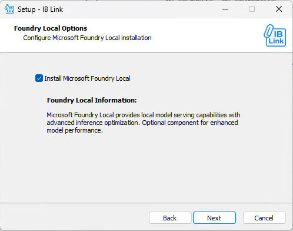

1. 「Python Environment」画面で  
   **Setup Python environment for Whisper server** にチェックが入っていることを確認します。
2. **［Next］** をクリックします。

---

### 3.10 モデル設定（Gemma 3 4B）

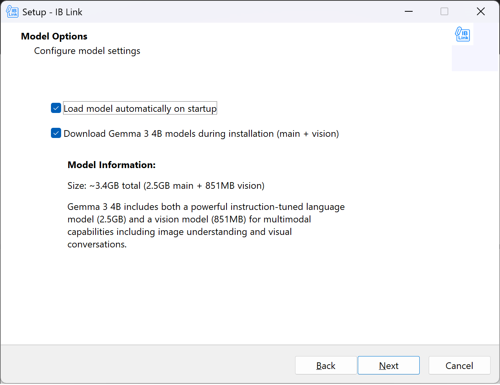

1. 「Model Options」画面で以下を確認します。
   - **Load model automatically on startup**：IB-Link 起動時に自動でモデルを読み込む（通常は ON 推奨）
   - **Download Gemma 3 4B models during installation (main + vision)**：インストール時にモデルをダウンロード（推奨）
2. 画面の案内どおり、モデル合計サイズは **約 3.4GB（main 約 2.5GB + vision 約 851MB）** です。ディスク容量と通信環境を確認してください。
3. **［Next］** をクリックします。

---

### 3.11 インストール開始（Ready to Install）

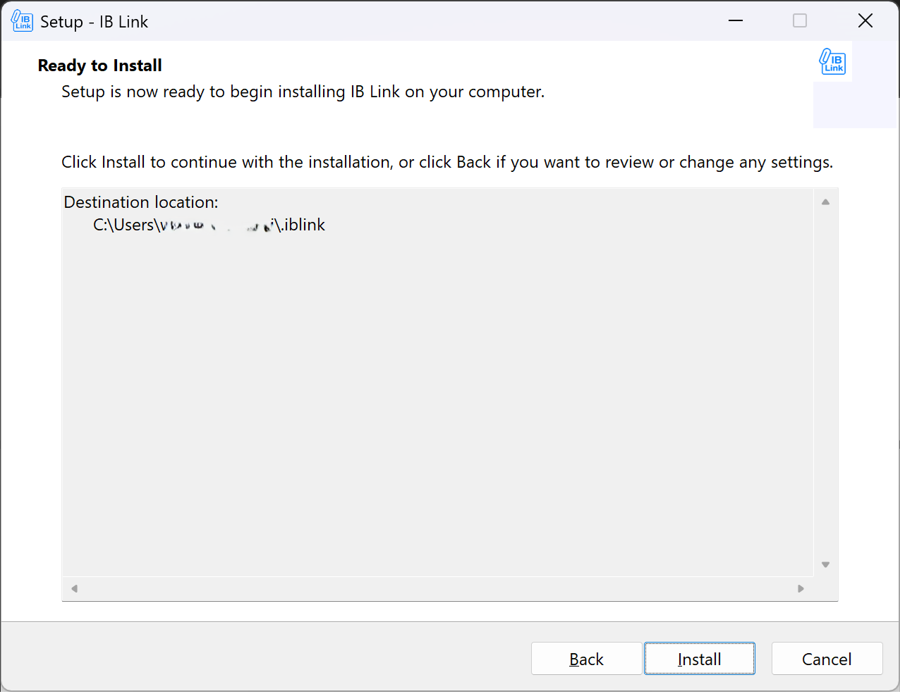

1. 「Ready to Install」画面で、インストール先（Destination location）などの内容を確認します。
2. 問題なければ **［Install］** をクリックしてインストールを開始します。
3. 設定を変更したい場合は **［Back］** をクリックして戻ります。

---

### 3.12 インストールの進行状況

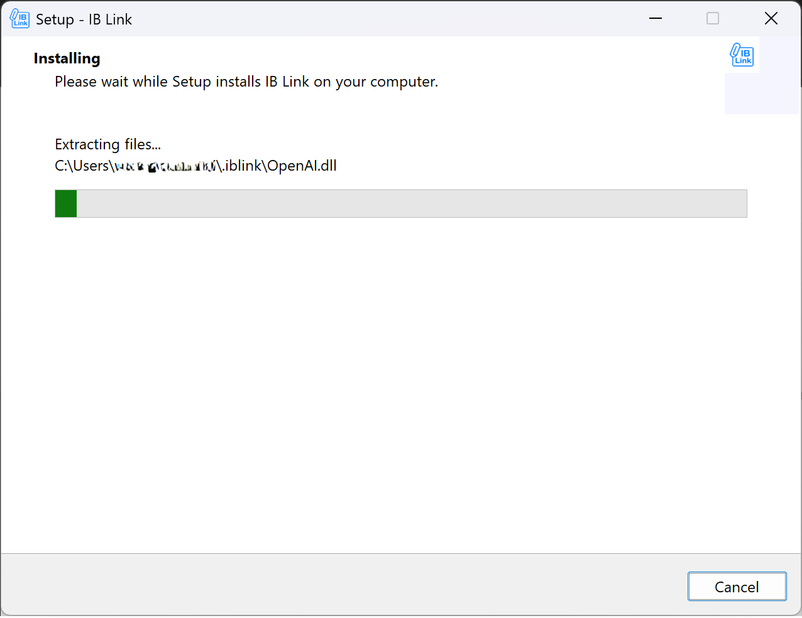

1. 「Installing」画面で進行状況が表示されます。
2. 完了するまで待ちます（原則 **［Cancel］** は押さないでください）。

---

### 3.13 ユーザー アカウント制御（UAC）の確認

1. インストール途中で、Windows の「ユーザー アカウント制御」ダイアログが表示される場合があります。
2. 「このアプリがデバイスに変更を加えることを許可しますか？」と表示されたら、  
   発行元が **Microsoft Windows** であることを確認します。
3. 問題なければ **［はい］** をクリックして処理を許可します。  
   （ここで［いいえ］を選択すると、必要な設定が完了せずインストールが失敗する可能性があります。）

---

### 3.14 セットアップ完了

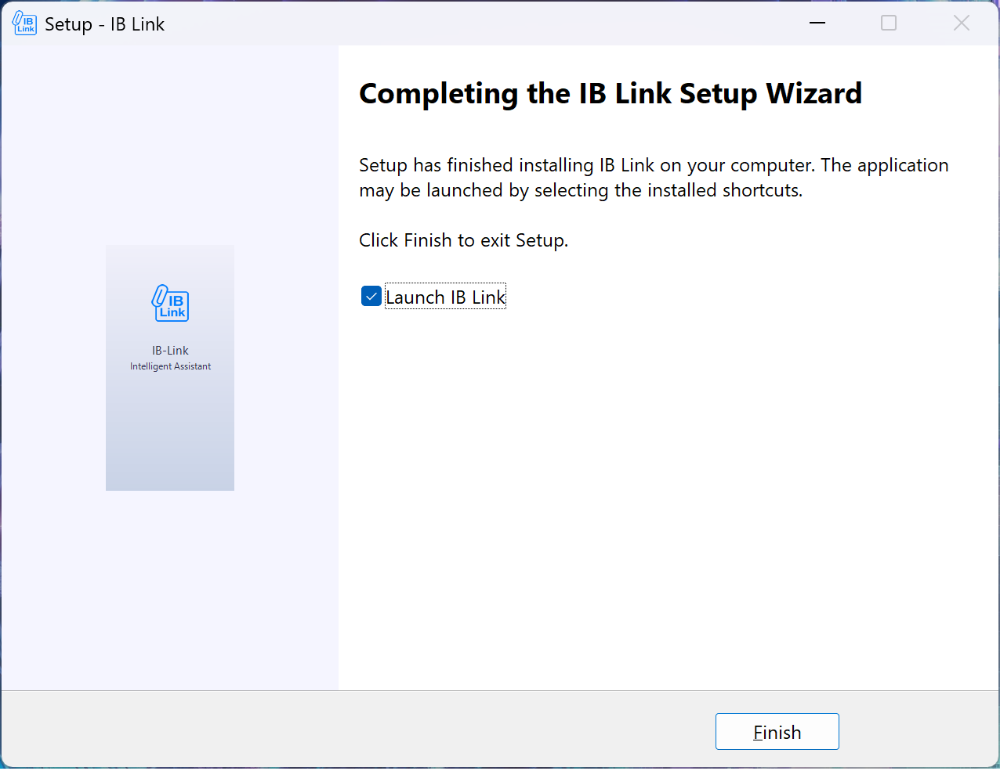

1. 「Completing the IB Link Setup Wizard」画面が表示されたらインストール完了です。
2. すぐに起動する場合は **Launch IB Link** にチェックが入っていることを確認し、**［Finish］** をクリックします。
3. すぐに起動しない場合はチェックを外して **［Finish］** をクリックし、後からデスクトップ/スタートメニューから起動します。

---

## 4. 初回起動（初期化：IB-Link Setup）

初回起動時は、環境準備（依存関係の導入、Whisper、モデル取得など）が自動で行われます。完了するまでアプリを閉じずにお待ちください。

### 4.1 前提コンポーネントの準備（Prerequisites）

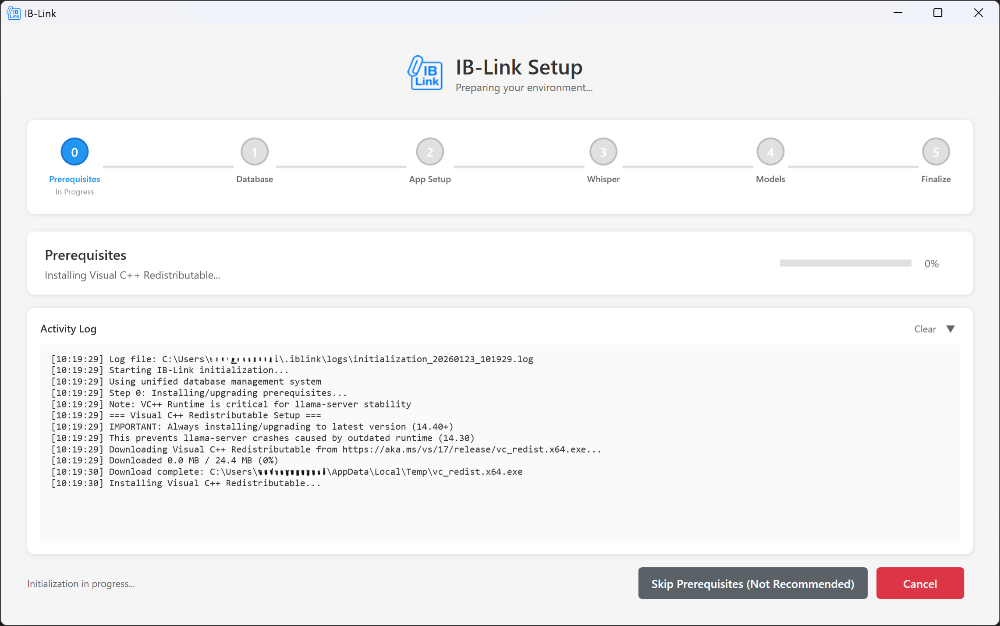

- 画面上部にステップ（Prerequisites / Database / App Setup / Whisper / Models / Finalize）が表示されます。
- 進行中は Activity Log に処理内容が表示されます。
- **Skip Prerequisites (Not Recommended)** は通常使用しません。

---

### 4.2 Whisper のセットアップ

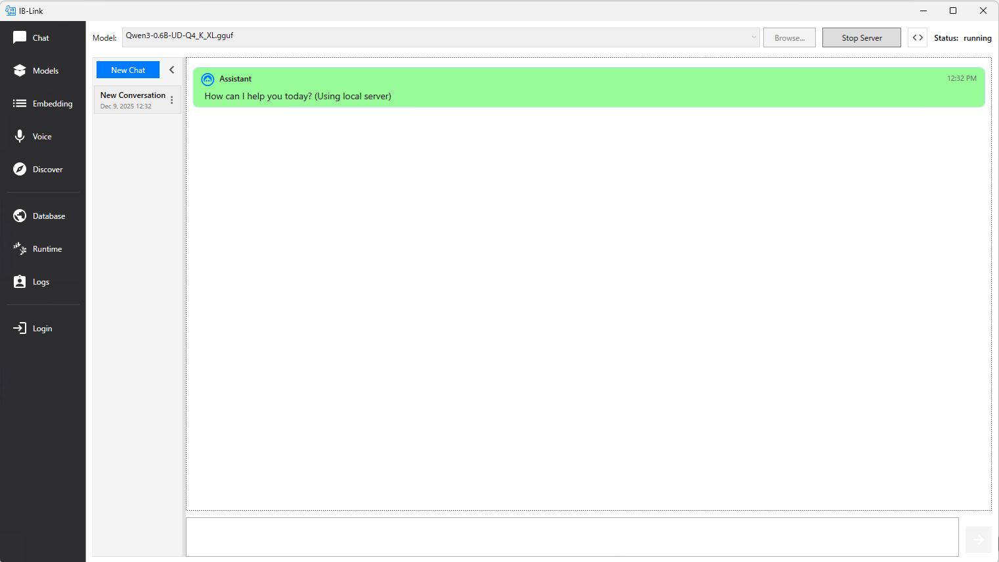

- 「Whisper Setup」が進行し、依存関係が導入されます。
- **Skip Whisper Setup** は通常使用しません（音声機能が必要な場合、未設定になる可能性があります）。

---

### 4.3 チャットモデルのダウンロード（Models）

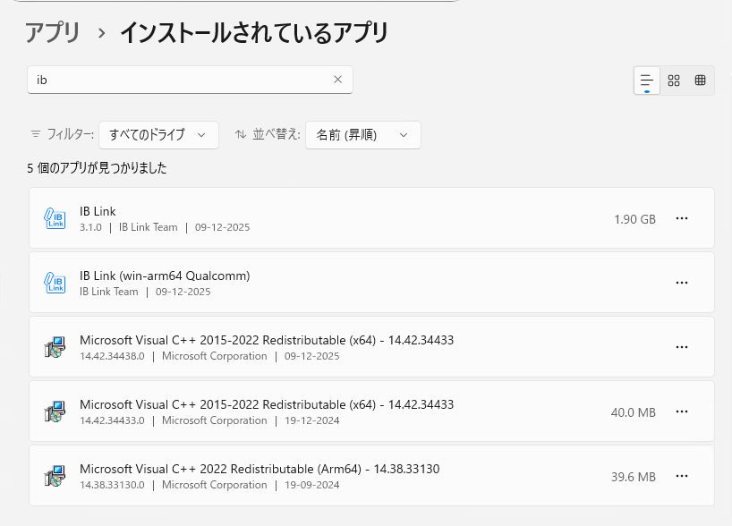

- 「Chat Model」のダウンロードが進行します（通信環境により時間がかかります）。
- **Skip Chat Model** を押すと、モデルのダウンロードを行わずに進む場合があります（推奨しません）。

---

### 4.4 初期化失敗時の再イニシャライズ（再実行）

初回起動（初期化：IB-Link Setup）が途中で失敗した場合、失敗したステップのみを選択して再実行（再イニシャライズ）できます。

#### 4.4.1 事前確認

- IB-Link を起動し、左メニューの `Setup` を開きます。
- 画面下部の `Activity Log` に失敗理由（例：ネットワークエラー、依存関係の導入失敗など）が表示されている場合は、先に内容を確認します。

#### 4.4.2 ネットワークエラー（Prerequisites）が出る場合

依存コンポーネント（例：Visual C++ Redistributable）の取得でネットワークが必要になる場合があります。

1. `Network Connection Required` の警告が表示されたら、ネットワーク接続を確認します。
2. 右側の `Retry` をクリックして再試行します。
3. 繰り返し失敗する場合は、警告内に表示されるダウンロード URL から手動導入し、再度 `Retry` をクリックします。

#### 4.4.3 再イニシャライズ（再実行）の実施

1. 左メニューから `Setup` を開き、`Initialization Complete`（または Setup 画面）まで進んでいることを確認します。
2. `Re-run Initialization Steps` で、再実行したいステップにチェックを入れます。
3. `Re-initialize Selected` をクリックして再実行します。

##### 4.4.3.1 Prerequisites（前提条件）を再実行する例

1. `Prerequisites` にチェックを入れます。
2. `Re-initialize Selected` をクリックします。

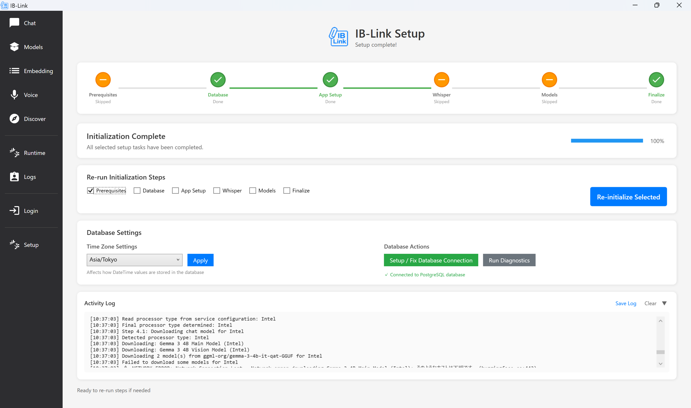

実行中はステップが `In Progress` になり、進捗とログが更新されます。

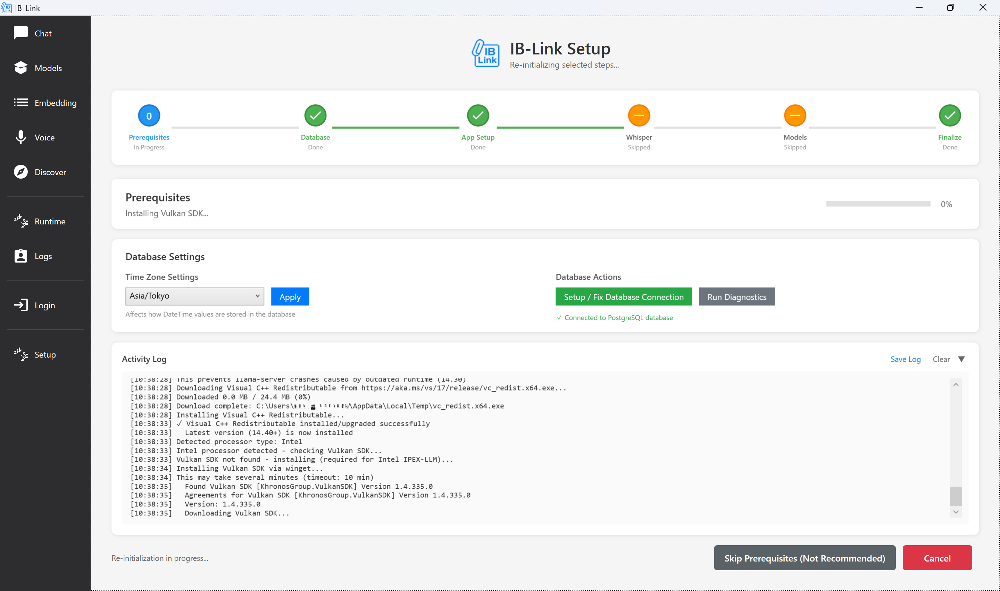

完了すると当該ステップが `Done`（緑のチェック）になります。

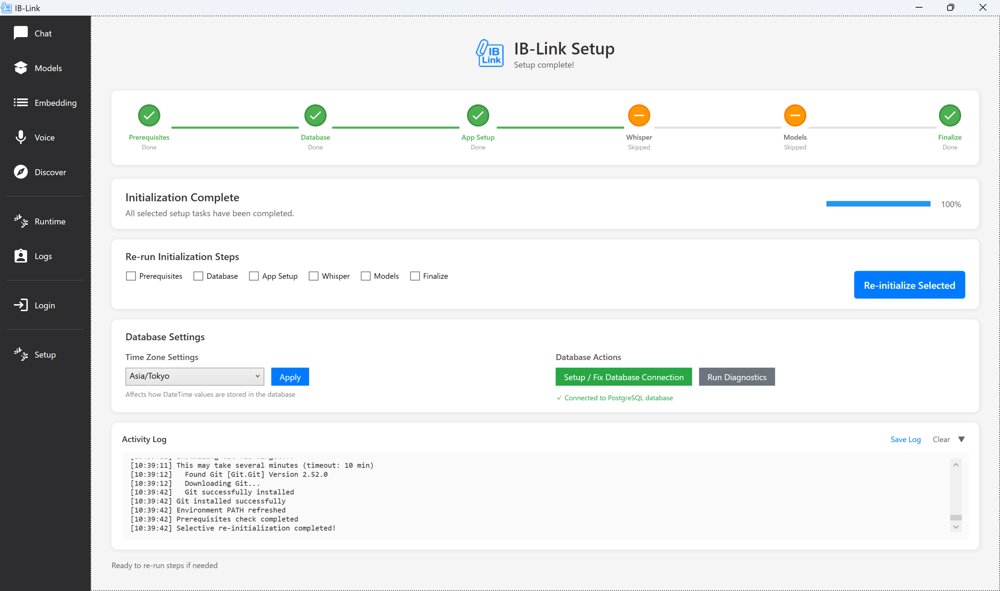

##### 4.4.3.2 Whisper を再実行する例

1. `Whisper` にチェックを入れます。
2. `Re-initialize Selected` をクリックします。

実行中は `Whisper Setup` が `In Progress` になり、進捗が表示されます。

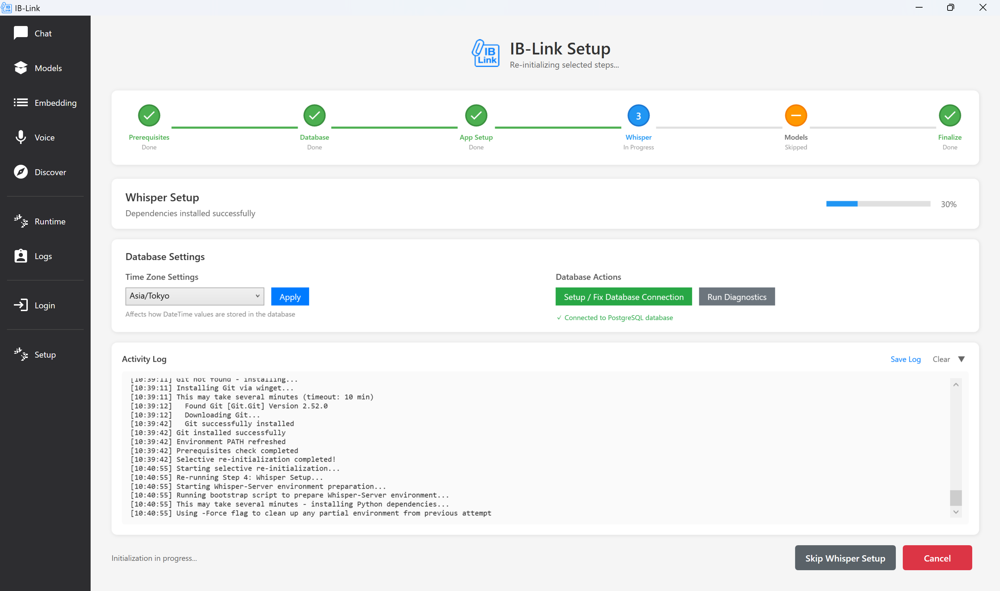

完了すると `Whisper` が `Done` になります。

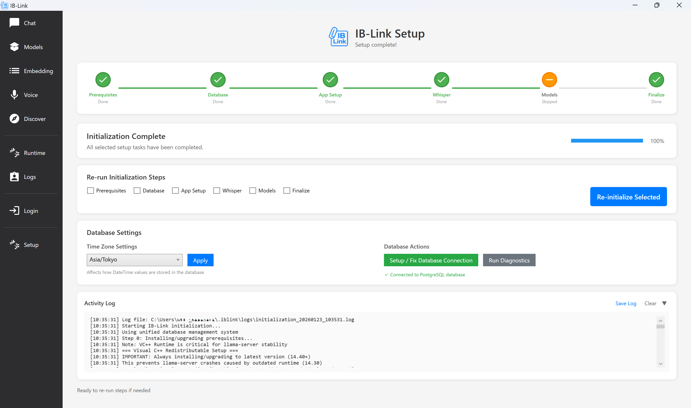

##### 4.4.3.3 Models（Chat Model）を再実行する例

1. `Models` にチェックを入れます。
2. `Re-initialize Selected` をクリックします。

実行中はダウンロード進捗とログが表示されます。

完了すると `Models` が `Done` になります。

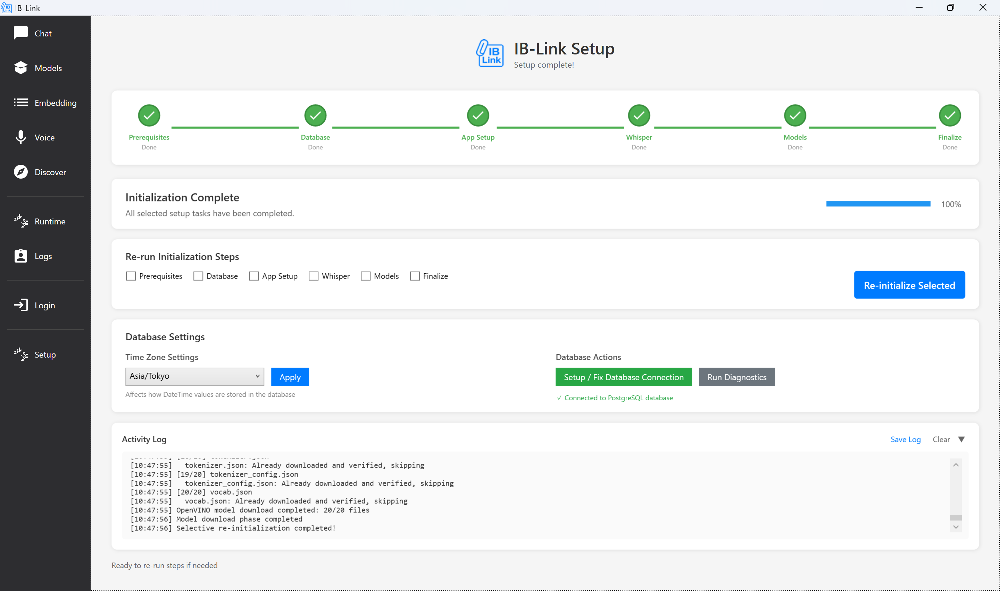

#### 4.4.4 再実行がうまくいかない場合の確認ポイント

- **ログ確認**: `Setup` 画面の `Activity Log` を確認し、失敗要因（ネットワーク、権限、容量、依存導入など）を切り分けます。  
  例：`C:\Users\<ユーザー名>\.iblink\logs\initialization_*.log`
- **ネットワーク**: 企業プロキシ／FW 環境では外部取得がブロックされることがあります。必要に応じて手動導入後に再実行します。
- **権限**: 依存導入で管理者権限が必要になることがあります。
- **ディスク容量**: `Models` 再実行はモデル取得で容量が必要です。

---

## 5. インストール後の確認

1. IB-Link を再起動し、正常に起動できることを確認します。
2. インストール時に設定した **PostgreSQL のパスワード** は忘れないよう、安全な場所に保管してください。

---

## 6. アンインストール手順

本章では、Windows 11 から **IB-Link** をアンインストールする手順を説明します。

---

### 6.1 アンインストール前の注意事項

- IB-Link を削除すると、アプリケーション本体と関連コンポーネントが削除されます。
- **Database (PostgreSQL data and configuration)** を削除すると、IB-Link 用データベース（保存されている設定や履歴など）も完全に削除され、元に戻せません。
  - データベースを残したい場合は、Database のチェックを **付けない** でください。
- **Vulkan SDK / Git** は「uninstall via winget」と表示される場合があります。
  - 他用途でも利用している場合は削除しないでください（通常はチェック不要です）。

---

### 6.2 アプリ一覧（インストールされているアプリ）を開く

1. **スタートメニュー** → **設定** を開きます。
2. **アプリ** → **インストールされているアプリ** を開きます。
3. 画面上部の検索ボックスに `ib` と入力し、**IB Link** を表示させます。

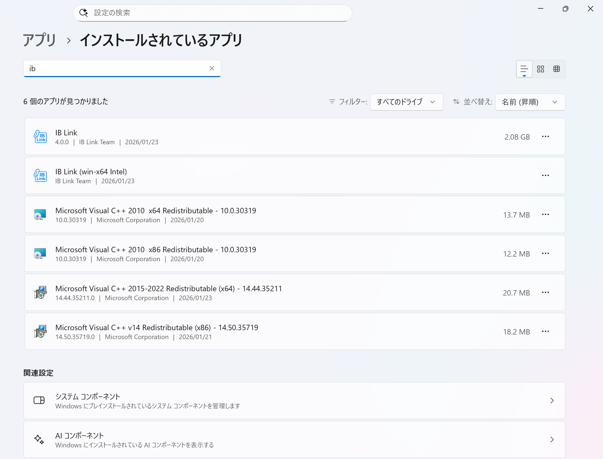

- 「IB Link」と「IB Link (win-x64 Intel)」など複数表示される場合があります。
- 基本的には「IB Link」をアンインストールしてください。

---

### 6.3 アンインストールの開始

1. アンインストールしたい **IB Link** の行の右端にある **…（3点リーダー）** をクリックします。
2. 表示されたメニューから **「アンインストール」** を選択します。

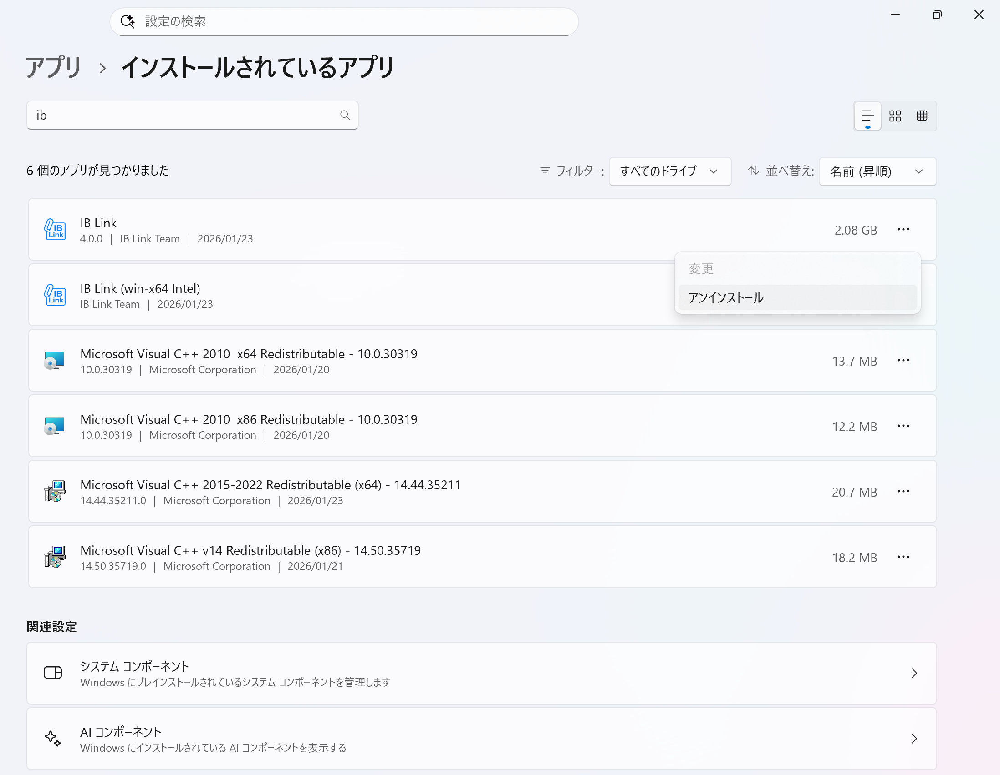

---

### 6.4 削除するコンポーネントの選択

IB Link のアンインストーラーが起動し、削除する項目を選択する画面が表示されます。

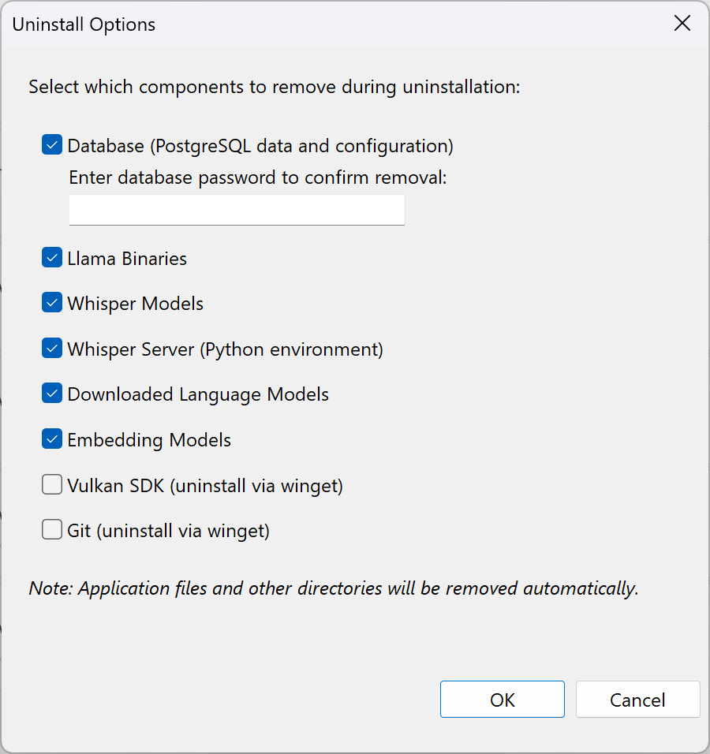

各項目の意味は以下のとおりです。

- **Database (PostgreSQL data and configuration)**
  - IB Link が利用している PostgreSQL データベース本体と設定を削除します（復元できません）。
- **Llama Binaries**
  - Llama 関連の実行ファイルを削除します。
- **Whisper Models**
  - Whisper 音声認識モデルを削除します。
- **Whisper Server (Python environment)**
  - Whisper Server 用の Python 環境を削除します。
- **Downloaded Language Models**
  - ダウンロード済みの各種言語モデルを削除します。
- **Embedding Models**
  - 埋め込み用モデルを削除します。
- **Vulkan SDK (uninstall via winget) / Git (uninstall via winget)**
  - winget を使って Vulkan SDK / Git を削除します（他用途でも使っている場合は削除しないでください）。

---

### 6.5 データベースも削除する場合（完全削除）

データベースも含めて完全削除したい場合は、次の操作を行います。

1. **「Database (PostgreSQL data and configuration)」にチェック**を入れます。
2. **「Enter database password to confirm removal」** に、導入時に設定した **PostgreSQL のパスワード** を入力します。
3. 必要に応じて削除したい項目にチェックを入れ、**「OK」** をクリックします。

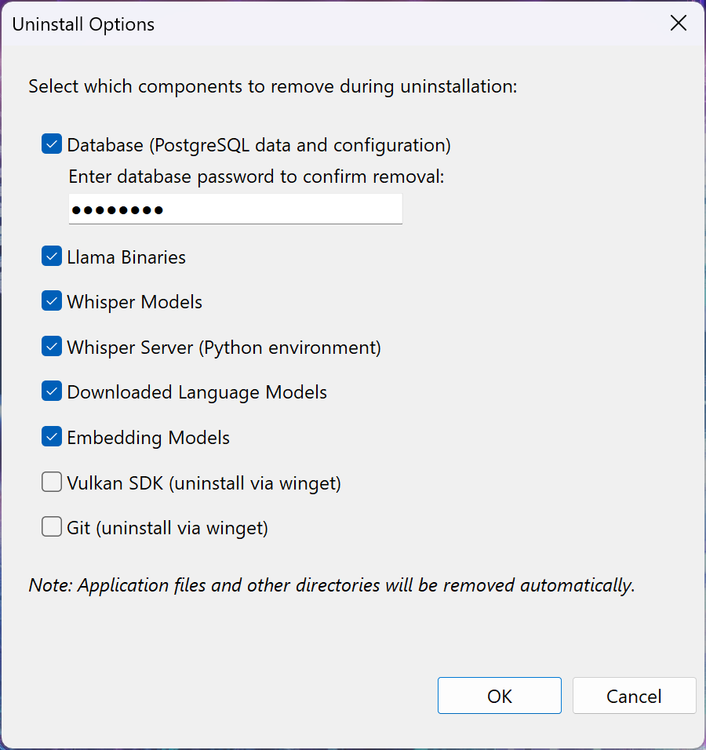

> **注意**  
> Database を削除すると、IB Link に保存されていたデータは元に戻せません。

---

### 6.6 Vulkan SDK / Git も削除する場合（任意）

Vulkan SDK / Git を **IB-Link 導入のためにのみ** インストールした場合に限り、チェックを入れて削除できます。

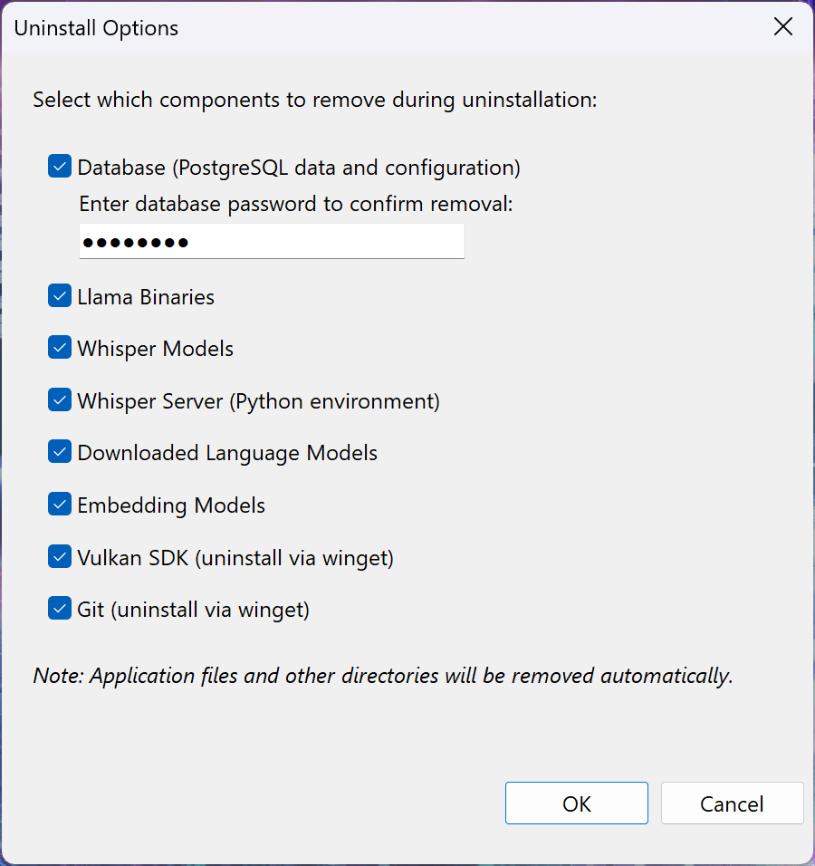

---

### 6.7 アンインストール確認

確認ダイアログが表示されたら、問題なければ **「はい (Y)」** をクリックします。

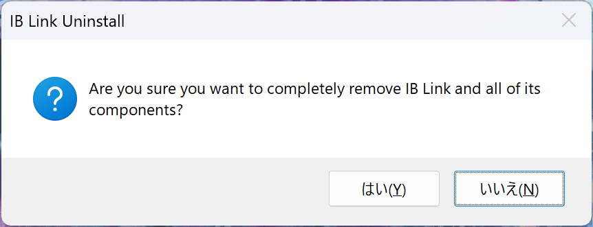

---

### 6.8 アンインストールの進行

アンインストールが進行している間は、次のような画面が表示されます。完了するまで待ちます。

※ 途中でユーザーアカウント制御（UAC）が表示された場合は、内容を確認のうえ許可してください。

---

### 6.9 アンインストール完了

アンインストールが正常に完了すると、次のメッセージが表示されます。

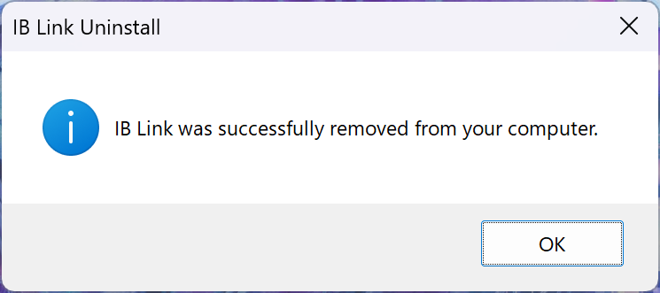

**「OK」** をクリックして画面を閉じます。

